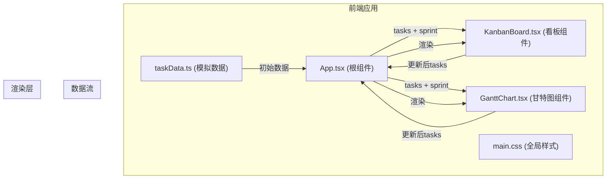

## 1. 架构设计



## 2. 技术描述
- 前端框架：React 18 + TypeScript
- 构建工具：Vite 5 + @vitejs/plugin-react
- 甘特图库：gantt-schedule-timeline-calendar
- 状态管理：React useState (提升至App根组件)
- 样式方案：原生CSS (CSS变量 + 响应式媒体查询)
- 拖拽实现：HTML5 Drag and Drop API

## 3. 项目结构
```
e:\solo\VersionFastPro\tasks\auto12\
├── package.json          # 项目依赖与脚本
├── vite.config.js        # Vite构建配置
├── tsconfig.json         # TypeScript配置
├── index.html            # 入口HTML
└── src/
    ├── App.tsx           # 根组件 - 状态管理、模式切换、数据分发
    ├── components/
    │   ├── KanbanBoard.tsx   # 看板组件 - 三列拖拽、状态管理
    │   └── GanttChart.tsx    # 甘特图组件 - 时间线、日期调整
    ├── utils/
    │   └── taskData.ts       # 模拟数据 - 任务与迭代周期
    └── styles/
        └── main.css          # 全局样式 - 主题、响应式、动画
```

## 4. 调用关系与数据流向

| 文件 | 依赖 | 输出 | 说明 |
|------|------|------|------|
| taskData.ts | 无 | tasks[], sprint | 生成初始任务数据和迭代周期 |
| App.tsx | taskData.ts, KanbanBoard, GanttChart | 渲染子组件 | 管理全局状态，分发数据，接收子组件更新 |
| KanbanBoard.tsx | App传入的tasks | 更新后的tasks | 展示三列看板，处理拖拽，输出状态变更 |
| GanttChart.tsx | App传入的tasks和sprint | 更新后的tasks | 展示甘特图，处理日期拖拽，检测冲突 |
| main.css | 无 | 样式规则 | 定义全局主题、布局、动画 |

## 5. 数据模型

### 5.1 数据类型定义
```typescript
type TaskStatus = 'todo' | 'in-progress' | 'done';
type Priority = 'low' | 'medium' | 'high';

interface Task {
  id: string;
  title: string;
  assignee: string;
  status: TaskStatus;
  priority: Priority;
  startDate: string;
  endDate: string;
  dependencies: string[];
  description?: string;
}

interface Sprint {
  id: string;
  name: string;
  startDate: string;
  endDate: string;
}
```

### 5.2 核心数据结构
| 字段 | 类型 | 说明 |
|------|------|------|
| Task.id | string | 任务唯一标识 |
| Task.title | string | 任务标题 |
| Task.assignee | string | 负责人 |
| Task.status | enum | 任务状态：todo/in-progress/done |
| Task.priority | enum | 优先级：low/medium/high |
| Task.startDate | string | ISO格式开始日期 |
| Task.endDate | string | ISO格式结束日期 |
| Task.dependencies | string[] | 依赖任务ID数组 |
| Sprint.id | string | 迭代ID |
| Sprint.name | string | 迭代名称 |
| Sprint.startDate | string | 迭代开始日期 |
| Sprint.endDate | string | 迭代结束日期 |

## 6. 性能优化策略

1. **拖拽性能**：使用 requestAnimationFrame 优化拖拽回调，避免频繁重渲染
2. **列表虚拟化**：甘特图任务量较大时采用虚拟滚动
3. **React.memo**：对看板卡片和甘特图任务条进行记忆化处理
4. **CSS硬件加速**：使用 transform 和 opacity 实现动画，触发GPU加速
5. **事件委托**：减少事件监听器数量，优化拖拽事件处理
6. **防抖节流**：筛选框输入使用防抖，避免频繁过滤

## 7. 核心API设计（内部）

| 组件方法 | 参数 | 返回值 | 说明 |
|----------|------|--------|------|
| App.handleTaskUpdate | updatedTask: Task | void | 接收子组件的任务更新 |
| App.handleModeChange | mode: 'kanban' \| 'gantt' | void | 切换视图模式 |
| KanbanBoard.onDragStart | e: DragEvent, taskId: string | void | 开始拖拽 |
| KanbanBoard.onDragOver | e: DragEvent, status: TaskStatus | void | 拖拽悬停 |
| KanbanBoard.onDrop | e: DragEvent, status: TaskStatus | void | 放置更新状态 |
| GanttChart.onTaskDrag | taskId: string, newStart: Date, newEnd: Date | void | 调整任务日期 |
| GanttChart.detectConflict | task: Task, allTasks: Task[] | boolean | 检测依赖冲突 |
