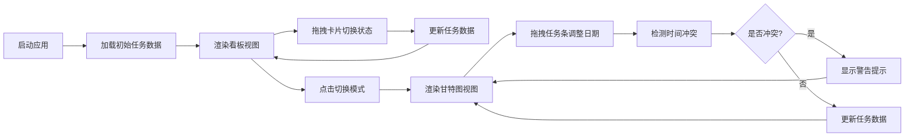

## 1. 产品概述
SprintBoard是一款敏捷任务看板应用，专为团队协作场景设计，解决现有看板工具配置复杂、缺乏直观时间线视角的痛点。通过看板视图与甘特图双模式切换，帮助团队高效管理迭代进度。

- 主要用途：团队任务追踪、迭代进度管理、项目时间线可视化
- 目标用户：敏捷开发团队、项目经理、产品负责人
- 市场价值：提供轻量、直观、高性能的双模式任务管理体验

## 2. 核心功能

### 2.1 用户角色
| 角色 | 注册方式 | 核心权限 |
|------|----------|----------|
| 团队成员 | 无需注册（本地应用） | 查看、拖拽、编辑任务，切换视图模式 |

### 2.2 功能模块
1. **看板视图**：待办/进行中/完成三列任务卡片，拖拽切换状态
2. **甘特图视图**：时间线展示任务起止日期与依赖关系，拖拽调整日期
3. **模式切换**：顶部标签按钮一键切换，数据保持同步
4. **任务管理**：添加任务、筛选任务、优先级标记
5. **交互反馈**：拖拽动画、悬停效果、冲突警告

### 2.3 页面详情
| 页面名称 | 模块名称 | 功能描述 |
|----------|----------|----------|
| 主应用页 | 顶部工具栏 | 模式切换按钮、添加任务按钮、筛选框、半透明毛玻璃效果 |
| 主应用页 | 看板视图 | 三列任务卡片、拖拽排序、状态过渡动画 |
| 主应用页 | 甘特图视图 | 时间轴、任务条、依赖箭头、拖拽调整、信息气泡 |

## 3. 核心流程
用户打开应用 → 默认显示看板视图 → 可拖拽卡片调整任务状态 → 点击切换按钮进入甘特图视图 → 拖拽任务条调整时间 → 系统检测时间冲突并给出警告 → 所有操作数据实时同步

## 4. 用户界面设计

### 4.1 设计风格
- 主背景色：#1e1e2e（深色主题）
- 看板列渐变：从左至右饱和度递增
- 按钮样式：圆角、毛玻璃半透明效果
- 字体：现代无衬线字体，标题加粗
- 布局：卡片式布局，层次分明
- 动画：0.3s cubic-bezier 过渡曲线

### 4.2 页面设计概述
| 页面名称 | 模块名称 | UI元素 |
|----------|----------|--------|
| 主应用页 | 顶部工具栏 | 半透明毛玻璃背景、模式切换标签、添加任务按钮、筛选输入框 |
| 主应用页 | 看板视图 | 三列渐变背景、任务卡片（圆角+阴影）、悬停上移动效、拖拽占位 |
| 主应用页 | 甘特图视图 | 时间轴刻度、彩色任务条、依赖箭头线、信息气泡、冲突警告 |

### 4.3 响应式
- 桌面端（≥1024px）：三列并排布局
- 平板端（768px-1023px）：两列布局，第三列换行
- 移动端（<768px）：单列滚动布局，自适应宽度
- 触摸优化：增大拖拽热区，支持触摸滑动

### 4.4 交互细节
- 卡片悬停：上移2px + 阴影加深
- 拖拽中：半透明效果 + 占位提示
- 模式切换：淡入淡出过渡
- 甘特图任务条悬停：显示详细信息气泡
- 冲突检测：红色边框 + 抖动动画
