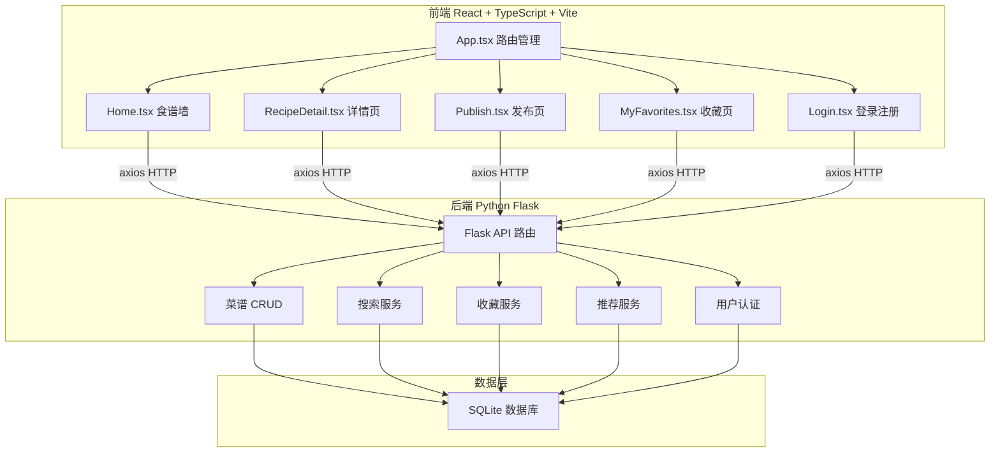
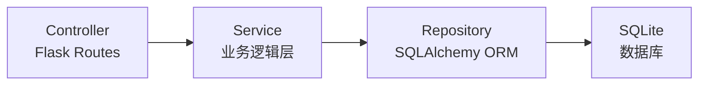
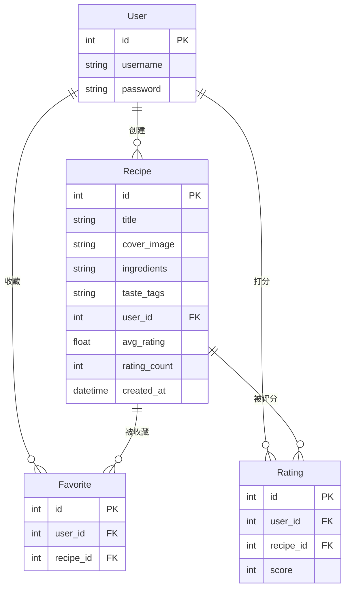

## 1. 架构设计



## 2. 技术说明

- 前端：React@18 + TypeScript + Vite + axios
- 初始化工具：Vite
- 后端：Python Flask + flask-cors + flask-sqlalchemy
- 数据库：SQLite（轻量级，无需额外安装）
- 样式：CSS Modules + CSS Variables（橙白配色主题）

## 3. 路由定义

| 路由 | 用途 |
|------|------|
| / | 首页食谱墙，展示所有菜谱卡片，支持搜索和标签筛选 |
| /recipe/:id | 食谱详情页，分步展示、收藏、打分、推荐 |
| /publish | 发布新菜谱表单 |
| /favorites | 我的收藏页 |
| /login | 登录/注册页 |

## 4. API 定义

### 4.1 用户相关

```typescript
// POST /api/register
interface RegisterRequest {
  username: string;
  password: string;
}
interface RegisterResponse {
  id: number;
  username: string;
}

// POST /api/login
interface LoginRequest {
  username: string;
  password: string;
}
interface LoginResponse {
  id: number;
  username: string;
  token: string;
}
```

### 4.2 菜谱相关

```typescript
// GET /api/recipes?keyword=&tag=
interface Recipe {
  id: number;
  title: string;
  cover_image: string;
  ingredients: string;
  taste_tags: string[];
  avg_rating: number;
  rating_count: number;
  author: string;
  steps: RecipeStep[];
  created_at: string;
}
interface RecipeStep {
  description: string;
  image: string;
}

// GET /api/recipes/:id
// 返回 Recipe

// POST /api/recipes
interface CreateRecipeRequest {
  title: string;
  cover_image: string;
  ingredients: string;
  taste_tags: string[];
  steps: RecipeStep[];
}

// GET /api/recipes/:id/recommend
interface RecommendResponse {
  recipes: Recipe[];
}
```

### 4.3 收藏相关

```typescript
// POST /api/recipes/:id/favorite
interface FavoriteRequest {
  user_id: number;
}

// DELETE /api/recipes/:id/favorite
interface UnfavoriteRequest {
  user_id: number;
}

// GET /api/users/:id/favorites
interface FavoritesResponse {
  recipes: Recipe[];
}
```

### 4.4 打分相关

```typescript
// POST /api/recipes/:id/rate
interface RateRequest {
  user_id: number;
  score: number; // 1-5
}
```

## 5. 服务器架构图



## 6. 数据模型

### 6.1 数据模型定义



### 6.2 数据定义语言

```sql
CREATE TABLE user (
    id INTEGER PRIMARY KEY AUTOINCREMENT,
    username VARCHAR(80) UNIQUE NOT NULL,
    password VARCHAR(200) NOT NULL
);

CREATE TABLE recipe (
    id INTEGER PRIMARY KEY AUTOINCREMENT,
    title VARCHAR(200) NOT NULL,
    cover_image TEXT,
    ingredients TEXT,
    taste_tags TEXT,
    steps TEXT,
    user_id INTEGER FOREIGN KEY REFERENCES user(id),
    avg_rating FLOAT DEFAULT 0,
    rating_count INTEGER DEFAULT 0,
    created_at DATETIME DEFAULT CURRENT_TIMESTAMP
);

CREATE TABLE favorite (
    id INTEGER PRIMARY KEY AUTOINCREMENT,
    user_id INTEGER FOREIGN KEY REFERENCES user(id),
    recipe_id INTEGER FOREIGN KEY REFERENCES recipe(id),
    UNIQUE(user_id, recipe_id)
);

CREATE TABLE rating (
    id INTEGER PRIMARY KEY AUTOINCREMENT,
    user_id INTEGER FOREIGN KEY REFERENCES user(id),
    recipe_id INTEGER FOREIGN KEY REFERENCES recipe(id),
    score INTEGER CHECK(score >= 1 AND score <= 5),
    UNIQUE(user_id, recipe_id)
);

CREATE INDEX idx_recipe_tags ON recipe(taste_tags);
CREATE INDEX idx_recipe_title ON recipe(title);
CREATE INDEX idx_favorite_user ON favorite(user_id);
CREATE INDEX idx_rating_recipe ON rating(recipe_id);
```
