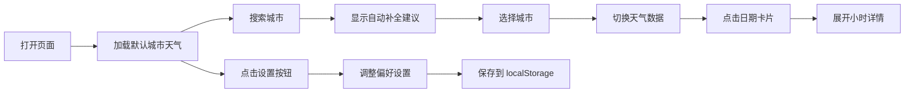

## 1. 产品概述

天气预报定制化仪表板是一个可高度个性化的天气信息展示平台，用户可以自定义显示偏好、布局方式和主题颜色，获得专属的天气数据体验。

- 主要目的：提供个性化、美观且信息丰富的天气预报界面，让用户根据自己的喜好定制天气仪表板
- 目标用户：关注天气信息、追求个性化体验的互联网用户
- 产品价值：打破传统天气应用千篇一律的界面，提供可定制的视觉体验和信息展示方式

## 2. 核心功能

### 2.1 用户角色

| 角色 | 注册方式 | 核心权限 |
|------|----------|----------|
| 普通用户 | 无需注册，直接使用 | 查看天气、搜索城市、定制偏好设置 |

### 2.2 功能模块

1. **天气展示区域**：5天天气预报卡片、小时级详情展开、温度曲线小图
2. **城市搜索模块**：搜索输入框、自动补全建议、最近搜索历史
3. **偏好设置模块**：主题切换、布局切换、显示参数开关
4. **数据持久化**：localStorage 存储用户偏好和搜索历史

### 2.3 页面详情

| 页面名称 | 模块名称 | 功能描述 |
|----------|----------|----------|
| 主页面 | 搜索栏 | 城市搜索输入，带防抖自动补全，最多5个建议 |
| 主页面 | 最近搜索侧边栏 | 显示最近5个搜索城市，点击快速切换 |
| 主页面 | 天气卡片组 | 显示今天和未来4天天气，卡片式布局 |
| 主页面 | 小时详情面板 | 点击某日卡片展开，显示24小时预报及温度曲线 |
| 主页面 | 偏好设置按钮 | 打开设置抽屉 |
| 偏好设置面板 | 主题设置 | 深色/浅色/自适应主题切换 |
| 偏好设置面板 | 布局设置 | 网格布局/列表布局切换 |
| 偏好设置面板 | 参数开关 | 温度、湿度、风速显示开关 |

## 3. 核心流程

用户打开页面 → 加载默认城市天气 → 可通过搜索框搜索新城市 → 搜索时显示自动补全建议 → 选择城市后切换天气数据 → 点击日期卡片展开小时详情 → 点击设置按钮调整偏好 → 偏好自动保存到本地

## 4. 用户界面设计

### 4.1 设计风格

- **主色调**：天空蓝到淡紫色的渐变背景（#4F9DF0 到 #B794F4）
- **卡片样式**：毛玻璃半透明效果（backdrop-filter: blur），白色半透明背景
- **字体**：大号粗体温度数字，中等大小的辅助文字
- **图标**：天气图标带有呼吸动画效果（淡入淡出循环）
- **动效**：平滑的滑动过渡效果，卡片悬停微交互
- **布局**：卡片式设计，响应式网格/列表布局

### 4.2 页面设计概述

| 页面名称 | 模块名称 | UI 元素 |
|----------|----------|---------|
| 主页面 | 搜索栏 | 圆角输入框、下拉建议列表、搜索图标 |
| 主页面 | 天气卡片 | 毛玻璃背景、天气图标、温度数字、湿度/风速/降水概率标签 |
| 主页面 | 小时详情 | 横向滑动的小时卡片、迷你温度曲线图 |
| 主页面 | 侧边栏 | 最近搜索城市列表、快速切换按钮 |
| 偏好面板 | 设置抽屉 | 从右侧滑出、开关控件、单选按钮组 |

### 4.3 响应式

- 桌面端：多列网格布局，侧边栏常驻
- 平板端：两列布局，侧边栏可收起
- 移动端：单列列表布局，搜索框置顶，侧边栏改为底部抽屉

### 4.4 动画与交互

- 天气图标呼吸动画：opacity 在 0.7-1.0 之间循环变化
- 卡片展开/收起：高度平滑过渡，内容淡入淡出
- 城市切换：卡片内容交叉淡入淡出，避免闪烁
- 搜索建议：下拉列表平滑展开
- 设置面板：从右侧滑入，背景遮罩淡入
