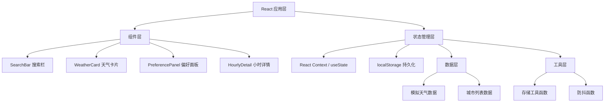

## 1. 架构设计



## 2. 技术描述

- **前端框架**：React 18 + TypeScript
- **构建工具**：Vite 5
- **状态管理**：React Context + useReducer
- **样式方案**：纯 CSS (CSS Modules) + CSS Variables
- **图标方案**：CDN 引入图标字体
- **数据来源**：模拟数据（mockData）
- **持久化方案**：localStorage

## 3. 目录结构

```
src/
├── types.ts              # 类型定义
├── mockData.ts           # 模拟数据
├── App.tsx               # 主应用组件
├── utils/
│   └── storage.ts        # 存储工具函数
└── components/
    ├── SearchBar.tsx     # 搜索栏组件
    ├── WeatherCard.tsx   # 天气卡片组件
    └── PreferencePanel.tsx # 偏好设置面板
```

## 4. 数据模型

### 4.1 核心类型定义

```typescript
interface City {
  id: string;
  name: string;
  country: string;
}

interface HourlyForecast {
  time: string;
  temp: number;
  humidity: number;
  windSpeed: number;
  weather: string;
  weatherIcon: string;
  precipitation: number;
}

interface DailyForecast {
  date: string;
  dayOfWeek: string;
  highTemp: number;
  lowTemp: number;
  humidity: number;
  windSpeed: number;
  weather: string;
  weatherIcon: string;
  precipitation: number;
  hourly: HourlyForecast[];
}

interface WeatherData {
  city: City;
  current: {
    temp: number;
    humidity: number;
    windSpeed: number;
    weather: string;
    weatherIcon: string;
    precipitation: number;
    feelsLike: number;
  };
  forecast: DailyForecast[];
}

interface UserPreferences {
  theme: 'light' | 'dark' | 'auto';
  layout: 'grid' | 'list';
  showTemperature: boolean;
  showHumidity: boolean;
  showWindSpeed: boolean;
}
```

### 4.2 存储数据结构

- `weather_preferences`: 用户偏好设置
- `recent_cities`: 最近搜索城市列表（最多5个）

## 5. 关键技术点

### 5.1 防抖搜索

搜索输入框使用 300ms 防抖，确保性能的同时提供流畅的自动补全体验。

### 5.2 主题系统

使用 CSS Variables 实现主题切换，支持浅色、深色和跟随系统三种模式。

### 5.3 响应式布局

使用 CSS Grid 和 Flexbox 实现响应式布局，断点设计：
- 移动端：< 640px
- 平板端：640px - 1024px
- 桌面端：> 1024px

### 5.4 动画效果

- CSS transition 实现平滑过渡
- @keyframes 实现呼吸动画
- transform 实现滑动效果

## 6. 文件清单

| 文件名 | 说明 |
|--------|------|
| package.json | 项目依赖和脚本配置 |
| vite.config.js | Vite 构建配置 |
| tsconfig.json | TypeScript 配置 |
| index.html | 入口 HTML 文件 |
| src/types.ts | 类型定义 |
| src/mockData.ts | 模拟数据 |
| src/App.tsx | 主应用组件 |
| src/components/SearchBar.tsx | 搜索栏组件 |
| src/components/WeatherCard.tsx | 天气卡片组件 |
| src/components/PreferencePanel.tsx | 偏好设置面板 |
| src/utils/storage.ts | localStorage 工具函数 |
