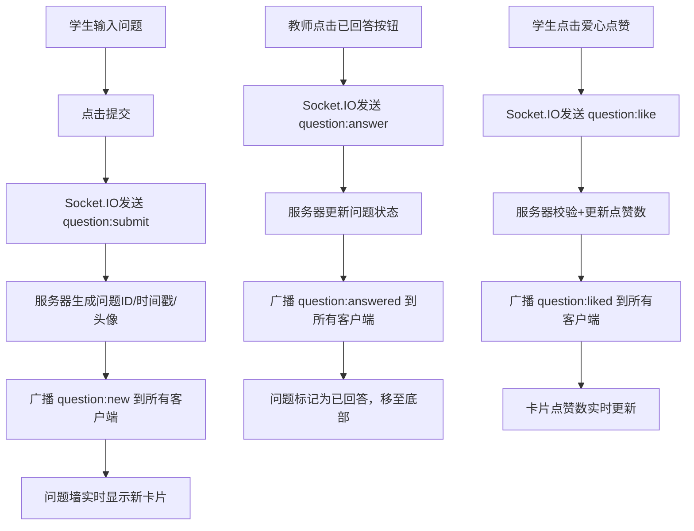

## 1. 产品概述

LiveQ&A 是一个面向在线教育直播课堂的实时匿名问答墙应用，让学员能够随时提问并参与讨论，同时保持课堂秩序不被打断。教师可通过标注已回答来管理问题，学生可点赞问题推动高关注度问题优先展示。

- 解决直播课堂中学生提问与教师管理的实时协作问题
- 目标用户：在线教育平台的教师和学员

## 2. 核心功能

### 2.1 用户角色

| 角色 | 进入方式 | 核心权限 |
|------|----------|----------|
| 学生 | 默认进入 | 提交问题、点赞问题、搜索过滤 |
| 教师 | 通过切换教师模式进入 | 提交问题、点赞问题、搜索过滤、标注已回答 |

### 2.2 功能模块

1. **问答墙页面**：问题提交、实时显示、搜索过滤、点赞、教师标注已回答

### 2.3 页面详情

| 页面名称 | 模块名称 | 功能描述 |
|----------|----------|----------|
| 问答墙 | 搜索栏 | 输入内容实时过滤问题列表（按问题内容匹配），过滤时保持已回答和排序逻辑 |
| 问答墙 | 问题卡片列表 | 展示问题内容、提交时间、匿名头像、已回答/未回答状态标签、点赞数；已回答问题自动移至底部 |
| 问答墙 | 问题提交区 | 固定在底部，输入问题内容（最多100字），点击提交；毛玻璃效果背景 |
| 问答墙 | 教师操作区 | 教师模式下每个卡片显示"已回答"按钮，点击标记已回答并同步所有客户端 |

## 3. 核心流程

**学生提问流程**：学生在底部输入框输入问题 → 点击提交 → 问题通过Socket.IO发送至服务器 → 服务器广播新问题到所有客户端 → 所有问题墙实时显示新问题卡片

**教师标注流程**：教师点击问题卡片"已回答"按钮 → 发送标注消息至服务器 → 服务器更新问题状态并广播变更 → 所有问题卡片状态同步更新，已回答问题移至底部

**点赞流程**：学生点击爱心图标 → 发送点赞消息至服务器 → 服务器校验是否重复点赞 → 广播点赞变更 → 卡片点赞数实时更新

## 4. 界面设计

### 4.1 设计风格

- 主色调：靛蓝（#3b82f6）代表未回答，翡翠绿（#10b981）代表已回答
- 背景色：浅蓝灰（#f0f4f8）
- 卡片样式：白色背景，圆角16px，浅阴影，悬停时阴影加深并上移
- 字体：标题使用粗体，正文使用常规字重
- 布局：卡片式布局，居中排列
- 图标：使用爱心图标表示点赞，绿色圆点脉冲动画表示已回答

### 4.2 页面设计概览

| 页面名称 | 模块名称 | UI元素 |
|----------|----------|--------|
| 问答墙 | 搜索栏 | 顶部搜索输入框，实时过滤 |
| 问答墙 | 问题卡片 | 白色圆角卡片，左上圆形头像，内容左对齐，底部点赞和已回答按钮 |
| 问答墙 | 提交区 | 底部固定，毛玻璃背景，渐变色提交按钮带涟漪动画 |
| 问答墙 | 角色切换 | 顶部切换学生/教师模式 |

### 4.3 响应式设计

- 桌面端：卡片最大宽度640px，居中显示
- 移动端：卡片宽度占满屏幕，缩小内边距
- 触摸优化：按钮和交互区域足够大

### 4.4 动画效果

- 问题卡片入场：从底部淡入上移，stagger 0.08s
- 悬停效果：阴影加深，translateY(-2px)过渡0.2s
- 点赞动画：爱心填充颜色，scale 1.2再回1
- 已回答标签：绿色圆点每2秒脉冲一次
- 提交按钮：涟漪扩散动画
