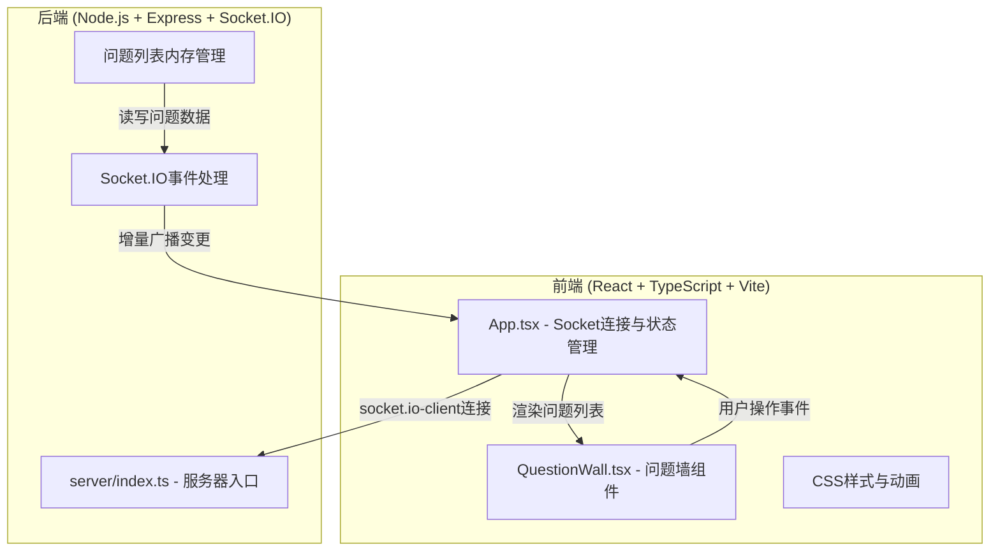
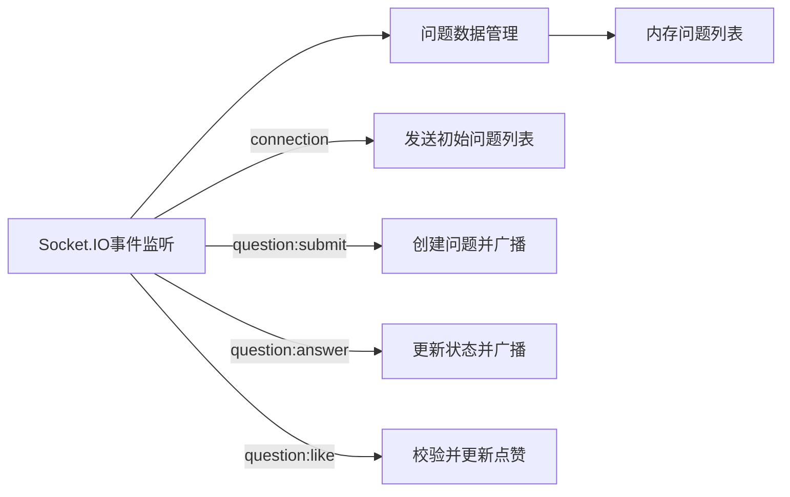
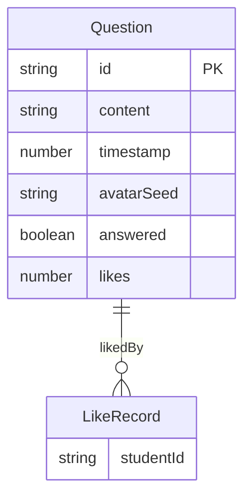

## 1. 架构设计



## 2. 技术说明

- 前端：React@18 + TypeScript + Vite + Socket.IO Client
- 初始化工具：vite-init (react-express-ts模板)
- 后端：Express@4 + Socket.IO
- 数据库：无（内存数据存储）
- 状态管理：React useState + Socket.IO实时同步
- 样式：CSS Modules / 内联样式

## 3. 路由定义

| 路由 | 用途 |
|------|------|
| / | 问答墙主页面 |

## 4. API定义（Socket.IO事件）

### 4.1 客户端 → 服务器事件

```typescript
interface QuestionSubmitPayload {
  content: string;
}

interface QuestionAnswerPayload {
  questionId: string;
}

interface QuestionLikePayload {
  questionId: string;
  studentId: string;
}
```

### 4.2 服务器 → 客户端事件

```typescript
interface Question {
  id: string;
  content: string;
  timestamp: number;
  avatarSeed: string;
  answered: boolean;
  likes: number;
  likedBy: string[];
}

interface QuestionsInitPayload {
  questions: Question[];
}

interface QuestionNewPayload {
  question: Question;
}

interface QuestionAnsweredPayload {
  questionId: string;
}

interface QuestionLikedPayload {
  questionId: string;
  likes: number;
  likedBy: string[];
}
```

### 4.3 事件列表

| 事件名 | 方向 | 载荷 | 说明 |
|--------|------|------|------|
| questions:init | 服务器→客户端 | QuestionsInitPayload | 新连接时发送完整问题列表 |
| question:submit | 客户端→服务器 | QuestionSubmitPayload | 学生提交问题 |
| question:new | 服务器→客户端 | QuestionNewPayload | 广播新问题（增量） |
| question:answer | 客户端→服务器 | QuestionAnswerPayload | 教师标注已回答 |
| question:answered | 服务器→客户端 | QuestionAnsweredPayload | 广播已回答状态变更（增量） |
| question:like | 客户端→服务器 | QuestionLikePayload | 学生点赞 |
| question:liked | 服务器→客户端 | QuestionLikedPayload | 广播点赞变更（增量） |

## 5. 服务器架构



## 6. 数据模型

### 6.1 数据模型定义



### 6.2 数据流向

1. **问题提交**：客户端 → `question:submit` → 服务器生成Question对象 → 广播 `question:new`（单条数据，<2KB）
2. **已回答标注**：客户端 → `question:answer` → 服务器更新answered字段 → 广播 `question:answered`（仅ID，<100B）
3. **点赞**：客户端 → `question:like` → 服务器校验+更新likes/likedBy → 广播 `question:liked`（ID+计数，<500B）
4. **初始同步**：客户端连接 → 服务器发送 `questions:init`（全量列表）
