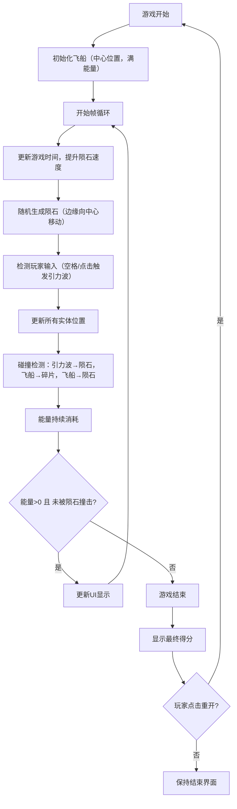

## 1. 产品概述

《陨石救援》是一款基于 Canvas2D 的太空题材动作小游戏，玩家在小行星带中操作飞船，通过释放引力波推开袭来的陨石，同时收集能量碎片维持护盾生存。

- **核心玩法**：能量管理 + 引力波防御 + 碎片收集
- **目标用户**：休闲游戏玩家，喜欢太空题材和简单操作的用户
- **产品价值**：提供紧张刺激的生存体验，考验玩家的反应速度和策略规划

## 2. 核心特性

### 2.1 功能模块
1. **游戏主界面**：游戏画布、背景星空、实时状态显示
2. **飞船系统**：位置控制、能量管理、护盾状态、引力波释放
3. **陨石系统**：随机生成、移动跟踪、碰撞检测、尺寸分级
4. **碎片系统**：能量碎片生成、收集判定、藏于陨石群机制
5. **UI 系统**：得分显示、能量条、连击数、游戏结束界面

### 2.2 页面详情
| 页面名称 | 模块名称 | 功能描述 |
|----------|----------|----------|
| 游戏主界面 | 背景层 | 深空蓝紫渐变、闪烁星星动画 |
| 游戏主界面 | 游戏实体层 | 飞船、陨石、能量碎片的绘制与更新 |
| 游戏主界面 | 特效层 | 引力波波纹、粒子特效、飞船尾迹 |
| 游戏主界面 | UI 叠加层 | 得分、能量、连击数显示（毛玻璃风格） |
| 游戏结束界面 | 结束弹窗 | 最终得分、重新开始按钮 |

## 3. 核心流程

## 4. 用户界面设计

### 4.1 设计风格
- **主色调**：深空蓝紫渐变背景（#0a0a1a → #1a0a2e → #0d1a3d）
- **强调色**：荧光青色（#00ffff）用于文字和UI边框
- **飞船**：三角形，带流光尾迹，主体白色渐变
- **陨石**：大中小三种，灰褐色（#4a4a4a、#5a5a5a、#6a6a6a），带随机裂痕
- **引力波**：半透明白色波纹，扩散时伴有粒子特效
- **能量碎片**：青蓝色发光菱形，带有脉冲动画
- **UI 面板**：半透明毛玻璃效果（background: rgba(255,255,255,0.08)，backdrop-filter: blur(10px)）

### 4.2 页面设计概览
| 页面名称 | 模块名称 | UI 元素 |
|----------|----------|----------|
| 游戏主界面 | 背景 | 深空渐变、100+闪烁星星、分层视差效果 |
| 游戏主界面 | 飞船 | 白色三角形态、蓝色流光尾迹、护盾光环 |
| 游戏主界面 | 陨石 | 不规则多边形、随机裂痕、旋转动画 |
| 游戏主界面 | 引力波 | 白色半透明圆环扩散、粒子溅射效果 |
| 游戏主界面 | 能量碎片 | 青色发光菱形、呼吸脉冲动画 |
| 游戏主界面 | 左上角UI | 毛玻璃面板、荧光青色文字（得分、能量条、连击） |
| 游戏结束界面 | 弹窗 | 居中毛玻璃面板、"游戏结束"标题、最终得分、重开按钮 |

### 4.3 响应性
- **全屏自适应**：Canvas 自动适配窗口大小，保持游戏区域比例
- **输入适配**：同时支持鼠标点击拖拽和空格键操作
- **性能目标**：稳定 60FPS，支持 50+ 陨石同时渲染无卡顿

### 4.4 动效设计
- **星星闪烁**：随机透明度变化，不同速度
- **飞船尾迹**：粒子跟随，渐变消失
- **引力波释放**：圆环快速扩张，透明度衰减
- **陨石碎裂**：大陨石被击中分裂为小陨石
- **碎片收集**：被吸引时加速飞向飞船，收集时有闪光特效
- **连击提示**：连续击碎陨石时数字放大弹跳
