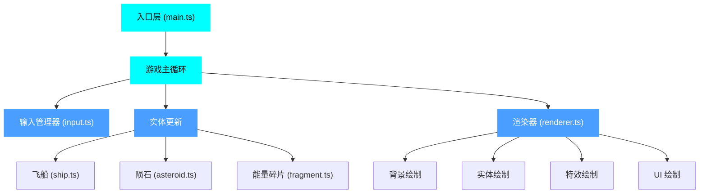

## 1. 架构设计



## 2. 技术描述

- **前端框架**：纯 TypeScript + HTML5 Canvas2D
- **构建工具**：Vite 5.x
- **语言版本**：TypeScript 5.x，target ES2020，严格模式
- **无第三方游戏引擎**：所有逻辑和渲染原生实现
- **无额外依赖**：仅 vite 和 typescript
- **资源生成**：所有图形资源程序化生成（无外部图片/音频）

## 3. 文件结构

```
项目根目录/
├── package.json          # 项目配置，仅依赖 vite 和 typescript
├── index.html            # 入口页面，内置全屏 Canvas 容器
├── tsconfig.json         # TypeScript 配置（严格模式，ES2020）
├── vite.config.js        # Vite 基础配置
└── src/
    ├── main.ts           # 游戏主循环、初始化、事件绑定、帧调度
    ├── ship.ts           # 飞船类：位置、能量、引力波、绘制
    ├── asteroid.ts       # 陨石类：生成、移动、碰撞、销毁
    ├── fragment.ts       # 碎片类：生成、跟踪、收集判定
    ├── renderer.ts       # 渲染器：绘制顺序、背景特效、UI叠加
    └── input.ts          # 输入管理器：鼠标/键盘事件映射
```

## 4. 核心数据结构

### 4.1 实体基类（接口）
```typescript
interface Entity {
  x: number;
  y: number;
  radius: number;
  active: boolean;
  update(dt: number, gameState: GameState): void;
  draw(ctx: CanvasRenderingContext2D): void;
}
```

### 4.2 游戏状态
```typescript
interface GameState {
  score: number;
  energy: number;
  maxEnergy: number;
  combo: number;
  gameTime: number;
  isGameOver: boolean;
  asteroids: Asteroid[];
  fragments: Fragment[];
  ship: Ship;
}
```

### 4.3 飞船状态
```typescript
interface ShipState {
  x: number;
  y: number;
  energy: number;
  maxEnergy: number;
  gravityWaveActive: boolean;
  gravityWaveRadius: number;
  gravityWaveMaxRadius: number;
  trail: { x: number; y: number; alpha: number }[];
}
```

### 4.4 陨石类型
```typescript
type AsteroidSize = 'small' | 'medium' | 'large';

interface AsteroidState {
  x: number;
  y: number;
  vx: number;
  vy: number;
  size: AsteroidSize;
  radius: number;
  rotation: number;
  rotationSpeed: number;
  health: number;
  cracks: { x: number; y: number; length: number }[];
  containsFragment: boolean;
}
```

## 5. 性能优化策略

### 5.1 渲染优化
- **离屏 Canvas**：星空背景预渲染到离屏 Canvas，每帧只需绘制一次
- **对象池**：陨石和碎片使用对象池复用，避免频繁 GC
- **批量绘制**：同类实体批量绘制，减少状态切换
- **视口剔除**：超出屏幕范围的实体跳过渲染（但保留逻辑更新）

### 5.2 逻辑优化
- **空间分区**：使用网格空间分区优化碰撞检测
- **帧率控制**：使用 `requestAnimationFrame` + 固定时间步长更新
- **粒子上限**：粒子系统设置最大数量，超过时复用最早的粒子
- **碰撞优化**：先做圆形包围盒检测，再做精确检测

### 5.3 内存优化
- **对象池模式**：所有可复用实体使用对象池
- **数组预分配**：实体数组预分配足够容量
- **及时清理**：失效实体立即标记，每帧统一清理

## 6. 关键算法

### 6.1 引力波碰撞检测
```
对于每个陨石：
  计算陨石到飞船中心的距离 dist
  如果 dist 在引力波当前半径范围内
    计算击退方向（从中心向外）
    根据陨石质量施加击退速度
    减少陨石生命值
    如果生命归零，分裂或销毁
```

### 6.2 能量消耗与恢复
```
每帧消耗：energy -= energyDrainRate * dt
收集碎片：energy = min(energy + fragmentValue, maxEnergy)
能量归零：游戏结束
```

### 6.3 陨石生成算法
```
生成间隔：baseInterval / (1 + gameTime * difficultyFactor)
生成位置：屏幕边缘外随机位置
目标方向：指向飞船当前位置（带随机偏移）
初始速度：baseSpeed * (1 + gameTime * speedFactor)
尺寸概率：large 20%, medium 50%, small 30%
藏碎片概率：陨石群中的大陨石 30% 概率藏有碎片
```

### 6.4 连击系统
```
击碎陨石时：
  如果距离上次击碎时间 < comboTimeout：
    combo += 1
    score += baseScore * comboMultiplier
  否则：
    combo = 1
    score += baseScore
```
