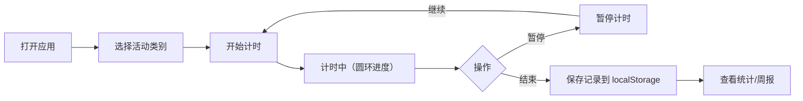

## 1. 产品概述
时间追踪应用帮助用户记录和分析每日时间使用情况，解决工作学习中分心、时间去向不明确的问题。
- 目标用户：需要管理时间的学生、上班族、自由职业者
- 核心价值：可视化时间分配，提升专注力和工作效率

## 2. 核心功能

### 2.1 用户角色
| 角色 | 注册方式 | 核心权限 |
|------|---------|---------|
| 普通用户 | 无需注册，本地存储 | 使用全部功能，数据存储在浏览器 localStorage |

### 2.2 功能模块
1. **计时器页面**：大圆环进度指示器、开始/暂停/结束按钮、活动类别选择
2. **类别管理页面**：类别 CRUD、颜色图标选择、拖拽排序网格
3. **统计面板页面**：饼图（时间占比）、柱状图（时段分布）、Tooltip 悬浮
4. **周报页面**：7天汇总、折线图趋势、最专注/最浪费时间活动推荐

### 2.3 页面详情
| 页面名称 | 模块名称 | 功能描述 |
|---------|---------|----------|
| 计时器 | 圆环进度 | 显示当前计时秒数，颜色从绿色渐变为红色 |
| 计时器 | 控制按钮 | 开始/暂停/结束，带按压回弹动画 |
| 类别管理 | 类别网格 | 可拖拽排序，弹性动画 |
| 类别管理 | 编辑器 | 创建/编辑类别，选择12种颜色和8种图标 |
| 统计面板 | 饼图 | Canvas 绘制各类别时间占比 |
| 统计面板 | 柱状图 | Canvas 绘制每小时时段耗时 |
| 统计面板 | Tooltip | 鼠标悬浮显示具体数值 |
| 周报 | 汇总数据 | 总时长、类别总时长、日平均专注时长 |
| 周报 | 折线图 | 7天每日总时长变化趋势 |
| 周报 | 推荐文字 | 最专注活动和最浪费时间活动 |

## 3. 核心流程
用户打开应用 → 选择活动类别 → 点击开始计时 → 计时中可暂停或结束 → 结束后自动保存记录 → 查看统计分析报告

## 4. 用户界面设计

### 4.1 设计风格
- 主题：深色模式
- 主背景：`#1A1A2E`
- 卡片背景：`#16213E`
- 强调色：`#E94560`
- 按钮风格：圆角、点击下压回弹动画
- 字体：系统无衬线字体
- 布局：卡片式布局，顶部导航栏（桌面）/底部 Tab 栏（移动端）
- 图标：8种预设图标（工作、学习、运动、娱乐、休息、会议、阅读、其他）
- 颜色：12种预设颜色供类别选择

### 4.2 页面设计概述
| 页面名称 | 模块名称 | UI 元素 |
|---------|---------|--------|
| 计时器 | 导航栏 | 4个标签页，底部发光线条切换动画 |
| 计时器 | 圆环指示器 | 大圆环，颜色渐变，秒数居中显示 |
| 计时器 | 控制按钮 | 3个按钮，按压缩放动画 |
| 类别管理 | 网格布局 | 可拖拽卡片，弹性动画 |
| 类别管理 | 选择器 | 颜色/图标网格选择器 |
| 统计面板 | 图表容器 | 双 Canvas，卡片 stagger 淡入动画 |
| 周报 | 数据卡片 | 统计数值卡片，折线图 |

### 4.3 响应式
- 桌面端（≥768px）：顶部导航栏，卡片横向排列
- 移动端（<768px）：底部 Tab 栏，卡片纵向排列，触控优化
- 所有交互支持触摸操作

### 4.4 动画规范
- 页面加载：卡片依次淡入上移（stagger，间隔80ms）
- 按钮点击：下压（scale 0.95）→ 回弹（scale 1.05）→ 恢复（scale 1）
- 卡片点击：轻微缩放反馈
- 导航切换：底部发光线条滑动动画
- 拖拽排序：弹性缓动动画
- 圆环进度：颜色随时间从绿色→黄色→红色渐变
