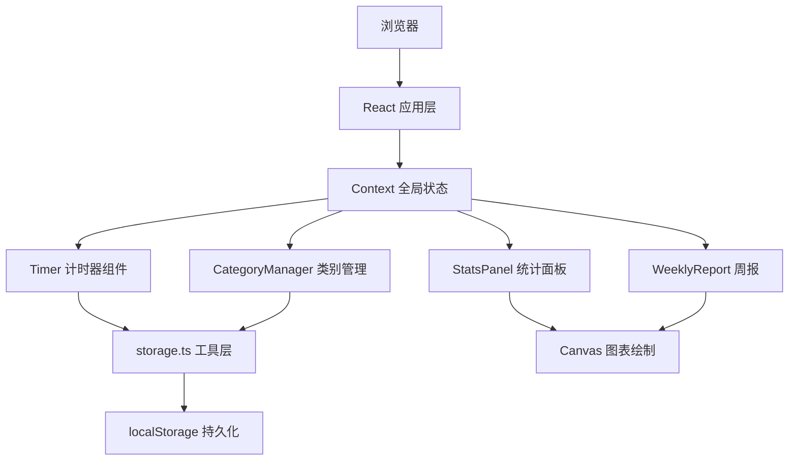

## 1. 架构设计
纯前端应用，数据存储在浏览器 localStorage，无后端依赖。



## 2. 技术描述
- 前端：React 18 + TypeScript + Vite
- 状态管理：React Context + useReducer
- 数据存储：localStorage（浏览器本地）
- 图表：原生 Canvas API 绘制
- 拖拽：原生 HTML5 Drag and Drop API
- 动画：CSS Transitions + requestAnimationFrame

### 依赖说明
- `react` ^18.2.0
- `react-dom` ^18.2.0
- `typescript` ^5.0.0
- `vite` ^5.0.0
- `@vitejs/plugin-react` ^4.0.0

## 3. 路由定义
单页应用，使用状态控制标签页切换，无 URL 路由。

| 标签页 | 对应组件 | 功能 |
|-------|---------|------|
| timer | Timer.tsx | 计时功能主页面 |
| category | CategoryManager.tsx | 活动类别管理 |
| stats | StatsPanel.tsx | 当日统计图表 |
| weekly | WeeklyReport.tsx | 7天周报分析 |

## 4. 数据模型

### 4.1 类型定义

```typescript
interface Category {
  id: string;
  name: string;
  color: string;
  icon: string;
  order: number;
}

interface TimeRecord {
  id: string;
  categoryId: string;
  startTime: number;
  endTime: number;
  duration: number;
  date: string;
}

interface TimerState {
  isRunning: boolean;
  isPaused: boolean;
  currentCategoryId: string | null;
  startTime: number | null;
  elapsedSeconds: number;
}

interface AppState {
  categories: Category[];
  records: TimeRecord[];
  timer: TimerState;
  activeTab: 'timer' | 'category' | 'stats' | 'weekly';
}
```

### 4.2 localStorage 键名
- `time_tracker_categories` - 类别列表
- `time_tracker_records` - 计时记录

## 5. 文件结构
```
e:\solo\VersionFastPro\tasks\auto20\
├── package.json
├── vite.config.js
├── tsconfig.json
├── index.html
└── src\
    ├── App.tsx
    ├── main.tsx
    ├── index.css
    ├── components\
    │   ├── Timer.tsx
    │   ├── CategoryManager.tsx
    │   ├── StatsPanel.tsx
    │   └── WeeklyReport.tsx
    ├── utils\
    │   └── storage.ts
    └── types\
        └── index.ts
```

## 6. 性能要求
- 计时器刷新频率：每秒 1 次
- 图表重渲染响应时间：≤ 100ms
- localStorage 读写：异步处理，不阻塞 UI
- 动画帧率：≥ 60fps
