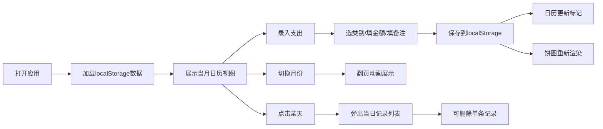

## 1. 产品概述

家庭开支记账小工具，帮助家庭成员随手记录日常开销，通过可视化分析了解消费结构。所有数据存储在浏览器本地，无需注册登录，开箱即用。

- 核心目标：让记账变得简单快捷，通过可视化图表直观展示钱花在哪里
- 目标用户：家庭成员、个人理财用户
- 产品价值：快速记账 + 直观分析，帮助养成理财习惯

## 2. 核心功能

### 2.1 功能模块

1. **支出录入表单**：类别选择、金额输入、备注填写、类别管理（增改）
2. **日历视图主页**：月份日历展示、彩色圆点标记支出、点击查看当日记录
3. **统计面板**：饼图展示本月类别占比、悬停详情、颜色与类别对应

### 2.2 页面详情

| 页面名称 | 模块名称 | 功能描述 |
|-----------|-------------|---------------------|
| 主页面 | 顶部导航栏 | 固定半透明毛玻璃效果，显示应用标题和当前月份 |
| 主页面 | 支出录入表单 | 下拉选择类别、数字输入金额、文本备注、保存按钮、类别管理弹窗 |
| 主页面 | 日历视图 | 7列网格日历、彩色圆点标记支出日、月份切换翻页动画、当日记录弹出层 |
| 主页面 | 统计面板 | Recharts饼图、悬停放大凸显、显示金额和百分比 |

## 3. 核心流程

## 4. 用户界面设计

### 4.1 设计风格

- **主色调**：深蓝色 `#1e3a5f`，配白色文字 `#ffffff`
- **辅助色**：各类别自定义颜色标签（8色预设）
- **卡片样式**：圆角 `12px`，轻微阴影 `0 4px 20px rgba(0,0,0,0.15)`
- **字体**：主字体 'Segoe UI'，标题加粗，正文常规
- **动效**：平滑淡入淡出 `transition: 0.3s ease`，翻页 `transform + opacity`
- **导航栏**：`position: fixed`，`backdrop-filter: blur(12px)`，半透明

### 4.2 页面设计概览

| 页面名称 | 模块名称 | UI元素 |
|-----------|-------------|-------------|
| 主页面 | 顶部导航 | 左对齐标题，中间月份切换箭头 |
| 主页面 | 录入表单 | 三列布局：类别下拉 + 金额输入 + 备注，保存按钮右对齐 |
| 主页面 | 日历视图 | 7×6网格，顶部星期表头，日期格子悬停高亮 |
| 主页面 | 统计面板 | 饼图居中，图例在右，悬停tooltip |

### 4.3 响应式设计

- Desktop-first 设计，优先适配 1280px 以上
- 平板端：表单改为两列布局，饼图缩小
- 移动端：单列布局，日历格子缩小字号，饼图自适应宽度
- 触摸优化：所有可点击区域最小 44×44px

### 4.4 性能指标

- 日历视图：12个月范围切换无卡顿（< 100ms 单月渲染）
- 饼图渲染：< 200ms 完成首次渲染
- 数据存储：使用 localStorage 异步读写，不阻塞 UI
