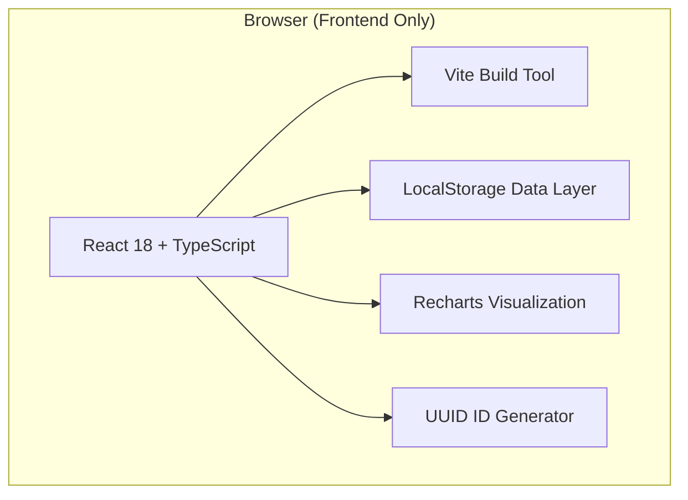
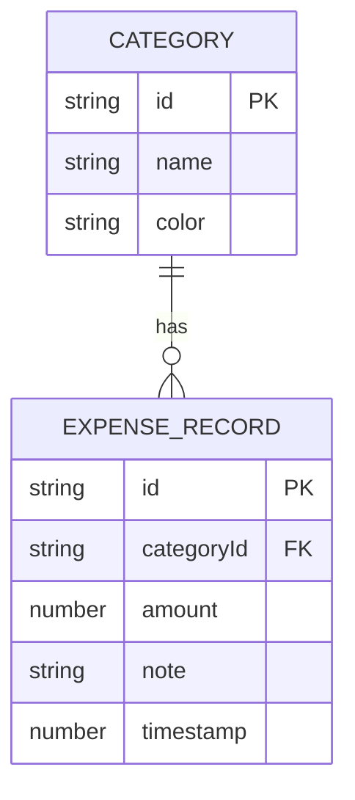

## 1. 架构设计



纯前端单页应用，无后端服务。React 组件树自上而下传递状态，localStorage 作为持久化层。

## 2. 技术说明

- **前端框架**：React 18 + TypeScript（严格模式）
- **构建工具**：Vite 5.x + @vitejs/plugin-react
- **图表库**：Recharts 2.x（饼图 PieChart + Cell + Tooltip）
- **ID生成**：uuid 9.x
- **样式方案**：原生 CSS + CSS Variables（深蓝主题）
- **数据存储**：浏览器 localStorage（JSON 序列化）

## 3. 组件结构

| 组件路径 | 职责 |
|-------|---------|
| `src/App.tsx` | 全局状态管理、数据持久化、组件编排、布局容器 |
| `src/components/ExpenseForm.tsx` | 支出录入表单、类别管理弹窗、数据校验 |
| `src/components/CalendarView.tsx` | 月份日历渲染、彩色圆点、日期点击弹层、月份翻页动画 |
| `src/components/StatisticsPanel.tsx` | 数据聚合、饼图渲染、悬停交互、图例展示 |

## 4. 类型定义

```typescript
interface Category {
  id: string;
  name: string;
  color: string;
}

interface ExpenseRecord {
  id: string;
  categoryId: string;
  amount: number;
  note: string;
  timestamp: number; // Date.getTime()
}

interface AppState {
  categories: Category[];
  records: ExpenseRecord[];
  currentMonth: string; // 'YYYY-MM'
}
```

## 5. 数据模型

### 5.1 ER图



### 5.2 localStorage 存储键

| 键名 | 类型 | 初始值 |
|------|------|--------|
| `expense_tracker_categories` | `Category[]` | 8个默认类别（餐饮/交通/购物/娱乐/居住/医疗/教育/其他） |
| `expense_tracker_records` | `ExpenseRecord[]` | `[]` |

## 6. 状态管理策略

- **方案**：React 内置 useState + useEffect（轻量级，无需 zustand）
- **数据流**：
  1. App.tsx 初始化时从 localStorage 读取
  2. 通过 props 向下传递 categories / records
  3. 子组件回调触发 App.tsx 中的更新函数
  4. useEffect 监听数据变化，自动同步到 localStorage
- **性能优化**：
  - 使用 useMemo 缓存月度数据过滤结果
  - 日历切换使用 CSS transform 动画，不重算数据
  - 饼图数据使用 useMemo 聚合
