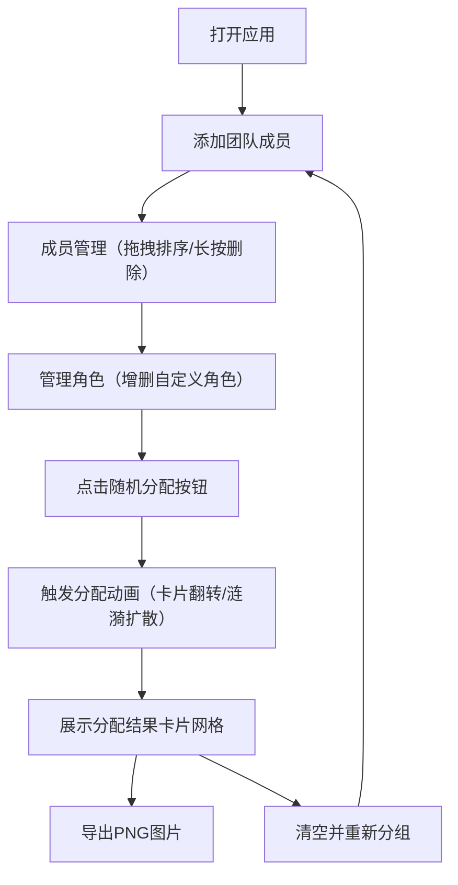

## 1. 产品概述

团队组建与角色分配应用，帮助用户在线快速完成团队成员管理与角色随机分配，解决传统线下分组效率低、角色分配不透明的问题。

- 主要用途：团队分组、课堂分组、活动分组、项目组角色分配
- 目标用户：教师、团队Leader、活动组织者、项目经理
- 产品价值：高效透明地完成团队组建与角色分配，过程可视化、结果可分享

## 2. 核心功能

### 2.1 功能模块

1. **成员管理模块**：添加成员、自动生成头像、拖拽排序、长按删除
2. **角色分配模块**：预设角色管理、自定义角色增删、随机分配动画、一键重置
3. **成果展示与导出模块**：卡片网格展示、PNG图片导出、清空重新分组

### 2.2 页面详情

| 页面名称 | 模块名称 | 功能描述 |
|-----------|-------------|---------------------|
| 主页面 | 成员管理 | 输入姓名添加成员，自动生成彩色头像（姓名首字母+随机背景色），成员列表支持拖拽排序（平滑动画），长按成员弹出确认对话框删除 |
| 主页面 | 角色分配 | 展示预设角色列表（队长、记录员、发言人、计时员、执行者），支持自定义新增/删除角色，点击"随机分配"按钮触发打乱与分配动画（卡片翻转/涟漪扩散），确保一人一角色，支持一键重置 |
| 主页面 | 成果展示 | 分配结果以多行卡片网格展示，每张卡片显示头像、姓名、角色及徽标，支持一键导出PNG图片，支持清空结果重新分组 |

## 3. 核心流程

用户打开应用 → 添加团队成员（可拖拽排序、删除）→ 管理角色（增删自定义角色）→ 点击随机分配 → 触发分配动画展示结果 → 导出PNG或清空重新开始

## 4. 用户界面设计

### 4.1 设计风格

- **主色调**：蓝紫渐变色主题，深蓝到深紫渐变背景
- **卡片样式**：毛玻璃效果（半透明背景 `backdrop-filter: blur()` + 模糊滤镜），悬停时轻微上浮阴影 + 边框发光动画
- **按钮样式**：圆角胶囊形状，点击时收缩再回弹的交互动画反馈
- **头像样式**：圆形裁剪 + 颜色填充 + 白色首字母
- **动效设计**：卡片淡入上升入场动画、卡片翻转/涟漪扩散分配动画、拖拽平滑动画
- **字体**：现代无衬线字体，中文优先使用系统字体

### 4.2 页面设计概述

| 页面名称 | 模块名称 | UI元素 |
|-----------|-------------|-------------|
| 主页面 | 头部标题 | 渐变文字标题、副标题描述 |
| 主页面 | 成员管理区 | 输入框+添加按钮、成员卡片列表（圆形头像+姓名+拖拽手柄） |
| 主页面 | 角色管理区 | 角色标签列表、添加角色输入框、删除按钮 |
| 主页面 | 操作按钮区 | 随机分配按钮（胶囊渐变）、重置按钮 |
| 主页面 | 结果展示区 | 响应式卡片网格（桌面多列/手机单列）、导出PNG按钮、清空按钮 |

### 4.3 响应式设计

- **桌面端**：多列卡片网格布局，左侧成员管理、右侧角色管理或上下布局
- **移动端**：单列布局，所有区域垂直堆叠，卡片全宽展示
- **触摸优化**：长按手势支持、拖拽触摸适配、足够的按钮点击区域

### 4.4 性能要求

- 100个成员分配时动画流畅不低于30FPS
- 分配逻辑在50ms内完成
- 页面加载动画平滑无卡顿
