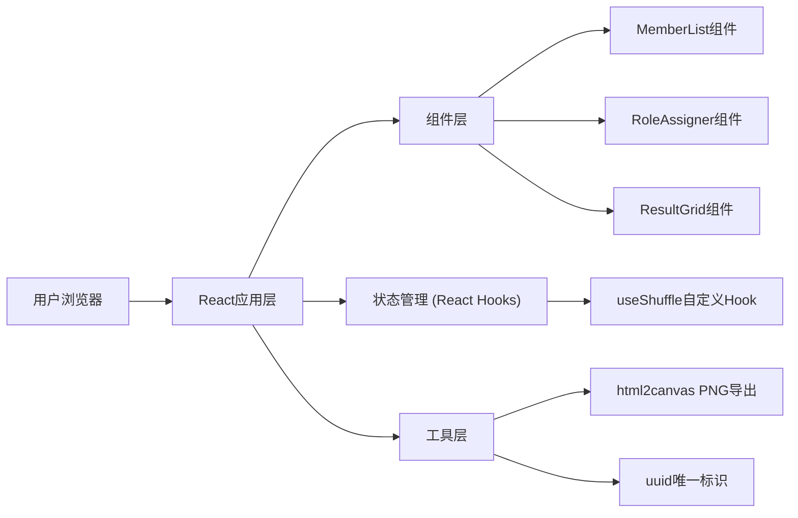

## 1. 架构设计

纯前端应用架构，无需后端服务，所有状态在前端管理。



## 2. 技术描述

- **前端框架**：React 18 + TypeScript
- **构建工具**：Vite 5 + @vitejs/plugin-react
- **状态管理**：React useState/useReducer + 自定义Hook (useShuffle)
- **样式方案**：纯CSS + CSS Modules/CSS变量，毛玻璃效果使用backdrop-filter
- **动画方案**：CSS transitions/animations + React key帧动画
- **第三方依赖**：
  - uuid：生成成员与角色的唯一ID
  - html2canvas：将DOM节点导出为PNG图片

## 3. 项目文件结构

| 文件路径 | 用途 |
|----------|------|
| /package.json | 项目依赖与脚本配置 |
| /vite.config.js | Vite构建配置与开发服务器设置 |
| /tsconfig.json | TypeScript严格模式与ESNext模块解析配置 |
| /index.html | 应用挂载入口HTML |
| /src/App.tsx | 主应用组件，管理整体布局与全局状态 |
| /src/components/MemberList.tsx | 成员列表组件，含添加、拖拽排序、删除功能 |
| /src/components/RoleAssigner.tsx | 角色管理与随机分配组件，含自定义角色与分配动画 |
| /src/components/ResultGrid.tsx | 成果展示卡片网格组件，含导出PNG功能 |
| /src/hooks/useShuffle.ts | 自定义Hook，封装分配逻辑与动画触发 |

## 4. 数据模型

### 4.1 类型定义

```typescript
interface Member {
  id: string;
  name: string;
  avatarColor: string;
  initial: string;
}

interface Role {
  id: string;
  name: string;
  icon: string;
  color: string;
}

interface Assignment {
  memberId: string;
  roleId: string;
}

interface AssignResult {
  member: Member;
  role: Role | null;
  animationDelay: number;
}
```

### 4.2 预设数据

- **预设角色**：队长（👑）、记录员（📝）、发言人（📢）、计时员（⏱️）、执行者（⚡）
- **头像颜色池**：一组美观的蓝紫色系渐变色供随机分配

## 5. 核心算法

### 5.1 Fisher-Yates 洗牌算法
用于角色随机打乱，确保公平性与随机性，时间复杂度O(n)，满足50ms内完成100个成员的分配。

### 5.2 拖拽排序
使用HTML5 Drag and Drop API或触摸事件实现，配合CSS transform实现平滑动画。

### 5.3 动画触发机制
使用useShuffle Hook管理动画状态，通过设置animationDelay实现卡片错峰入场效果。
