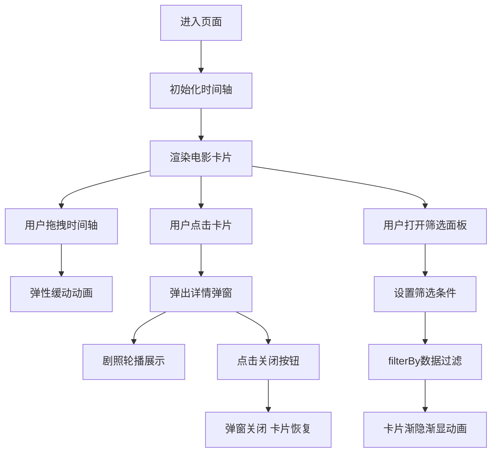

## 1. 产品概述

电影时光轴是一个沉浸式影史浏览应用，通过交互式时间线可视化展示百年影史经典影片，让电影爱好者以独特的视觉方式探索电影艺术的发展历程。

- 核心价值：将影史经典影片以时间轴形式呈现，提供直观、有趣的电影探索体验
- 目标用户：电影爱好者、影视从业者、学生及研究者
- 解决问题：传统电影列表缺乏时间维度的可视化，难以直观感受电影发展脉络

## 2. 核心功能

### 2.1 用户角色
| 角色 | 注册方式 | 核心权限 |
|------|----------|----------|
| 访客用户 | 无需注册 | 浏览时间轴、查看电影详情、使用筛选功能 |

### 2.2 功能模块
1. **时间轴主界面**：横向时间线展示、电影卡片布局、拖拽缩放交互
2. **详情弹窗模块**：电影剧照轮播、剧情简介、主演列表展示
3. **侧边筛选面板**：导演筛选、类型筛选、评分范围筛选

### 2.3 页面详情
| 页面名称 | 模块名称 | 功能描述 |
|---------|----------|----------|
| 主页面 | 时间轴引擎 | 年份区间管理、卡片布局计算、拖拽滚动逻辑、弹性缓动动画 |
| 主页面 | 电影卡片 | 旧式电影票根样式设计、展示年份/片名/导演/评分、点击触发详情 |
| 主页面 | 详情弹窗 | 毛玻璃背景、剧照自动轮播、淡入淡出切换、主演标签、关闭按钮 |
| 主页面 | 侧边筛选 | 导演下拉选择、类型复选框组、评分双滑块区间选择、动态过滤动画 |

## 3. 核心流程

用户进入页面后，首先看到横向时间轴展示按年份排列的经典电影卡片。用户可以拖拽时间轴浏览不同年代的影片，点击感兴趣的卡片弹出详情弹窗查看完整信息。同时，用户可以通过侧边筛选面板按导演、类型或评分范围过滤显示的电影卡片，筛选结果以平滑的渐隐渐显动画呈现。

## 4. 用户界面设计

### 4.1 设计风格
- **主色调**：深灰色背景 (#1a1a1a) 搭配暖金色点缀 (#d4af37)，营造复古电影氛围
- **标题栏**：丝绒红色 (#8b0000) 背景，白色加粗字体
- **卡片设计**：旧式电影票根样式，锯齿边角，做旧纹理背景（CSS渐变模拟）
- **字体选择**：
  - 年份标签：衬线字体 (Playfair Display)
  - 正文内容：经典无衬线字体 (Georgia)
- **动画风格**：弹性缓动 (cubic-bezier(0.68, -0.55, 0.265, 1.55))、淡入淡出、平滑过渡

### 4.2 页面设计概述
| 页面名称 | 模块名称 | UI 元素 |
|---------|----------|---------|
| 主页面 | 顶部标题栏 | 丝绒红背景、白色加粗标题、副标题 |
| 主页面 | 时间轴区域 | 横向时间线、年份刻度标签、电影票根卡片 |
| 主页面 | 电影卡片 | 锯齿边角、做旧纹理、年份/片名/导演/评分信息 |
| 主页面 | 详情弹窗 | 毛玻璃背景 (backdrop-filter)、剧照轮播、剧情段落、主演标签、关闭按钮 |
| 主页面 | 侧边筛选面板 | 导演下拉菜单、类型复选框组、评分双滑块、应用筛选按钮 |

### 4.3 响应式设计
- **桌面端 (≥768px)**：横向时间轴布局，卡片水平排列，侧边筛选面板从右侧滑入
- **移动端 (<768px)**：时间轴自动切换为垂直布局，卡片缩小并上下排列，筛选面板改为底部滑入
- **触摸优化**：增大点击区域，支持触摸拖拽，优化移动端交互体验

### 4.4 性能要求
- 拖拽时间轴时帧率不低于 30FPS
- 筛选过滤时卡片动画流畅无卡顿
- 使用 CSS transform 和 opacity 实现硬件加速动画
- 合理使用 will-change 优化渲染性能
