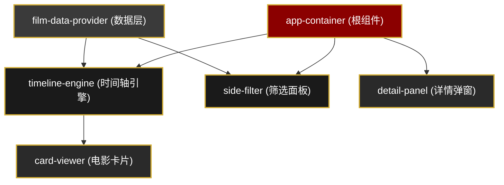
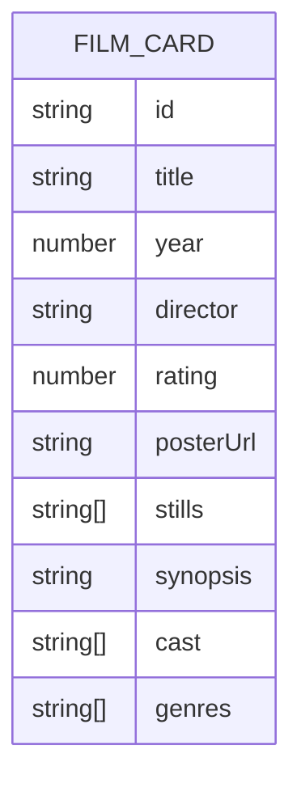

## 1. 架构设计

本项目采用模块化前端架构，基于 Web Components + TypeScript + Lit 构建，通过自定义事件实现模块间解耦通信。



## 2. 技术描述

- **前端框架**：Lit 3.1 + TypeScript 5.4
- **构建工具**：Vite 5.2（esbuild 压缩）
- **模块系统**：原生 Web Components + Shadow DOM 样式隔离
- **通信机制**：CustomEvent 自定义事件实现组件间解耦
- **包管理**：npm

### 核心依赖
```json
{
  "lit": "^3.1.0",
  "vite": "^5.2.0",
  "typescript": "^5.4.0",
  "@types/node": "^20.11.0"
}
```

## 3. 模块定义

| 模块文件 | 职责描述 | 核心功能 |
|---------|----------|----------|
| `src/app-container.ts` | 根组件 | 初始化子模块、事件监听协调、全局状态管理 |
| `src/timeline-engine.ts` | 时间轴核心引擎 | 年份区间管理、卡片布局计算、拖拽滚动逻辑、弹性缓动动画 |
| `src/film-data-provider.ts` | 数据提供层 | 内置 20+ 经典电影元数据、条件筛选 filterBy 方法 |
| `src/card-viewer.ts` | 电影卡片组件 | 旧式电影票根样式渲染、数据展示、点击交互 |
| `src/detail-panel.ts` | 详情弹窗组件 | 毛玻璃背景、剧照轮播、剧情展示、主演标签、关闭交互 |
| `src/side-filter.ts` | 侧边筛选组件 | 导演下拉、类型复选框、评分双滑块、筛选事件派发 |

## 4. 自定义事件定义

```typescript
// card-select: 用户点击电影卡片
interface CardSelectEventDetail {
  cardId: string;
  cardData: FilmCardData;
}

// filter-applied: 用户应用筛选条件
interface FilterAppliedEventDetail {
  director: string | null;
  genres: string[];
  ratingMin: number;
  ratingMax: number;
}

// filter-change: 筛选结果变化
interface FilterChangeEventDetail {
  filteredCards: FilmCardData[];
}

// close-detail: 关闭详情弹窗
interface CloseDetailEventDetail {
  cardId: string;
}
```

## 5. 数据模型定义



### 电影数据结构
```typescript
interface FilmCardData {
  id: string;
  title: string;
  year: number;
  director: string;
  rating: number;
  posterUrl: string;
  stills: string[];
  synopsis: string;
  cast: string[];
  genres: string[];
}
```

## 6. 文件结构

```
auto29/
├── package.json
├── index.html
├── vite.config.js
├── tsconfig.json
└── src/
    ├── app-container.ts
    ├── timeline-engine.ts
    ├── film-data-provider.ts
    ├── card-viewer.ts
    ├── detail-panel.ts
    └── side-filter.ts
```

## 7. 性能优化策略

1. **渲染性能**：
   - 使用 CSS `transform` 和 `opacity` 实现动画，启用 GPU 加速
   - 合理使用 `will-change` 提示浏览器优化
   - 拖拽时使用 `requestAnimationFrame` 确保帧率稳定

2. **内存管理**：
   - 组件销毁时移除事件监听器
   - 取消未完成的动画帧请求
   - 及时清理定时器和轮播间隔

3. **动画优化**：
   - 筛选时使用 CSS transition 实现渐隐渐显
   - 弹性缓动使用 cubic-bezier 曲线
   - 批量 DOM 更新，减少重排重绘
