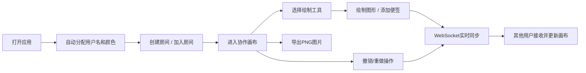

## 1. 产品概述

在线协作白板应用，支持多个用户同时在无限画布上绘制、添加图形和便签，所有操作实时同步。解决远程团队协作、头脑风暴、在线教学等场景下的可视化交流需求，提供流畅的多人实时协作体验。

## 2. 核心功能

### 2.1 用户角色

| 角色 | 注册方式 | 核心权限 |
|------|----------|----------|
| 普通用户 | 自动分配匿名身份 | 创建/加入房间、绘制图形、添加便签、撤销重做、导出画布 |

### 2.2 功能模块

1. **主界面**：无限画布、顶部工具栏、侧边用户列表、底部操作栏
2. **房间管理**：创建房间、加入房间、房间号自动生成
3. **画布操作**：自由绘制、矩形/圆形图形、文本便签、选中变换（移动/缩放/旋转）
4. **实时同步**：WebSocket消息广播、用户状态同步、操作历史同步
5. **历史管理**：撤销（最多50步）、重做、操作历史记录
6. **导出功能**：PNG图片导出、Loading动画

### 2.3 页面详情

| 页面名称 | 模块名称 | 功能描述 |
|----------|----------|----------|
| 主界面 | 用户身份区 | 左上角显示随机用户名和颜色，支持修改用户名 |
| 主界面 | 房间管理 | 自动生成房间号，支持输入房间号加入 |
| 主界面 | 工具栏 | 画笔颜色/粗细选择、图形类型选择（画笔/矩形/圆形/便签） |
| 主界面 | 无限画布 | 支持缩放（0.5x-3x）、平移（中键或Ctrl+左键）、网格背景 |
| 主界面 | 用户列表 | 侧边栏显示在线用户，颜色圆点指示，淡入淡出动画 |
| 主界面 | 底部操作栏 | 撤销/重做按钮，操作平滑过渡 |
| 主界面 | 导出按钮 | 右上角导出PNG，3秒Loading动画 |

## 3. 核心流程

用户打开应用 → 自动分配用户名和颜色 → 创建房间（自动生成房间号）或输入房间号加入 → 选择工具开始绘制/添加图形 → 操作通过WebSocket实时同步给房间内其他用户 → 可随时撤销/重做操作 → 点击导出按钮生成PNG图片

## 4. 用户界面设计

### 4.1 设计风格
- **主色调**：深色主题，背景 `#1a1a2e`，卡片/侧边栏 `#16213e`
- **强调色**：选中边框 `#00b4d8`，悬停状态 `#0f3460`，文字 `#e2e8f0`
- **画布背景**：浅灰网格 `#2a2a4e`，网格线 `#3a3a5e`
- **便签样式**：黄色背景 `#ffeb3b`，黑色文字，14px字号，轻微阴影
- **按钮风格**：扁平图标，圆角 `border-radius: 8px`，悬停平滑过渡 `transition: 0.2s`
- **字体**：现代无衬线字体，清晰可读
- **动画**：用户列表淡入淡出 `0.3s`，按钮切换 `0.2s`，画布变化平滑过渡

### 4.2 页面设计概述

| 页面名称 | 模块名称 | UI元素 |
|----------|----------|--------|
| 主界面 | 顶部工具栏 | 房间号显示、用户名编辑、工具选择器、颜色选择器、粗细调节、导出按钮 |
| 主界面 | 中心画布 | 无限画布、网格背景、图形元素、选中边框（蓝色虚线）、变换手柄（实心小方块） |
| 主界面 | 右侧用户列表 | 用户卡片、颜色圆点、用户名、加入/离开淡入动画 |
| 主界面 | 底部操作栏 | 撤销按钮、重做按钮、状态提示 |

### 4.3 响应式设计
- 桌面端优先设计，侧边栏固定宽度
- 画布区域自适应剩余空间
- 工具栏按钮尺寸适合鼠标操作

## 5. 性能要求
- 同时显示100个图形元素和5个在线用户时，绘制延迟 ≤ 100ms
- WebSocket消息使用MessagePack二进制格式减小负载
- 画布更新频率限制为每秒最多30帧
- 高DPI屏幕支持清晰渲染
