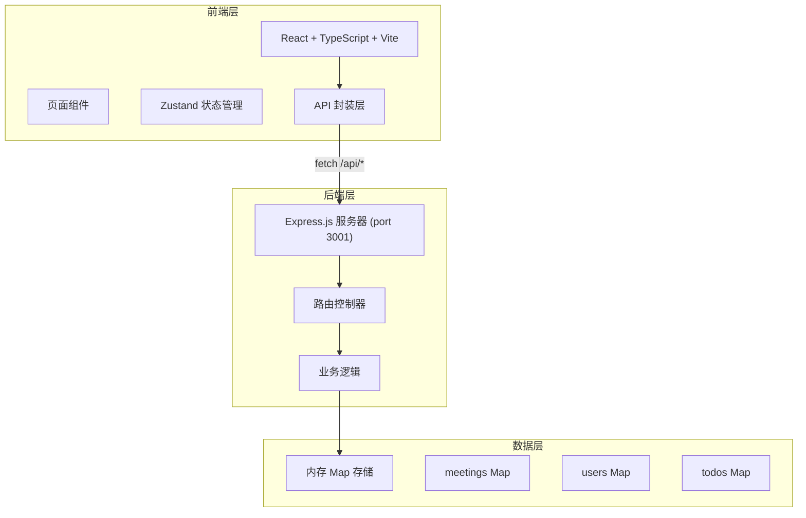
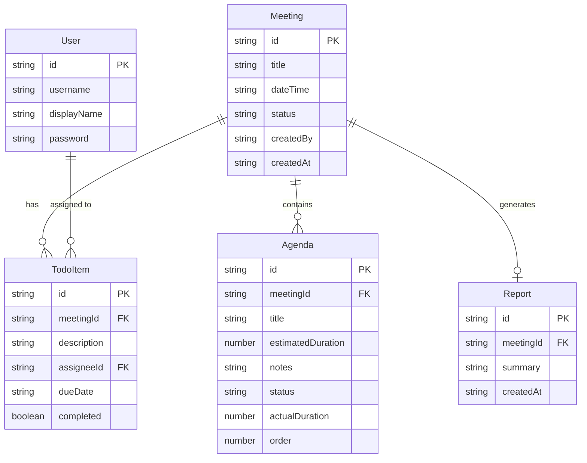

## 1. 架构设计



## 2. 技术说明

- 前端：React@18 + TypeScript + Vite + Tailwind CSS
- 初始化工具：vite-init (react-express-ts 模板)
- 后端：Express.js（ESM格式，server.mjs）
- 数据库：内存 Map 存储（无需数据库）
- 状态管理：Zustand
- 路由：react-router-dom
- 日期处理：date-fns
- 唯一标识：uuid
- 图标：lucide-react

## 3. 路由定义

| 路由 | 用途 |
|------|------|
| /login | 用户登录页面 |
| / | 主页，历史会议列表 |
| /meetings/new | 创建新会议 |
| /meetings/:id | 会议详情/纪要报告页 |
| /meetings/:id/record | 实时记录页面 |

## 4. API 定义

### 认证

```
POST /api/login
Request:  { username: string, password: string }
Response: { user: { id, username, displayName }, token: string }
```

### 会议

```
POST /api/meetings
Request:  { title: string, dateTime: string, participantIds: string[], agendas: { title: string, estimatedDuration: number }[] }
Response: Meeting

GET /api/meetings
Response: Meeting[]（按创建时间倒序）

GET /api/meetings/:id
Response: Meeting（含 agendas 和 todos）

PUT /api/meetings/:id
Request:  { agendas?: Agenda[], status?: string, ...partial Meeting }
Response: Meeting
```

### 纪要报告

```
POST /api/meetings/:id/report
Response: { report: Report }（自动生成纪要并提取待办）

GET /api/meetings/:id/report
Response: Report
```

### 待办事项

```
POST /api/todos
Request:  { meetingId: string, description: string, assigneeId: string, dueDate: string }
Response: TodoItem

PUT /api/todos/:id
Request:  { description?: string, assigneeId?: string, dueDate?: string, completed?: boolean }
Response: TodoItem

DELETE /api/todos/:id
Response: { success: boolean }
```

## 5. 服务器架构图

```mermaid
flowchart LR
    "Express 路由" --> "控制器函数"
    "控制器函数" --> "数据操作"
    "数据操作" --> "内存 Map"
```

## 6. 数据模型

### 6.1 数据模型定义



### 6.2 TypeScript 类型定义

```typescript
interface User {
  id: string;
  username: string;
  displayName: string;
  password: string;
}

interface Agenda {
  id: string;
  meetingId: string;
  title: string;
  estimatedDuration: number;
  notes: string;
  status: 'pending' | 'completed' | 'skipped';
  actualDuration: number;
  order: number;
  startedAt?: string;
}

interface Meeting {
  id: string;
  title: string;
  dateTime: string;
  participantIds: string[];
  agendas: Agenda[];
  status: 'scheduled' | 'in_progress' | 'completed';
  createdBy: string;
  createdAt: string;
}

interface TodoItem {
  id: string;
  meetingId: string;
  description: string;
  assigneeId: string;
  dueDate: string;
  completed: boolean;
}

interface Report {
  id: string;
  meetingId: string;
  summary: string;
  createdAt: string;
}
```
