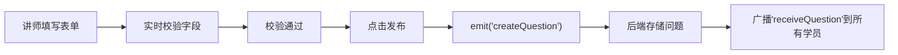
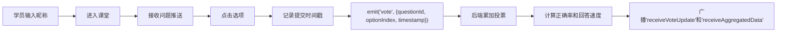
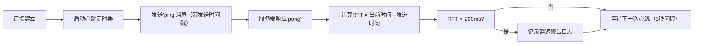

## 1. 产品概述
实时课堂互动问答系统，解决组织内部培训或技能分享活动中讲师难以评估学员掌握程度、学员缺少即时反馈渠道的问题。通过实时投票、答题统计和知识点热力图，提升课堂互动效率和教学效果。

## 2. 核心功能

### 2.1 用户角色
| 角色 | 注册方式 | 核心权限 |
|------|---------|---------|
| 讲师 | 直接进入 | 创建问题、关闭问题、查看实时统计、查看知识点热力图 |
| 学员 | 输入昵称匿名进入 | 接收问题、匿名答题、查看正确答案 |

### 2.2 功能模块
1. **讲师面板**：问题创建表单、问题列表、实时统计条形图、知识点热力图
2. **学员面板**：昵称输入、问题卡片展示、答题选项、答案解析
3. **实时通信层**：WebSocket双向通信、心跳监控、RTT延迟测量
4. **数据统计层**：投票统计、正确率计算、回答速度统计、知识点掌握度聚合

### 2.3 页面详情
| 页面名称 | 模块名称 | 功能描述 |
|---------|---------|---------|
| 讲师面板 | 问题创建表单 | 支持单选/多选、题目文本、选项列表、正确答案标志、知识点标签，实时校验（题目非空、选项≥2个、正确答案≥1个） |
| 讲师面板 | 实时统计图表 | 动态条形图展示各选项投票人数与百分比，每秒刷新带缓动动画，正确选项绿色高亮 |
| 讲师面板 | 知识点热力图 | 色块矩阵展示学员对各知识点的掌握程度，支持鼠标滚轮缩放、拖拽平移 |
| 学员面板 | 问题卡片 | 接收讲师发布的问题，以卡片形式展示，选项按钮点击高亮，提交后只读 |
| 学员面板 | 答案解析 | 问题关闭后显示正确答案和解析 |
| 全局 | WebSocket监控 | 心跳包定期发送，测量RTT往返时间，超过200ms记录日志报警 |

## 3. 核心流程

### 3.1 讲师创建问题流程

### 3.2 学员答题流程

### 3.3 WebSocket心跳监控流程

## 4. 用户界面设计

### 4.1 设计风格
- **主色调**：海洋蓝 `#1a3a5c`，搭配白色背景
- **卡片样式**：圆角 `8px`，阴影 `0 4px 12px rgba(0,0,0,0.1)`
- **交互效果**：hover时`transform: translateY(-2px)`，阴影加深，过渡`0.2s ease-out`
- **动画效果**：
  - 问题卡片淡入：`opacity 0→1, 0.3s`
  - 热力图色块切换：`background-color 0.3s`
  - 条形图数据更新：framer-motion缓动动画

### 4.2 页面设计概述
| 页面