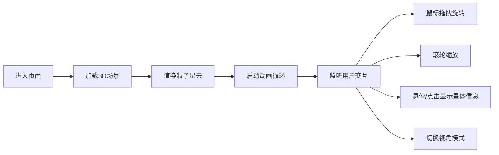

## 1. 产品概述
粒子星云星图是一个基于Web的交互式3D星空可视化应用，通过浏览器呈现壮观的螺旋星系效果。用户可以自由探索宇宙，与星体互动，获得沉浸式的天文观赏体验。

- **主要目的**：创建一个视觉震撼、交互流畅的3D星空可视化工具，让用户以第一视角探索虚拟星系
- **目标用户**：天文爱好者、创意设计人员、普通用户
- **市场价值**：作为教育展示、艺术装置、网页背景等多场景应用

## 2. 核心功能

### 2.1 用户角色
| 角色 | 注册方式 | 核心权限 |
|------|----------|----------|
| 访客用户 | 无需注册 | 浏览星系、交互查看星体信息、切换视角模式 |

### 2.2 功能模块
1. **3D星系渲染**：2000+粒子组成的螺旋星云，光谱渐变色，动态大小变化
2. **视角交互**：鼠标拖拽旋转、滚轮缩放、自由视角/自动环绕切换
3. **星体信息**：悬停/点击弹出信息卡片，显示星体名称和虚拟属性
4. **动画效果**：星系缓慢自转、星体随机闪烁脉冲
5. **UI控制面板**：底部半透明控制条，显示统计信息和操作提示

### 2.3 页面详情
| 页面名称 | 模块名称 | 功能描述 |
|---------|---------|----------|
| 主页面 | 3D场景容器 | 全屏渲染粒子星云，支持鼠标交互 |
| 主页面 | 底部控制条 | 星系名称、星体数量统计、操作提示、视角切换按钮 |
| 主页面 | 星体信息卡片 | 悬停/点击星体时显示详细信息 |

## 3. 核心流程
用户进入页面后，自动加载并渲染3D星系场景。用户可以通过鼠标拖拽旋转视角，滚轮缩放查看细节，悬停或点击星体查看信息，点击视角切换按钮在自由视角和自动环绕模式间切换。

## 4. 用户界面设计

### 4.1 设计风格
- **主色调**：纯黑背景 (#000000)，蓝白色调文字 (#87CEEB, #FFFFFF)
- **辅助色**：光谱渐变色（蓝 #0066FF → 白 #FFFFFF → 红 #FF3300）
- **按钮样式**：圆角毛玻璃效果，半透明背景，悬浮时微亮
- **字体**：现代无衬线字体，采用 font-feature-settings 优化显示
- **布局风格**：全屏沉浸式，底部固定控制条
- **视觉效果**：毛玻璃（backdrop-filter: blur）、柔和发光、渐变透明

### 4.2 页面设计概述
| 页面名称 | 模块名称 | UI元素 |
|---------|---------|--------|
| 主页面 | 3D场景 | 全屏Canvas、2000+粒子星体、螺旋分布、光谱渐变 |
| 主页面 | 控制条 | 左侧：星系名称 + 星体数量统计；中间：操作提示文字；右侧：视角切换按钮 |
| 主页面 | 信息卡片 | 半透明圆角卡片，显示星体名称、光谱类型、亮度等级 |

### 4.3 响应性
- 桌面端优先，全屏自适应
- 支持窗口大小变化时自动调整渲染尺寸
- 触控设备支持触摸滑动旋转、双指缩放

### 4.4 3D场景指引
- **环境**：纯黑背景，营造宇宙深空氛围
- **光照**：采用粒子自发光，无需额外光源
- **相机**：PerspectiveCamera，初始距离1000，视场角75度
- **相机运动**：OrbitControls 支持拖拽旋转、滚轮缩放；自动环绕模式缓慢公转
- **构图**：螺旋星系为视觉中心，粒子向外围逐渐稀疏
- **交互**：Raycaster 进行星体拾取，悬停高亮效果
- **后处理**：粒子加色混合，营造发光效果
- **性能**：使用 BufferGeometry 和 Points 优化渲染，目标60FPS
