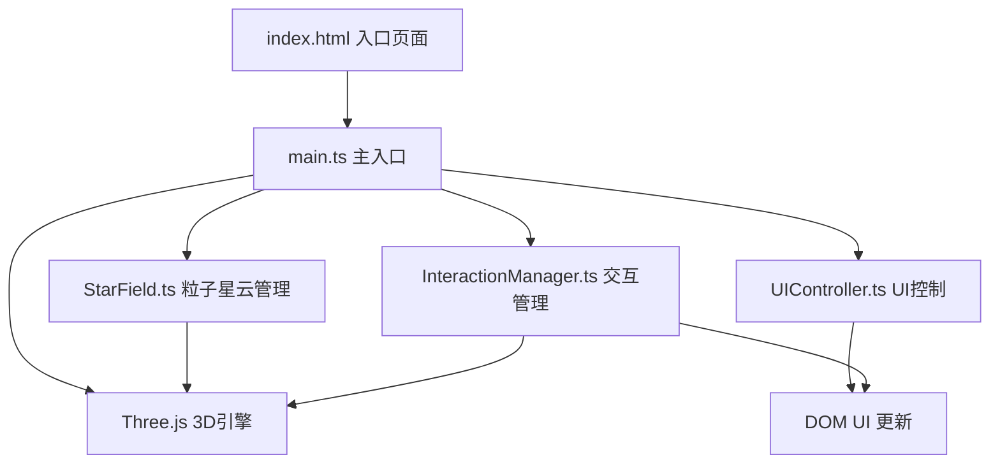

## 1. 架构设计



## 2. 技术描述

- **前端**：TypeScript@5 + Three.js@0.160 + Vite@5
- **构建工具**：Vite 5.x
- **UI层**：原生HTML/CSS，毛玻璃效果
- **3D渲染**：Three.js Points + BufferGeometry
- **交互**：Three.js OrbitControls + Raycaster

## 3. 项目结构

| 文件路径 | 作用 |
|---------|------|
| `/package.json` | 项目依赖和脚本配置 |
| `/index.html` | 入口HTML，包含Canvas容器和UI结构 |
| `/tsconfig.json` | TypeScript配置（严格模式，ES2020） |
| `/vite.config.js` | Vite构建配置 |
| `/src/main.ts` | 主入口，初始化场景、相机、渲染器，启动动画循环 |
| `/src/StarField.ts` | 粒子星云生成、位置颜色计算、动画更新 |
| `/src/InteractionManager.ts` | 鼠标拖拽、滚轮缩放、悬停点击拾取 |
| `/src/UIController.ts` | 底部UI显示更新、视角模式切换 |

## 4. 核心模块设计

### 4.1 StarField 类
```typescript
class StarField {
  // 2000+粒子数据
  positions: Float32Array
  colors: Float32Array
  sizes: Float32Array
  starData: Array<{name: string, spectralType: string, brightness: number}>
  
  generateSpiralGalaxy(): void  // 螺旋星系算法
  updateRotation(elapsed: number): void  // 自转动画
  updatePulse(elapsed: number): void  // 闪烁脉冲
  getStarInfo(index: number): StarInfo  // 获取星体信息
}
```

### 4.2 InteractionManager 类
```typescript
class InteractionManager {
  raycaster: THREE.Raycaster
  mouse: THREE.Vector2
  hoveredStar: number | null
  
  setupControls(camera: Camera, domElement: HTMLElement): void
  onMouseMove(event: MouseEvent): void
  onClick(event: MouseEvent): void
  onWheel(event: WheelEvent): void
  getIntersectedStar(): number | null
}
```

### 4.3 UIController 类
```typescript
class UIController {
  updateStarCount(count: number): void
  showStarCard(info: StarInfo, x: number, y: number): void
  hideStarCard(): void
  toggleViewMode(): 'free' | 'auto'
  getViewMode(): 'free' | 'auto'
}
```

## 5. 性能优化策略

1. **几何体优化**：使用 BufferGeometry 而非 Geometry，减少内存占用
2. **粒子系统**：使用 Points 而非 Mesh，单Draw Call渲染所有粒子
3. **材质优化**：使用 PointsMaterial，开启 transparent 和 blending
4. **动画优化**：仅更新 uniform 变量，避免每帧重建几何体
5. **拾取优化**：限制 raycaster 检测频率，仅在鼠标移动时检测
6. **像素比控制**：限制 renderer.setPixelRatio 为 Math.min(window.devicePixelRatio, 2)

## 6. 数据模型

### 6.1 星体数据结构
```typescript
interface StarInfo {
  id: number
  name: string
  spectralType: 'O' | 'B' | 'A' | 'F' | 'G' | 'K' | 'M'
  brightness: number  // 0.0 - 10.0
  distance: number    // 距离中心距离
  color: string       // 十六进制颜色
}
```

### 6.2 光谱类型映射
| 类型 | 颜色 | 温度 | 描述 |
|------|------|------|------|
| O | 蓝 #0066FF | 30000K+ | 蓝色巨星 |
| B | 蓝白 #99BBFF | 10000-30000K | 蓝白色主序星 |
| A | 白 #FFFFFF | 7500-10000K | 白色主序星 |
| F | 黄白 #FFFFCC | 6000-7500K | 黄白色次巨星 |
| G | 黄 #FFCC66 | 5200-6000K | 黄色主序星（如太阳） |
| K | 橙 #FF9933 | 3700-5200K | 橙色红巨星 |
| M | 红 #FF3300 | 2400-3700K | 红色红矮星 |
