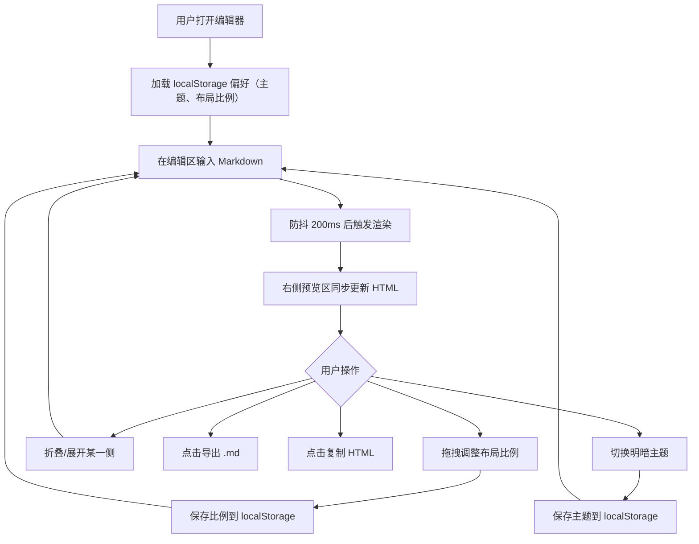

## 1. 产品概述

一款轻量级在线 Markdown 编辑器，解决浏览器中无法实时所见即所得的痛点，为开发者和技术写作者提供实时渲染、双栏预览、一键导出的流畅写作体验。

- 核心目标：让用户在浏览器中编辑 Markdown 时，右侧同步渲染为格式化 HTML，实现真正的所见即所得
- 目标用户：开发者、技术博客作者、文档编写者

## 2. 核心功能

### 2.1 功能模块

1. **编辑器主页**：Markdown 编辑区 + 实时预览区 + 底部工具栏

### 2.2 页面详情

| 页面名称 | 模块名称 | 功能描述 |
|----------|----------|----------|
| 编辑器主页 | 编辑区 | 左侧 Markdown 文本输入区，支持语法高亮提示，防抖 200ms 后触发渲染 |
| 编辑器主页 | 预览区 | 右侧实时渲染 HTML 预览，支持标题、列表、代码块（暗色背景+行号+横向滚动）、表格、图片等语法 |
| 编辑器主页 | 双栏布局 | 编辑区/预览区可单独折叠/展开，拖拽分隔条调整左右宽度比例，偏好保存至 localStorage |
| 编辑器主页 | 工具栏 | 导出 .md 文件、复制 HTML（保留样式）、明/暗主题切换按钮 |
| 编辑器主页 | 主题切换 | 明/暗两种主题，切换时编辑区背景、字体颜色、预览区边框平滑过渡 0.3s，偏好持久化 |
| 编辑器主页 | 响应式适配 | <768px 时自动切换为上下布局 |

## 3. 核心流程

用户打开编辑器 → 在左侧输入 Markdown 文本 → 右侧预览区同步渲染 HTML → 通过拖拽调整编辑/预览比例 → 折叠/展开某一侧 → 点击工具栏导出 .md 或复制 HTML → 切换明暗主题 → 所有偏好自动保存

## 4. 用户界面设计

### 4.1 设计风格

- 主色调：深蓝 (#1E3A5F) + 浅灰 (#F5F7FA)
- 按钮样式：圆角渐变，悬停时上浮阴影，点击回弹动画（scale 0.95→1.0）
- 字体：编辑器使用等宽字体（JetBrains Mono / Fira Code），预览区使用系统字体
- 布局：现代卡片式布局，编辑区和预览区各为独立卡片
- 图标：使用 lucide-react 图标库

### 4.2 页面设计概览

| 页面名称 | 模块名称 | UI 元素 |
|----------|----------|----------|
| 编辑器主页 | 编辑区卡片 | 深色背景 textarea，等宽字体，行号，顶部标签栏（可折叠按钮） |
| 编辑器主页 | 预览区卡片 | 白色背景，格式化 HTML 渲染，代码块暗色背景+行号+横向滚动，顶部标签栏（可折叠按钮） |
| 编辑器主页 | 拖拽分隔条 | 窄条状，悬停变色，拖拽时高亮 |
| 编辑器主页 | 底部工具栏 | 渐变圆角按钮组（导出、复制、主题切换），图标+文字 |

### 4.3 响应式设计

- 桌面端（≥768px）：左右双栏布局，可拖拽调整比例
- 移动端（<768px）：自动切换为上下布局，编辑区在上，预览区在下，不可拖拽
- 所有过渡动画使用 CSS transition

### 4.4 性能指标

- 连续输入 500 字内渲染延迟 < 100ms（防抖 200ms 优化）
- 内存占用稳定在 60MB 以下
