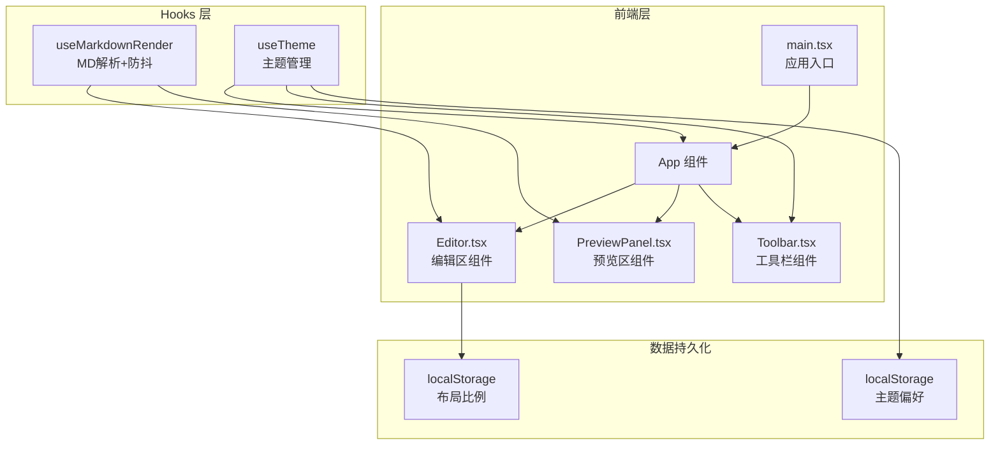

## 1. 架构设计



## 2. 技术说明

- 前端：React@18 + TypeScript + Vite
- 初始化工具：vite-init (react-ts 模板)
- 样式：CSS Modules + CSS 变量（主题切换）
- Markdown 解析：react-markdown + remark-gfm（GFM 表格/任务列表支持）+ rehype-highlight（代码高亮）
- 状态管理：React useState/useCallback + 自定义 Hooks（无需 zustand，单页面简单状态）
- 数据持久化：localStorage
- 后端：无

## 3. 路由定义

| 路由 | 用途 |
|------|------|
| / | 编辑器主页，包含编辑区、预览区、工具栏 |

## 4. 文件组织结构

```
├── package.json
├── vite.config.ts
├── tsconfig.json
├── index.html
└── src/
    ├── main.tsx
    ├── App.tsx
    ├── App.css
    ├── components/
    │   ├── Editor.tsx
    │   ├── PreviewPanel.tsx
    │   └── Toolbar.tsx
    └── hooks/
        ├── useMarkdownRender.ts
        └── useTheme.ts
```

## 5. 核心依赖

| 依赖 | 版本 | 用途 |
|------|------|------|
| react | ^18 | UI 框架 |
| react-dom | ^18 | DOM 渲染 |
| react-markdown | ^9 | Markdown 转 React 组件 |
| remark-gfm | ^4 | GFM 语法扩展（表格、任务列表、删除线） |
| rehype-highlight | ^7 | 代码块语法高亮 |
| type-fest | ^4 | TypeScript 类型工具 |
| @types/react | ^18 | React 类型定义 |
| @types/react-dom | ^18 | ReactDOM 类型定义 |
| @vitejs/plugin-react | ^4 | Vite React 插件 |

## 6. 组件接口设计

### Editor.tsx Props
```typescript
interface EditorProps {
  content: string
  theme: 'light' | 'dark'
  onChange: (value: string) => void
}
```

### PreviewPanel.tsx Props
```typescript
interface PreviewPanelProps {
  content: string
  theme: 'light' | 'dark'
}
```

### Toolbar.tsx Props
```typescript
interface ToolbarProps {
  content: string
  theme: 'light' | 'dark'
  onToggleTheme: () => void
}
```

### useMarkdownRender Hook
```typescript
function useMarkdownRender(content: string, delay?: number): {
  renderedHtml: string
  isRendering: boolean
}
```

### useTheme Hook
```typescript
function useTheme(): {
  theme: 'light' | 'dark'
  toggleTheme: () => void
}
```
