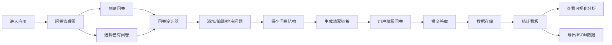

## 1. 产品概述
在线调查问卷设计与数据收集平台，为用户提供便捷的问卷创建、发布、填写和统计分析一体化解决方案。
- 面向需要快速收集意见反馈的个人用户和小型团队，解决传统纸质问卷效率低下、统计繁琐的痛点
- 提供可视化问卷设计、实时数据收集、智能统计分析三大核心价值，降低问卷制作门槛

## 2. 核心特性

### 2.1 用户角色
| 角色 | 注册方式 | 核心权限 |
|------|----------|----------|
| 普通用户 | 无需注册，本地浏览器访问 | 创建、编辑、删除问卷；填写问卷；查看统计结果；导出数据 |

### 2.2 功能模块
1. **问卷设计器**：问题列表、编辑面板、拖拽排序、实时预览
2. **问卷填写页**：动态表单渲染、必填校验、答案提交
3. **统计看板**：答案分布图表、多维度数据可视化、导出功能
4. **问卷管理**：问卷列表、创建/编辑/删除、多问卷切换

### 2.3 页面详情
| 页面名称 | 模块名称 | 功能描述 |
|----------|----------|----------|
| 问卷设计器 | 左侧问题列表 | 展示所有问题，支持拖拽排序、添加、删除、选中编辑 |
| 问卷设计器 | 右侧编辑面板 | 编辑选中问题的题型、标题、选项、必填性，实时预览填写效果 |
| 问卷填写页 | 动态表单 | 根据JSON结构渲染问题，支持5种题型，悬停动画效果 |
| 问卷填写页 | 提交校验 | 提交前检查必答题，未完成时提示用户 |
| 统计看板 | 图表卡片 | 单选/多选饼图、评分柱状图、文本题列表，卡片入场动画 |
| 问卷管理 | 问卷列表 | 展示所有问卷，支持创建、编辑、删除、跳转 |

## 3. 核心流程
用户进入应用后，先在问卷管理页面创建或选择问卷，进入设计器编辑问题结构，完成后可分享问卷链接供他人填写，填写数据实时汇总，最后通过统计看板查看可视化分析结果。

## 4. 用户界面设计

### 4.1 设计风格
- 主色调：靛蓝色（#4F46E5），辅助色：浅蓝灰（#F0F4F8）背景
- 按钮样式：渐变靛蓝色，圆角8px，悬停上移2px，阴影加深
- 字体：系统无衬线字体，标题18px-24px，正文14px-16px
- 布局风格：卡片式布局，清晰分隔线，充足留白
- 图标风格：线性简约图标，与主色调一致

### 4.2 页面设计概述
| 页面名称 | 模块名称 | UI元素 |
|----------|----------|----------|
| 问卷设计器 | 左右分栏 | 左侧问题列表（可拖拽），右侧编辑面板，顶部工具栏 |
| 问卷设计器 | 问题卡片 | 拖拽手柄、题型标签、编辑/删除按钮、选中高亮 |
| 问卷填写页 | 问题区域 | 分隔线分隔各题，选项悬停背景变色动画 |
| 统计看板 | 图表卡片 | 卡片从底部向上渐入（0.3秒），内嵌recharts图表，卡片间有间距 |

### 4.3 响应式
- 桌面端：左右分栏布局，设计器左侧30%右侧70%
- 平板端：设计器上下分栏，统计看板2列布局
- 手机端：全部单列布局，按钮增大，优化触摸区域

### 4.4 动画效果
- 按钮悬停：上移2px + 阴影加深（0.2s ease）
- 选项悬停：背景色渐变（0.15s ease）
- 卡片入场：从底部上移10px + 渐入（0.3s ease，依次延迟）
- 拖拽排序：元素跟随鼠标，位置平滑过渡
