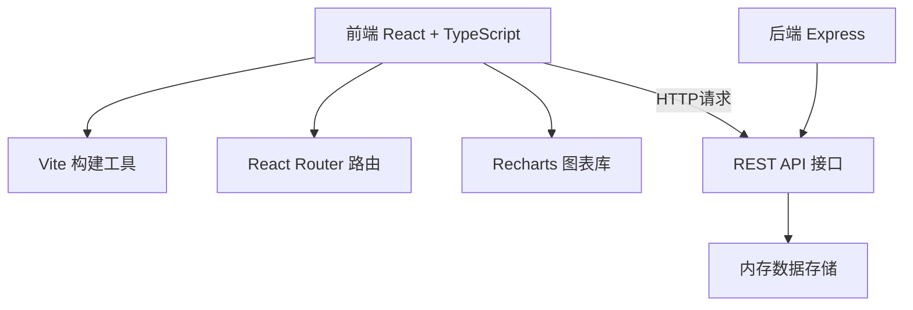
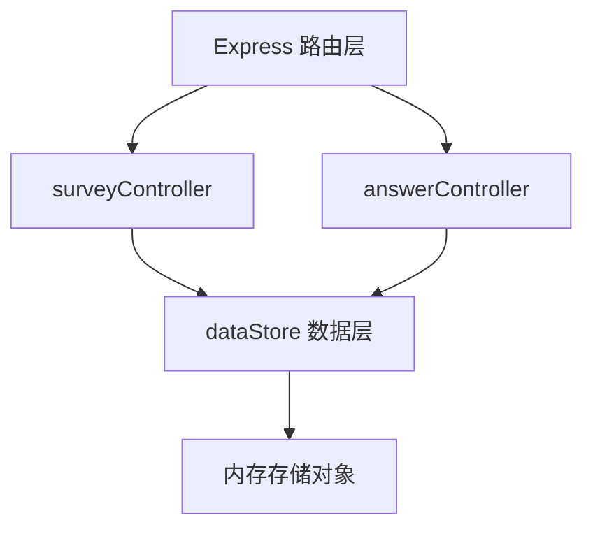
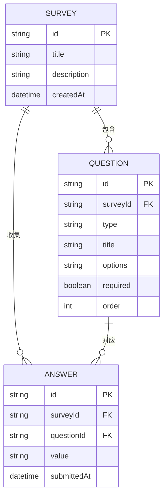

## 1. 架构设计



## 2. 技术描述

- 前端：React@18 + TypeScript + Vite@5 + React Router@6 + Recharts@2
- 后端：Node.js + Express@4 + uuid
- 数据存储：内存对象模拟，无需数据库
- 构建工具：Vite，支持HMR和TypeScript编译

## 3. 路由定义

| 路由 | 用途 |
|------|------|
| / | 问卷管理首页，展示问卷列表 |
| /designer/:surveyId | 问卷设计器，编辑问卷结构 |
| /viewer/:surveyId | 问卷填写页，收集用户答案 |
| /dashboard/:surveyId | 统计看板，展示可视化分析 |

## 4. API 定义

### 类型定义

```typescript
type QuestionType = 'single' | 'multiple' | 'dropdown' | 'text' | 'rating';

interface Question {
  id: string;
  type: QuestionType;
  title: string;
  options?: string[];
  required: boolean;
  order: number;
}

interface Survey {
  id: string;
  title: string;
  description: string;
  questions: Question[];
  createdAt: number;
}

interface Answer {
  id: string;
  surveyId: string;
  questionId: string;
  value: string | string[] | number;
  submittedAt: number;
}

interface AnswerSubmission {
  surveyId: string;
  answers: { questionId: string; value: any }[];
}
```

### 接口列表

| 方法 | 路径 | 描述 | 请求体 | 响应 |
|------|------|------|--------|------|
| GET | /api/surveys | 获取所有问卷 | - | Survey[] |
| GET | /api/surveys/:id | 获取单个问卷详情 | - | Survey |
| POST | /api/surveys | 创建新问卷 | { title, description } | Survey |
| PUT | /api/surveys/:id | 更新问卷结构 | Survey | Survey |
| DELETE | /api/surveys/:id | 删除问卷 | - | { success: boolean } |
| POST | /api/answers | 提交问卷答案 | AnswerSubmission | { success: boolean } |
| GET | /api/answers/:surveyId | 获取问卷所有回答 | - | Answer[] |
| GET | /api/export/:surveyId | 导出问卷数据 | - | JSON 文件 |

## 5. 服务器架构图



## 6. 数据模型

### 6.1 数据模型定义



### 6.2 内存数据结构

```typescript
// 内存存储
interface DataStore {
  surveys: Map<string, Survey>;
  answers: Map<string, Answer[]>;
}

// 初始化示例数据
const initialSurveys: Survey[] = [
  {
    id: 'demo-1',
    title: '用户满意度调查',
    description: '感谢您参与本次调查，帮助我们改进产品体验',
    questions: [
      {
        id: 'q1',
        type: 'single',
        title: '您的性别是？',
        options: ['男', '女', '其他'],
        required: true,
        order: 0
      },
      {
        id: 'q2',
        type: 'rating',
        title: '您对产品的整体满意度评分',
        required: true,
        order: 1
      }
    ],
    createdAt: Date.now()
  }
];
```

## 7. 项目文件结构

```
.
├── package.json
├── vite.config.js
├── tsconfig.json
├── index.html
├── src/
│   ├── App.tsx           # 主应用组件，路由配置
│   ├── types.ts          # TypeScript 类型定义
│   ├── dataStore.ts      # 前端数据层封装
│   └── components/
│       ├── Designer.tsx  # 问卷设计器
│       ├── Viewer.tsx    # 问卷填写组件
│       └── Statistics.tsx # 统计看板
└── server/
    └── index.ts          # Express 服务器
```

## 8. 性能优化策略

1. **拖拽性能**：使用 `requestAnimationFrame` 优化拖拽更新，避免频繁重渲染，确保响应延迟 < 50ms
2. **图表渲染**：使用 Recharts 按需渲染，数据预处理，100条数据内渲染 < 200ms
3. **组件优化**：使用 React.memo、useMemo、useCallback 避免不必要重渲染
4. **懒加载**：统计看板图表组件延迟加载，提升首屏速度
5. **防抖节流**：编辑面板输入防抖，拖拽操作节流
