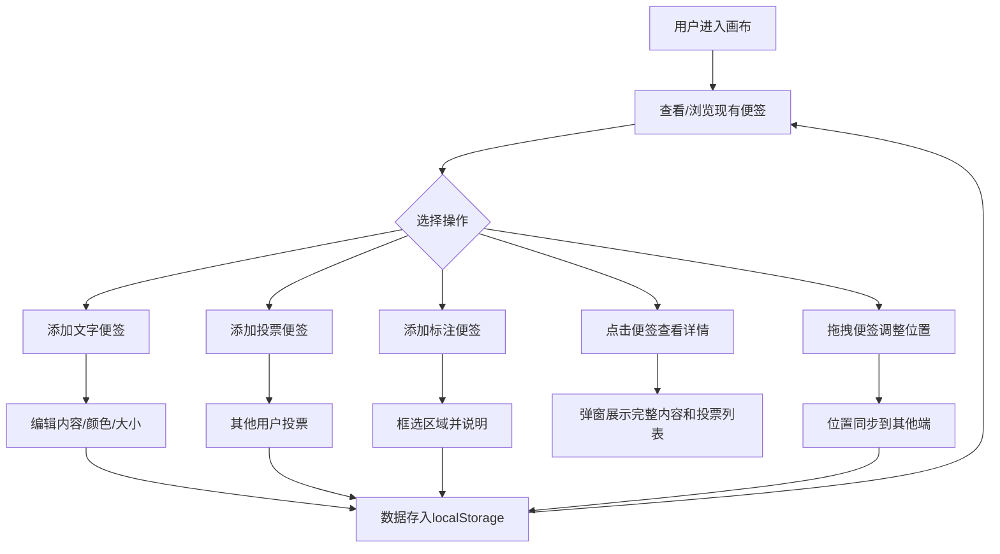

## 1. 产品概述

在线头脑风暴画布——一款面向远程团队的共享创意收集与快速决策工具。团队成员可以在无限画布上自由添加文字便签、投票便签和标注便签，通过实时拖拽同步、投票统计和区域标注，实现高效的远程头脑风暴和决策。

- 目标用户：需要进行远程创意收集、头脑风暴和快速决策的团队
- 核心价值：打破远程协作的空间限制，用可视化的方式让创意自由流动、快速收敛

## 2. 核心功能

### 2.1 用户角色
| 角色 | 注册方式 | 核心权限 |
|------|----------|----------|
| 团队成员 | 直接访问 | 添加/编辑/拖拽便签、投票、导出画布 |

### 2.2 功能模块
1. **画布页面**：无限缩放平移画布、便签渲染与拖拽、网格背景、详情弹窗
2. **工具栏**：添加便签按钮（三种类型）、清空画布、导出PNG

### 2.3 页面详情
| 页面名称 | 模块名称 | 功能描述 |
|----------|----------|----------|
| 画布页面 | 无限画布 | 支持鼠标滚轮缩放、拖拽平移，网格线随缩放密度自适应变化 |
| 画布页面 | 文字便签 | 可编辑内容、颜色和大小，支持拖拽移动位置 |
| 画布页面 | 投票便签 | 其他用户点击投票按钮，投票数字实时更新显示 |
| 画布页面 | 标注便签 | 框选画布区域并添加说明文字，用于标注重要区域 |
| 画布页面 | 详情弹窗 | 点击便签弹出详情，显示完整内容和投票结果列表，带背景模糊和收起动画 |
| 画布页面 | 实时同步 | 模拟WebSocket同步，拖拽时其他端同步移动位置 |
| 画布页面 | 数据持久化 | 所有操作存入localStorage，刷新页面完全恢复状态 |
| 画布页面 | 导出PNG | 一键将画布导出为PNG图片 |
| 工具栏 | 添加便签 | 下拉选择便签类型（文字/投票/标注），点击添加到画布 |
| 工具栏 | 清空画布 | 一键清除所有便签，带确认提示 |
| 工具栏 | 导出PNG | 使用html2canvas将画布区域导出为PNG图片 |

## 3. 核心流程

用户进入画布 → 通过工具栏选择便签类型并添加 → 在画布上拖拽便签排列 → 点击便签查看详情 → 对投票便签进行投票 → 框选区域添加标注 → 导出画布或刷新页面恢复状态

## 4. 用户界面设计

### 4.1 设计风格
- 主色调：柔和奶油色底（#FFF8F0），搭配珊瑚橙（#FF6B6B）和雾蓝（#74B9FF）便签
- 便签配色：文字便签珊瑚橙系、投票便签雾蓝系、标注便签淡紫系
- 网格线：浅灰色（#E8E4E0），缩放时密度自适应
- 按钮风格：圆角胶囊按钮，带悬浮高亮和点击缩放反馈
- 字体：Noto Sans SC（中文优先），搭配 DM Sans（英文数字）
- 布局：全屏画布 + 右上角浮动毛玻璃工具栏
- 图标：Lucide Icons
- 动画：拖拽弹性过渡、弹窗淡入缩放、背景模糊

### 4.2 页面设计概览
| 页面名称 | 模块名称 | UI元素 |
|----------|----------|--------|
| 画布页面 | 画布背景 | 奶油色底、浅灰自适应网格、CSS Transform缩放平移 |
| 画布页面 | 文字便签 | 珊瑚橙卡片、圆角阴影、可编辑文本、拖拽手柄 |
| 画布页面 | 投票便签 | 雾蓝卡片、投票计数徽章、点击投票按钮、数字跳动动画 |
| 画布页面 | 标注便签 | 淡紫色虚线框、半透明填充、标注文字 |
| 画布页面 | 详情弹窗 | 居中弹窗、backdrop-blur背景模糊、缩放淡入动画、收起动画 |
| 工具栏 | 工具栏 | 右上角固定、毛玻璃背景、半透明、垂直排列按钮 |

### 4.3 响应式设计
- 桌面优先设计，画布占满全屏
- 工具栏在小屏幕上收缩为图标模式
- 便签拖拽在触摸设备上使用touch事件

### 4.4 性能目标
- 画布超过50个便签时保持60FPS
- 使用CSS Transform进行坐标变换（GPU加速）
- 便签拖拽使用requestAnimationFrame节流
- 避免不必要的重渲染（React.memo、useMemo）
