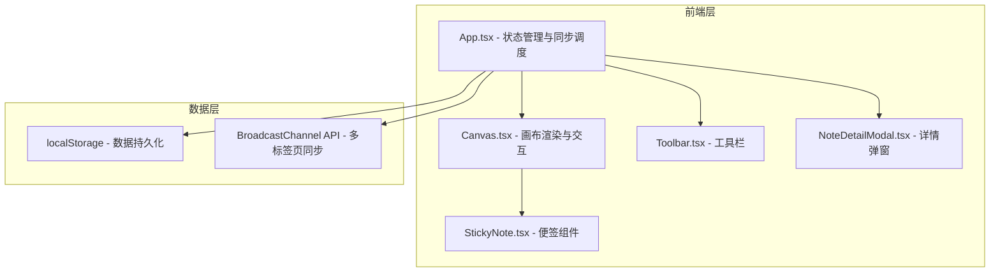
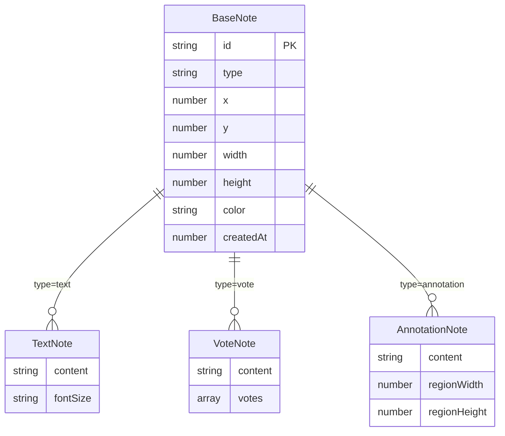

## 1. 架构设计



## 2. 技术说明
- 前端：React@18 + TypeScript + Vite
- 状态管理：Zustand（轻量级状态管理，适合画布状态）
- 样式：Tailwind CSS + CSS Modules（关键动画）
- 初始化工具：vite-init（react-ts模板）
- 后端：无（纯前端，localStorage模拟后端）
- 同步方案：BroadcastChannel API 模拟多用户WebSocket同步
- 导出：html2canvas 将画布导出为PNG

## 3. 路由定义
| 路由 | 用途 |
|------|------|
| / | 画布主页面（唯一页面，全屏画布） |

## 4. API定义（无后端，本地数据接口）

### 4.1 数据类型定义

```typescript
type NoteType = 'text' | 'vote' | 'annotation';

interface BaseNote {
  id: string;
  type: NoteType;
  x: number;
  y: number;
  width: number;
  height: number;
  color: string;
  createdAt: number;
}

interface TextNote extends BaseNote {
  type: 'text';
  content: string;
  fontSize: 'small' | 'medium' | 'large';
}

interface VoteNote extends BaseNote {
  type: 'vote';
  content: string;
  votes: string[];
}

interface AnnotationNote extends BaseNote {
  type: 'annotation';
  content: string;
  regionWidth: number;
  regionHeight: number;
}

type StickyNote = TextNote | VoteNote | AnnotationNote;

interface CanvasState {
  notes: StickyNote[];
  viewport: {
    x: number;
    y: number;
    scale: number;
  };
}
```

### 4.2 localStorage接口
- `brainstorm-canvas-state`：存储CanvasState JSON字符串
- 读取：页面加载时从localStorage恢复
- 写入：每次状态变更后同步写入

### 4.3 BroadcastChannel同步协议
- 频道名称：`brainstorm-sync`
- 消息类型：`note_add` | `note_move` | `note_update` | `note_vote` | `note_delete` | `canvas_clear`

## 5. 数据模型



## 6. 关键技术决策

### 6.1 画布渲染方案
- 使用CSS Transform（translate + scale）实现缩放平移，利用GPU加速
- 便签作为DOM元素渲染（非Canvas 2D），保持可交互性
- 网格线使用CSS background实现，通过background-size动态调整密度

### 6.2 性能优化策略
- 便签组件使用React.memo避免不必要的重渲染
- 拖拽过程中使用requestAnimationFrame节流位置更新
- 缩放时使用will-change: transform提示浏览器优化
- 超出视口的便签使用虚拟化或visibility:hidden降低渲染负担

### 6.3 拖拽实现
- mousedown/mousemove/mouseup事件处理拖拽
- 拖拽时计算鼠标在画布坐标系中的位置（考虑缩放比例）
- 拖拽结束触发回调更新全局state

### 6.4 导出PNG方案
- 使用html2canvas库截取画布DOM区域
- 导出时临时调整画布视口以包含所有便签
- 生成canvas后调用toDataURL('image/png')下载
