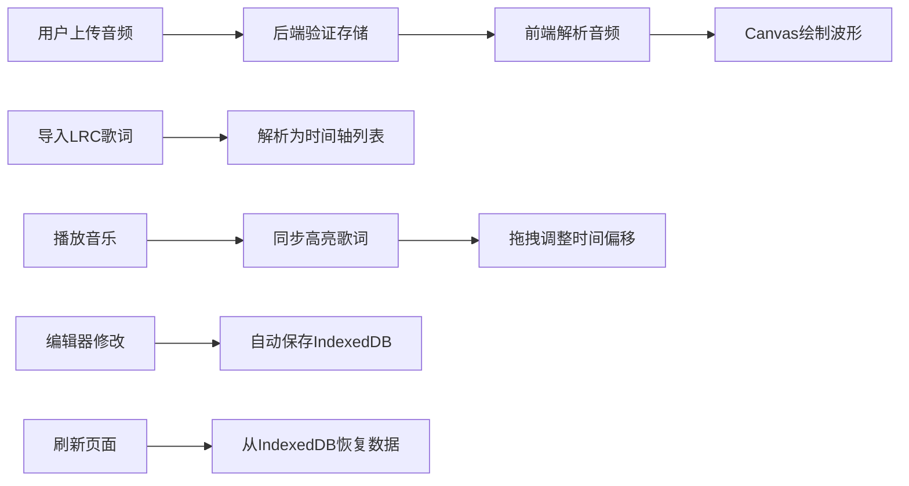

## 1. 产品概述

可视化音乐歌词同步播放器，支持本地音频上传、波形可视化、LRC歌词同步显示与编辑的个人音乐工具。为音乐爱好者提供类似卡拉OK的沉浸式歌词体验，同时支持歌词时间轴的精确调整和持久化存储。

## 2. 核心功能

### 2.1 用户角色
| 角色 | 注册方式 | 核心权限 |
|------|----------|----------|
| 普通用户 | 无需注册，本地使用 | 上传音频、编辑歌词、播放音乐、数据本地持久化 |

### 2.2 功能模块
1. **播放器视图**：音频播放控制、波形可视化、歌词滚动显示
2. **歌词编辑器视图**：歌词行列表、时间码编辑、增删改操作
3. **文件管理**：音频上传、LRC歌词加载、文件列表展示

### 2.3 页面详情
| 页面名称 | 模块名称 | 功能描述 |
|----------|----------|----------|
| 主页面 | 音频上传模块 | 支持拖拽或点击上传MP3格式音频文件，后端验证并存储 |
| 主页面 | 波形显示模块 | Canvas绘制音频波形，支持点击跳转、进度高亮、渐变色渲染 |
| 主页面 | 歌词显示模块 | LRC歌词解析、当前行高亮、缓动滚动、点击跳转、拖拽调时 |
| 主页面 | 播放控制模块 | 播放/暂停、进度条、音量控制、发光悬停效果 |
| 编辑器页面 | 歌词编辑模块 | 完整歌词列表、时间码显示、增删改行、自动保存到IndexedDB |
| 编辑器页面 | 歌词导入模块 | 支持LRC文件导入解析、手动输入歌词 |

## 3. 核心流程

用户上传音频文件 → 后端处理并返回文件信息 → 前端解析音频并绘制波形 → 加载/导入LRC歌词文件 → 播放音乐时同步高亮歌词 → 可拖拽调整歌词时间偏移 → 切换到编辑器修改歌词内容和时间码 → 所有修改自动存入IndexedDB → 刷新页面数据自动恢复

## 4. 用户界面设计

### 4.1 设计风格
- **主色调**：霓虹青绿（#00ffcc），渐变色从青绿到蓝色（#00ffcc → #0066ff）
- **背景色**：深色主题，主背景#0a0a0f，次级背景#12121a
- **按钮样式**：圆角按钮，悬停时发出青绿光晕，平滑过渡动画
- **字体**：使用现代无衬线字体，标题加粗，正文适中
- **布局风格**：桌面端横版布局，波形在上、歌词在下；移动端竖版自适应

### 4.2 页面设计概述
| 页面名称 | 模块名称 | UI元素 |
|----------|----------|----------|
| 主页面 | 波形区域 | Canvas画布、渐变色填充、进度高亮层、时间刻度 |
| 主页面 | 歌词区域 | 半透明背景、当前行高亮发光、滚动缓动动画 |
| 主页面 | 控制栏 | 播放/暂停按钮发光效果、进度条、音量滑块、视图切换 |
| 编辑器页面 | 歌词列表 | 明暗双层背景、当前输入行高亮、拖拽排序手柄 |
| 编辑器页面 | 编辑表单 | 时间码输入框、歌词文本输入、添加/删除按钮 |

### 4.3 响应式
- **桌面端**（≥1024px）：波形占上半部分，歌词和控制栏占下半部分，编辑器侧边展开
- **平板端**（768px-1024px）：波形高度适中，歌词区域占满剩余空间
- **移动端**（<768px）：竖版布局，波形变窄置于顶部，歌词占满剩余空间，编辑器全屏切换

### 4.4 性能优化
- 波形渲染使用requestAnimationFrame保证60fps
- 歌词滚动使用transform: translateY实现GPU加速
- 歌词数据使用虚拟滚动，只渲染可见区域
- IndexedDB操作使用异步Promise接口避免阻塞主线程
