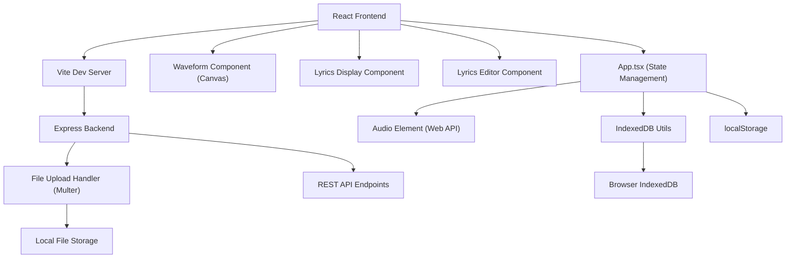
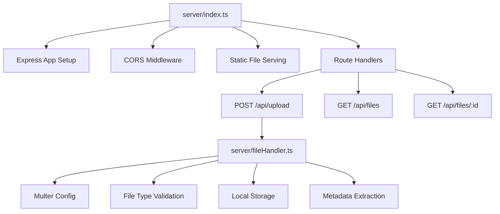
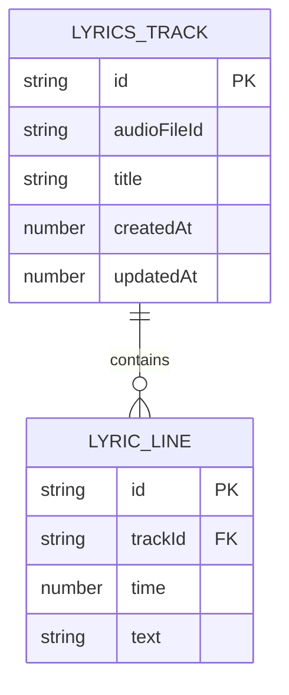

## 1. 架构设计



## 2. 技术描述

- **前端框架**：React 18 + TypeScript
- **构建工具**：Vite 5
- **后端服务**：Express 4 + TypeScript
- **文件上传**：Multer
- **数据持久化**：IndexedDB (浏览器端) + localStorage (配置存储)
- **音频处理**：Web Audio API + HTML5 Audio Element
- **UI渲染**：Canvas API (波形) + CSS3 Transforms (动画)
- **唯一ID生成**：uuid

## 3. 路由定义

| 路由 | 用途 |
|------|------|
| / | 主页面，包含播放器、波形、歌词显示 |
| /editor | 歌词编辑器页面 |
| /api/upload | POST - 上传音频文件 |
| /api/files | GET - 获取已上传文件列表 |
| /api/files/:id | GET - 获取指定音频文件 |

## 4. API 定义

### 4.1 类型定义

```typescript
interface AudioFile {
  id: string;
  name: string;
  size: number;
  duration: number;
  url: string;
  uploadedAt: number;
}

interface LyricLine {
  id: string;
  time: number;
  text: string;
  trackId: string;
}

interface LyricsTrack {
  id: string;
  audioFileId: string;
  title: string;
  lines: LyricLine[];
  createdAt: number;
  updatedAt: number;
}
```

### 4.2 请求/响应格式

**POST /api/upload**
- Request: multipart/form-data (field: "audio", file: .mp3)
- Response: `{ success: true, data: AudioFile }`

**GET /api/files**
- Response: `{ success: true, data: AudioFile[] }`

**GET /api/files/:id**
- Response: 音频文件流 (audio/mpeg)

## 5. 服务器架构



## 6. 数据模型

### 6.1 IndexedDB 数据模型



### 6.2 IndexedDB 数据库配置

- **数据库名**：LyricsPlayerDB
- **版本**：1
- **对象存储**：
  - `tracks` - 歌词轨道表，主键: `id`，索引: `audioFileId`
  - `lines` - 歌词行表，主键: `id`，索引: `trackId`

### 6.3 localStorage 存储

- `currentAudioId` - 当前播放的音频ID
- `currentTrackId` - 当前编辑的歌词轨道ID
- `volume` - 音量设置 (0-1)
- `viewMode` - 视图模式 (player/editor)
