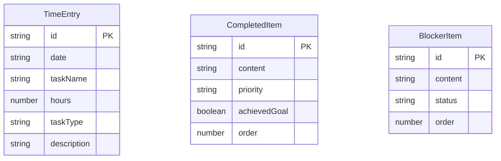

## 1. 架构设计

```mermaid
graph TB
    "Frontend[前端 React+TypeScript+Vite]" --> "API[REST API接口层]"
    "API" --> "Backend[后端 Express+TypeScript]"
    "Backend" --> "DataStore[内存数据存储 Map]"
    
    subgraph "Frontend[前端模块]"
        "MainDashboard[主看板组件]"
        "TimeEntryForm[工时录入组件]"
        "ReportPreview[报告预览组件]"
        "Store[Zustand状态管理]"
    end
    
    subgraph "Backend[后端模块]"
        "Server[Express服务]"
        "DataStore"
    end
    
    "MainDashboard" --> "Store"
    "TimeEntryForm" --> "Store"
    "ReportPreview" --> "Store"
    "Store" --> "API"
    "Server" --> "DataStore"
```

## 2. 技术说明

- 前端：React@18 + TypeScript + Tailwind CSS@3 + Vite
- 状态管理：Zustand
- 图表库：Recharts
- 导出库：file-saver + html2canvas
- 后端：Express@4 + TypeScript
- 数据存储：内存Map（非持久化）
- 初始化工具：vite-init (react-express-ts 模板)

## 3. 路由定义

| 路由 | 用途 |
|------|------|
| `/` | 主看板页面，集成工时录入、事项管理与报告预览 |

## 4. API定义

### 4.1 TypeScript类型定义

```typescript
type TaskType = "开发" | "测试" | "会议" | "文档"
type Priority = "高" | "中" | "低"
type BlockerStatus = "未解决" | "已解决" | "待沟通"
type TemplateType = "business" | "creative"

interface TimeEntry {
  id: string
  date: string
  taskName: string
  hours: number
  taskType: TaskType
  description: string
}

interface CompletedItem {
  id: string
  content: string
  priority: Priority
  achievedGoal: boolean
  order: number
}

interface BlockerItem {
  id: string
  content: string
  status: BlockerStatus
  order: number
}

interface SummaryData {
  totalHours: number
  hoursByType: Record<TaskType, number>
  hoursByDate: Record<string, number>
  completedItems: CompletedItem[]
  blockerItems: BlockerItem[]
}

interface ExportRequest {
  summary: SummaryData
  template: TemplateType
  projectName: string
  exporterName: string
}
```

### 4.2 请求/响应Schema

| 接口 | 方法 | 请求参数 | 响应数据 |
|------|------|----------|----------|
| `/api/entries` | GET | `startDate`, `endDate` (query) | `TimeEntry[]` |
| `/api/entries` | POST | `TimeEntry` (body) | `{ success: boolean, entry: TimeEntry }` |
| `/api/summary` | GET | `startDate`, `endDate` (query) | `SummaryData` |
| `/api/export` | POST | `ExportRequest` (body) | `{ html: string }` |

## 5. 服务端架构图

```mermaid
graph LR
    "Controller[路由控制器]" --> "Service[业务逻辑]"
    "Service" --> "Repository[数据存储层]"
    "Repository" --> "Store[内存Map]"
```

## 6. 数据模型

### 6.1 数据模型定义



### 6.2 数据存储

使用内存Map存储，无需DDL。数据结构如下：
- `entries: Map<string, TimeEntry>` - 工时记录，key为id
- `completedItems: Map<string, CompletedItem>` - 完成事项，key为id
- `blockerItems: Map<string, BlockerItem>` - 阻塞问题，key为id
