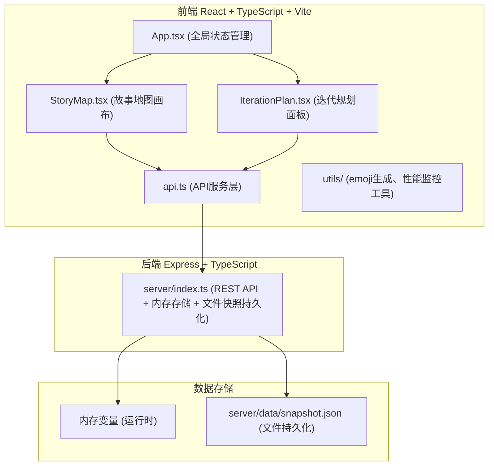
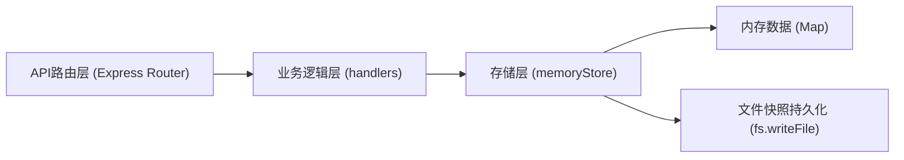
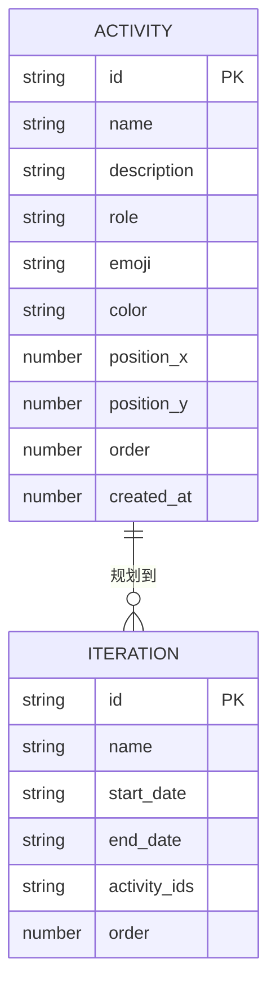

## 1. 架构设计



## 2. 技术描述
- 前端：React@18 + TypeScript@5 + Vite@5 + react-beautiful-dnd@13 + @hello-pangea/dnd（兼容React 18的dnd替代方案）+ zustand（状态管理）
- 构建工具：Vite 5
- 后端：Express@4 + TypeScript@5 + uuid@9
- 数据库：内存存储 + JSON文件快照持久化（server/data/snapshot.json）
- 测试：Vitest@1 + @testing-library/react@14 + @testing-library/jest-dom@6

## 3. 路由定义
| 路由 | 用途 |
|-------|---------|
| / | 主页面（故事地图 + 迭代规划） |

## 4. API 定义

### 4.1 TypeScript 类型
```typescript
interface Activity {
  id: string;
  name: string;
  description: string;
  role: 'visitor' | 'registered' | 'admin';
  emoji: string;
  color: string;
  position: { x: number; y: number };
  order: number;
  createdAt: number;
}

interface Iteration {
  id: string;
  name: string;
  startDate: string;
  endDate: string;
  activityIds: string[];
  order: number;
}

interface AppState {
  activities: Activity[];
  iterations: Iteration[];
}
```

### 4.2 REST API 端点
| 方法 | 路径 | 描述 | 请求体 | 响应 |
|------|------|------|--------|------|
| GET | /api/state | 获取全部应用状态 | - | `AppState` |
| POST | /api/activities | 新建活动 | `Partial<Activity>` | `Activity` |
| PUT | /api/activities/:id | 更新活动 | `Partial<Activity>` | `Activity` |
| DELETE | /api/activities/:id | 删除活动 | - | `{ success: boolean }` |
| PUT | /api/activities/reorder | 批量重排活动 | `{ ids: string[], role?: string }` | `{ success: boolean }` |
| POST | /api/iterations | 新建迭代 | `Partial<Iteration>` | `Iteration` |
| PUT | /api/iterations/:id | 更新迭代 | `Partial<Iteration>` | `Iteration` |
| DELETE | /api/iterations/:id | 删除迭代 | - | `{ success: boolean }` |
| PUT | /api/iterations/reorder | 重排迭代卡片 | `{ iterationId: string, activityIds: string[] }` | `{ success: boolean }` |
| POST | /api/state/restore | 恢复快照 | `AppState` | `{ success: boolean }` |

## 5. 服务端架构



## 6. 数据模型

### 6.1 ER 图


### 6.2 快照存储格式（JSON文件）
```json
{
  "version": 1,
  "timestamp": 1718154000000,
  "activities": [
    {
      "id": "uuid",
      "name": "注册登录",
      "description": "用户通过手机号/邮箱注册并登录",
      "role": "visitor",
      "emoji": "🔐",
      "color": "#6366f1",
      "position": { "x": 0, "y": 0 },
      "order": 0,
      "createdAt": 1718154000000
    }
  ],
  "iterations": [
    {
      "id": "uuid",
      "name": "周期1",
      "startDate": "2026-06-15",
      "endDate": "2026-06-29",
      "activityIds": [],
      "order": 0
    }
  ]
}
```
