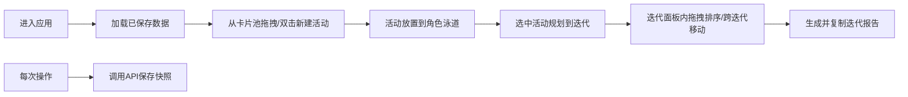

## 1. 产品概述
用户故事地图与迭代规划应用，帮助团队在产品开发前期将零散用户需求可视化组织成故事地图，并基于地图规划迭代周期。
- 目标用户：产品经理、研发团队、UX设计师
- 核心价值：通过可视化拖拽和迭代规划，提高需求梳理效率和团队协作清晰度

## 2. 核心功能

### 2.1 用户角色
| 角色 | 说明 | 核心权限 |
|------|------|----------|
| 团队成员 | 使用应用的所有用户 | 新建活动、拖拽排序、规划迭代、生成报告 |

### 2.2 功能模块
1. **故事地图画布**：左侧活动卡片池、右侧角色泳道画布、拖拽放置、双击新建
2. **迭代规划面板**：抽屉式/底部模态、迭代分组卡片列表、拖拽排序与跨迭代移动、弹性动画
3. **报告生成**：结构化文本报告、一键复制、模态动画

### 2.3 页面详情
| 页面名称 | 模块名称 | 功能描述 |
|-----------|-------------|---------------------|
| 主页面 | 顶部导航栏 | 应用名称、用户头像 |
| 主页面 | 活动卡片池 | 预设活动卡片列表（注册登录、浏览商品等），支持拖出 |
| 主页面 | 故事地图画布 | 按用户角色（访客、注册用户、管理员）分泳道，支持水平/垂直滚动、双击新建、拖拽排序 |
| 主页面 | 迭代规划面板 | 桌面端右侧抽屉、平板端底部全屏模态，按迭代分组，支持拖拽排序、跨迭代移动、日期设置 |
| 主页面 | 报告模态弹窗 | 生成迭代规划报告、一键复制 |

## 3. 核心流程

### 3.1 主流程
1. 用户进入应用，加载已保存的故事地图和迭代数据
2. 从卡片池拖拽活动到地图对应角色泳道
3. 双击画布空白区域新建活动，自动生成emoji缩略图
4. 选中活动卡片点击"规划至迭代"添加到迭代面板
5. 在迭代面板中拖拽排序或跨迭代移动
6. 点击"生成报告"查看并复制结构化报告
7. 所有操作实时保存，刷新页面后状态完全恢复

### 3.2 Mermaid流程图

## 4. 用户界面设计

### 4.1 设计风格
- 主色调：深灰蓝底色（#1e293b）搭配珊瑚橙（#ff6b6b）和浅金色（#f7d794）作为强调色
- 背景：毛玻璃磨砂效果（backdrop-filter: blur）
- 卡片样式：圆角10px、轻微阴影（box-shadow: 0 4px 12px rgba(0,0,0,0.15)）
- 拖拽视觉：卡片缩放1.05倍、旋转5度、半透明（opacity: 0.8）
- 字体：使用Playfair Display作为标题字体，Lato作为正文字体
- 分隔线：迭代分组之间使用渐变分隔线

### 4.2 页面设计概览
| 页面名称 | 模块名称 | UI元素 |
|-----------|-------------|-------------|
| 主页面 | 导航栏 | 深色背景、毛玻璃、Logo左对齐、用户头像右对齐 |
| 主页面 | 卡片池 | 左侧固定宽度、滚动区域、卡片随机背景色、emoji图标 |
| 主页面 | 故事地图 | 三列泳道布局、每列标题带角色标识、水平/垂直滚动容器 |
| 主页面 | 迭代面板 | 桌面端右侧抽屉滑入、平板端底部全屏上滑、渐变分组分隔线 |
| 主页面 | 报告模态 | 缩放进入动画、背景模糊关闭、结构化文本展示、复制按钮 |

### 4.3 响应式
- 桌面端（≥1200px）：迭代面板为右侧抽屉式，宽度400px
- 平板端（768px-1199px）：迭代面板改为底部弹出的全屏模态
- 采用Desktop-first设计思路，使用CSS media queries适配

### 4.4 动画效果
- 新建活动卡片：淡入动画（fadeIn 0.3s ease-out）
- 拖拽过程：缩放1.05倍 + 旋转5度 + 半透明
- 跨迭代移动：弹性动画（cubic-bezier(0.68, -0.55, 0.265, 1.55)）+ 缩小放大效果
- 报告模态：缩放进入（scale 0→1）、背景模糊（blur 0→8px）
