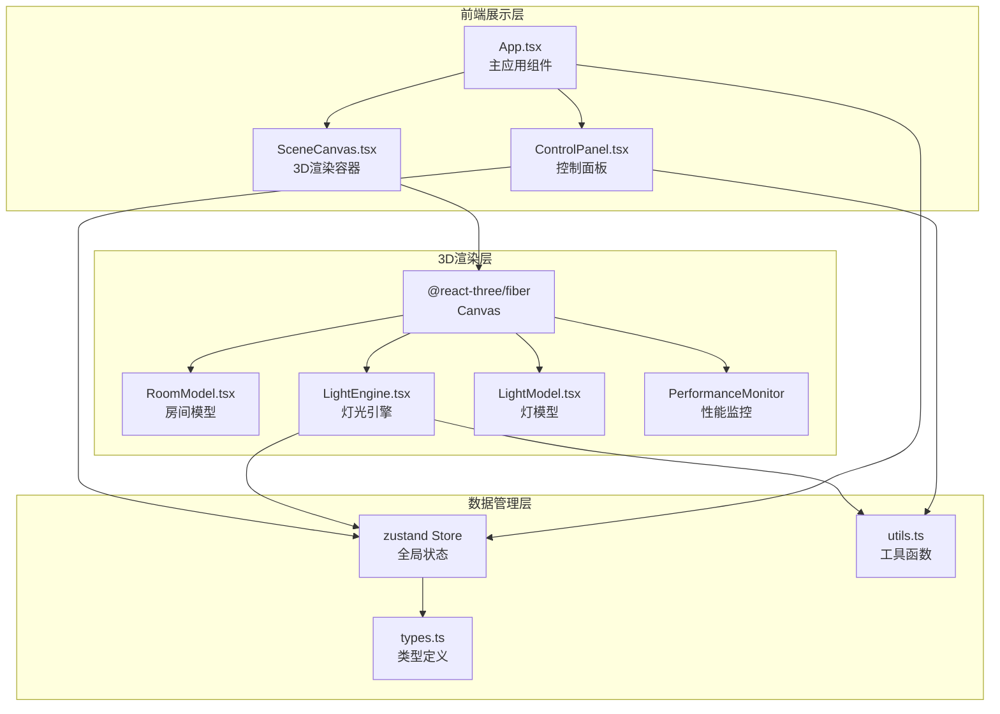

## 1. 架构设计



## 2. 技术栈

- 前端：React@18 + TypeScript + Vite
- 3D渲染：Three.js + @react-three/fiber + @react-three/drei
- 状态管理：zustand
- 初始化工具：vite-init (react-ts模板)
- 无后端

## 3. 路由定义

| 路由 | 用途 |
|------|------|
| / | 主页面，3D灯光预览应用 |

## 4. 数据流

```mermaid
flowchart LR
    "用户操作<br/>(切换/调节/添加)" --> "zustand Store<br/>(lights, selectedId)"
    "zustand Store" --> "ControlPanel<br/>(读取状态渲染UI)"
    "zustand Store" --> "LightEngine<br/>(读取配置创建灯光)"
    "LightEngine" --> "useFrame<br/>(缓动动画lerp)"
    "useFrame" --> "Three.js灯光对象<br/>(实际渲染)"
    "App.tsx" --> "重置逻辑<br/>(resetLights)"
    "App.tsx" --> "导出快照<br/>(gl.domElement.toDataURL)"
```

## 5. 文件结构与职责

```
src/
├── types.ts              # 类型定义：LightConfig, LightType, PresetPosition等
├── store.ts              # zustand状态：lights数组、selectedId、addLight/removeLight/reset等
├── utils.ts              # 工具函数：colorTempToRGB、debounce、lerp
├── scene/
│   ├── RoomModel.tsx     # 房间3D模型：墙壁、地板、沙发、桌子
│   ├── LightEngine.tsx   # 灯光引擎：创建/更新灯光对象，useFrame缓动动画
│   └── LightModel.tsx    # 灯具3D模型：不同灯具的几何体+材质外观
├── ui/
│   ├── ControlPanel.tsx  # 控制面板：光源卡片列表、灯具选择、滑块、按钮
│   ├── SceneCanvas.tsx   # 3D渲染容器：Canvas、resize、导出
│   └── LightCard.tsx     # 光源卡片：单个光源信息展示与选择
├── App.tsx               # 主应用：组合组件、全局逻辑
├── App.css               # 全局样式
└── main.tsx              # 入口
```

## 6. 关键技术实现

### 6.1 缓动过渡动画

在LightEngine中使用useFrame进行每帧lerp插值：
- 记录每个灯光的currentValue和targetValue
- 每帧按 `current = lerp(current, target, delta * 4)` 渐变（约0.5秒到达目标）
- 应用于强度(intensity)和颜色(color)

### 6.2 多光源管理

- zustand store维护lights数组，每个光源有独立id、type、position、colorTemp、brightness
- selectedId标识当前编辑的光源
- ControlPanel中卡片列表展示所有光源，点击选中
- 添加光源时从预设位置列表中按序分配

### 6.3 性能优化

- useFrame中控制渲染帧率(framerate=30)
- 滑块onChange使用throttle(100ms)减少更新频率
- 几何体和材质复用(useMemo)
- dispose清理不再使用的资源
- Stats组件实时监控FPS

### 6.4 响应式布局

- CSS媒体查询@media (max-width: 767px)
- 桌面端：flex-row, 左侧面板320px
- 移动端：flex-column, 底部固定栏120px，transform translateY展开/收起

### 6.5 PNG导出

- 获取Canvas的gl.domElement
- 设置renderer尺寸为1920x1080
- 渲染一帧后toDataURL('image/png')
- 创建<a>标签触发下载
