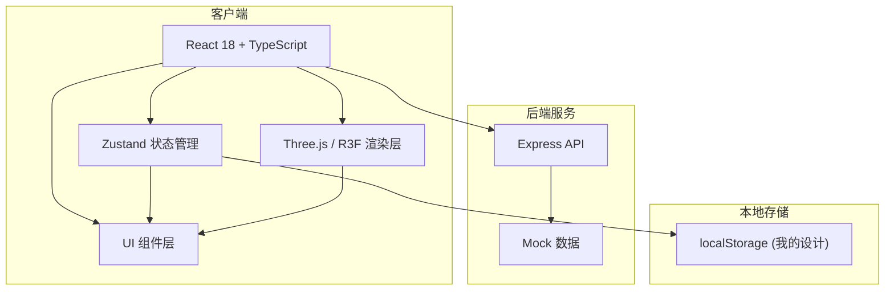
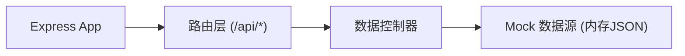
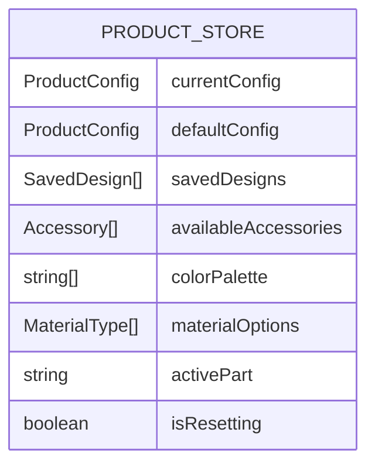

## 1. 架构设计



## 2. 技术描述

- 前端框架：React 18 + TypeScript 5 + Vite 5
- 3D渲染：Three.js + @react-three/fiber + @react-three/drei
- 状态管理：Zustand
- 样式方案：原生CSS（CSS Modules风格，含CSS变量）
- 后端服务：Express 4（模拟API，提供产品默认配置和配件数据）
- 本地存储：localStorage存储用户保存的设计配置

## 3. 路由定义

| 路由 | 用途 |
|------|------|
| / | 主页面，含3D场景、配置面板、控制栏、我的设计 |

## 4. API定义

### 4.1 类型定义

```typescript
type PartName = 'base' | 'pole' | 'shade';
type MaterialType = 'metal' | 'plastic' | 'matte' | 'glossy';
type AccessoryId = 'shade-flower' | 'shade-cone' | 'deco-ring' | 'base-extender';

interface PartConfig {
  color: string;
  material: MaterialType;
}

interface Accessory {
  id: AccessoryId;
  name: string;
  description: string;
  compatibleWith?: AccessoryId[];
  incompatibleWith?: AccessoryId[];
}

interface ProductConfig {
  base: PartConfig;
  pole: PartConfig;
  shade: PartConfig;
  accessories: AccessoryId[];
}

interface SavedDesign {
  id: string;
  name: string;
  config: ProductConfig;
  thumbnail: string;
  timestamp: number;
}
```

### 4.2 接口列表

| 方法 | 路径 | 描述 | 响应 |
|------|------|------|------|
| GET | /api/product/default | 获取产品默认配置 | `{ config: ProductConfig }` |
| GET | /api/accessories | 获取可选配件列表 | `{ accessories: Accessory[] }` |
| GET | /api/colors | 获取预设颜色盘 | `{ colors: string[] }` |
| GET | /api/materials | 获取可选材质列表 | `{ materials: MaterialType[] }` |

## 5. 服务端架构



## 6. 数据模型

### 6.1 状态管理结构



### 6.2 核心文件结构

```
project/
├── package.json
├── vite.config.js
├── tsconfig.json
├── index.html
├── server/
│   └── index.ts          (Express API服务)
└── src/
    ├── main.tsx          (React入口)
    ├── App.tsx           (根组件)
    ├── index.css         (全局样式)
    ├── store/
    │   └── productStore.ts  (Zustand状态)
    └── components/
        ├── SceneViewer.tsx  (3D场景)
        ├── ConfigPanel.tsx  (配置面板)
        ├── ControlBar.tsx   (控制栏)
        └── DesignList.tsx   (我的设计列表)
```
