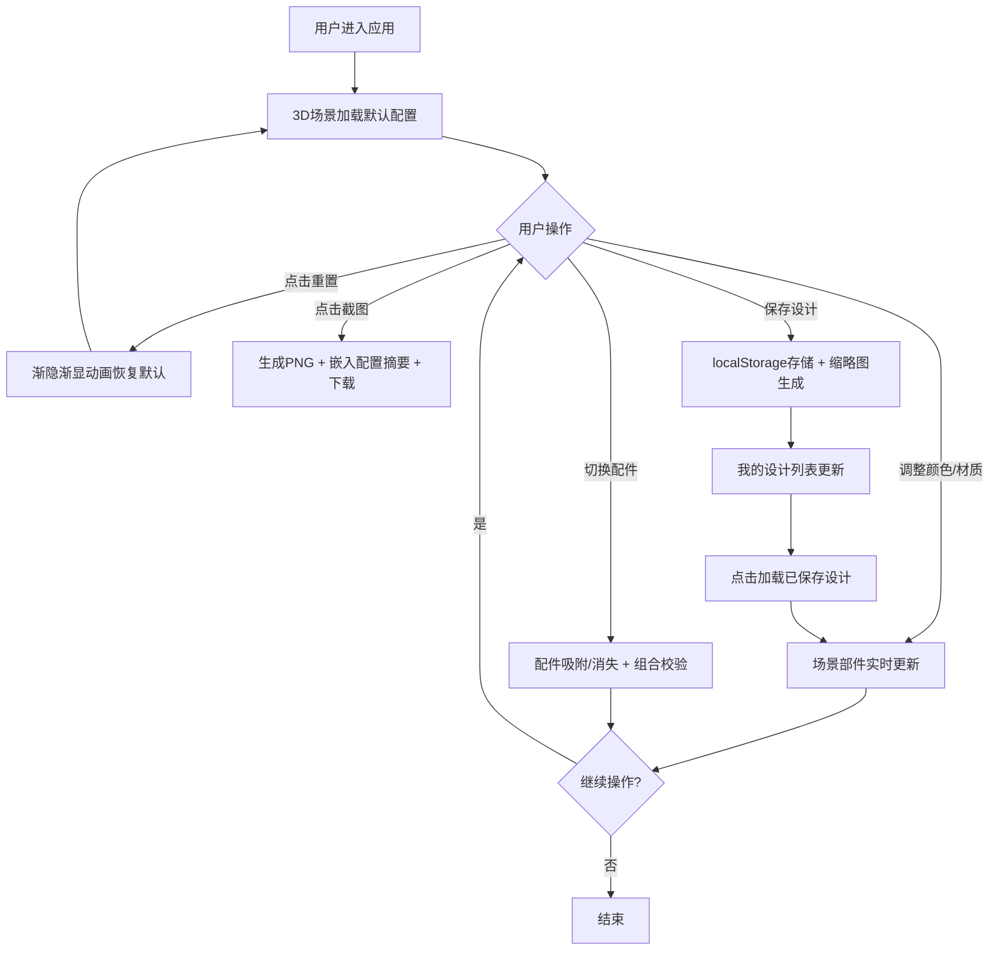

## 1. 产品概述

在线3D产品展示与个性化配置应用，让用户通过浏览器交互式查看和定制一款虚拟台灯产品的颜色、材质和组件配置。

- 主要目的：提供沉浸式3D产品定制体验，帮助用户在购买前可视化个性化配置效果
- 目标用户：电商消费者、产品设计师、DIY爱好者
- 市场价值：提升用户购买转化率，降低产品定制沟通成本

## 2. 核心功能

### 2.1 用户角色

| 角色 | 注册方式 | 核心权限 |
|------|----------|----------|
| 访客用户 | 无需注册 | 浏览3D产品、配置颜色材质配件、保存设计到本地、截图分享 |

### 2.2 功能模块

1. **3D场景展示**：台灯模型渲染、相机交互、光照系统、材质实时更新
2. **配置面板**：颜色选择器（12色）、材质切换（4种）、配件启用/禁用
3. **控制栏**：一键重置、场景截图、配置保存/加载
4. **我的设计**：本地存储配置列表、缩略图展示、一键加载

### 2.3 页面详情

| 页面名称 | 模块名称 | 功能描述 |
|---------|---------|---------|
| 主页面 | 3D场景展示 | 加载台灯模型（底座/灯杆/灯罩），支持拖拽旋转、缩放、平移，实时响应配置变更 |
| 主页面 | 配置面板 | 左侧可折叠面板（320px），含颜色网格、材质按钮组、配件卡片列表 |
| 主页面 | 控制栏 | 顶部控制按钮，含重置、截图相机、保存配置功能 |
| 主页面 | 我的设计 | 右侧配置列表，展示本地保存的5个设计，含缩略图和名称，点击加载 |

## 3. 核心流程

用户进入应用 → 3D场景加载默认台灯配置 → 用户调整颜色/材质/配件 → 场景实时更新 → 可选择保存配置/截图/重置 → 保存的设计可随时加载恢复

## 4. 用户界面设计

### 4.1 设计风格

- 主色调：深灰（#2a2a2a）+ 白色（#ffffff）极简风格
- 强调色：柔和渐变（#6366f1 → #8b5cf6）用于选中状态
- 按钮样式：圆角8px，悬停微亮，点击下沉2px
- 字体：现代无衬线字体（系统默认），标题16px/正文14px
- 布局风格：左侧固定面板 + 右侧全屏3D画布 + 顶部悬浮控制栏
- 图标风格：简洁线性图标

### 4.2 页面设计概述

| 页面名称 | 模块名称 | UI元素 |
|---------|---------|--------|
| 主页面 | 3D场景 | 全屏Canvas，环境光+方向光，柔和阴影，鼠标拖拽旋转 |
| 主页面 | 配置面板 | 320px宽侧边栏，可折叠为60px图标栏，圆角卡片容器 |
| 主页面 | 颜色选择器 | 3×4圆形色块网格，选中项1.2倍放大+白色勾选标记 |
| 主页面 | 材质切换 | 4个按钮组，选中项渐变背景+白色文字 |
| 主页面 | 配件卡片 | 带缩略图的卡片，悬停上浮4px+阴影加深，显示名称标签 |
| 主页面 | 控制栏 | 顶部居中悬浮，半透明毛玻璃背景，图标按钮组 |
| 主页面 | 我的设计 | 右侧竖向列表，缩略图+名称+时间戳，悬停显示删除按钮 |

### 4.3 响应式设计

- 桌面端（>1024px）：左侧配置面板（320px）+ 中间3D场景 + 右侧我的设计列表
- 移动端（≤1024px）：顶部控制栏 + 中部3D场景 + 底部水平滑动配置面板

### 4.4 3D场景设计

- 环境：柔和灰色渐变背景，模拟工作室光照
- 光照：环境光（强度0.6）+ 主方向光（强度1.0，带阴影）+ 补光（强度0.3）
- 相机：默认距离5单位，俯仰角30°，支持OrbitControls拖拽旋转/缩放
- 材质：支持金属/塑料/哑光/亮光四种材质属性组合
- 动画：配置切换300ms线性过渡，重置动画1000ms渐隐渐显
- 性能：保持30fps以上，模型面数控制在合理范围
