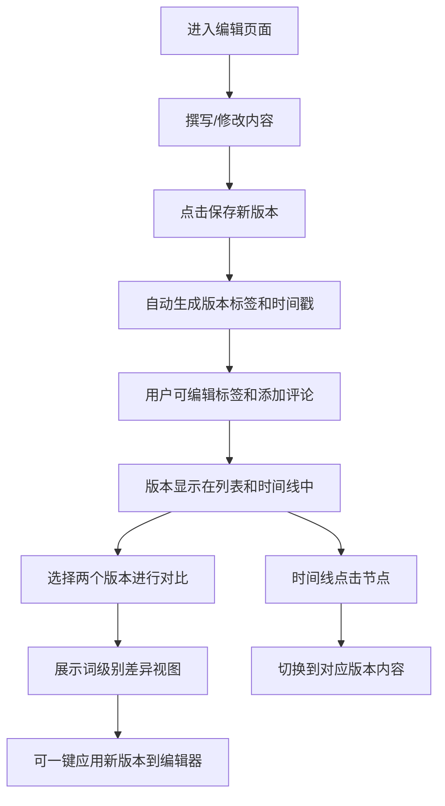

## 1. 产品概述
轻量级在线写作与版本对比工具，为写作者提供多草稿版本管理、词级别差异对比和时间线回溯功能。
- 核心价值：解决写作过程中版本混乱、难以追溯修改历史的痛点，提供直观的版本对比和一键恢复能力
- 目标用户：作家、内容创作者、编辑人员等需要频繁迭代文稿的用户群体

## 2. 核心功能

### 2.1 功能模块
1. **编辑器模块**：Markdown编辑区、工具栏、保存新版本功能
2. **版本列表模块**：右侧版本侧边栏，展示所有版本标签、评论，支持多选对比
3. **差异对比模块**：双栏对比视图，词级别增删改高亮显示，一键应用修改
4. **时间线模块**：水平时间轴展示版本节点，支持滚轮缩放和聚合显示

### 2.2 页面详情
| 页面名称 | 模块名称 | 功能描述 |
|-----------|-------------|---------------------|
| 主页面 | 编辑器模块 | 支持Markdown语法编辑，实时预览，保存为新版本按钮 |
| 主页面 | 版本列表模块 | 展示所有版本的标签、评论、时间戳，支持复选框多选 |
| 主页面 | 差异对比模块 | 双栏对比视图，词级别差异高亮（新增绿色、删除红色删除线、修改黄色背景） |
| 主页面 | 时间线模块 | 水平时间轴，版本节点展示，滚轮缩放，密集版本聚合，点击跳转 |

## 3. 核心流程
用户进入应用后，在编辑器中撰写或修改内容，点击"保存为新版本"创建版本快照。可在右侧版本列表中浏览历史版本，选择两个版本进行差异对比，查看词级别的修改内容。通过时间线视图可以直观地浏览版本演进历史，点击任意节点快速切换到该版本内容。

## 4. 用户界面设计

### 4.1 设计风格
- **主色调**：柔和蓝灰色系（#5B7BA8 主色，#A8B8CC 辅助色，#E8EEF4 背景色）
- **按钮风格**：圆角卡片式按钮，点击时微缩放动画反馈
- **字体**：使用 "Noto Serif SC" 作为正文衬线字体，"Inter" 作为界面无衬线字体
- **布局风格**：卡片式布局，清晰的边框和柔和阴影
- **动效**：版本列表和时间轴采用淡入动画加载，平滑过渡

### 4.2 页面设计概述
| 页面名称 | 模块名称 | UI元素 |
|-----------|-------------|-------------|
| 主页面 | 编辑器模块 | 大尺寸文本输入区，工具栏按钮，保存按钮醒目突出，卡片边框 |
| 主页面 | 版本列表模块 | 右侧侧边栏，版本卡片堆叠，复选框，标签显示，评论摘要 |
| 主页面 | 差异对比模块 | 双栏并列布局，各版本标题栏，高亮样式区分增删改，应用按钮 |
| 主页面 | 时间线模块 | 页面底部横向滚动区域，节点圆点连接线，悬停详情，缩放支持 |

### 4.3 响应式设计
- 桌面端（>1024px）：左右分栏布局，左侧编辑器，右侧版本列表
- 平板端（768-1024px）：上下结构，编辑器在上，版本列表在下可折叠
- 手机端（<768px）：折叠面板，编辑器全屏显示，版本列表和时间线通过抽屉展开
- 所有触摸设备优化按钮尺寸和点击区域

## 5. 性能要求
- 版本切换渲染时间 < 200ms
- 差异对比计算与渲染 < 200ms
- 时间线滚动和缩放保持60fps
