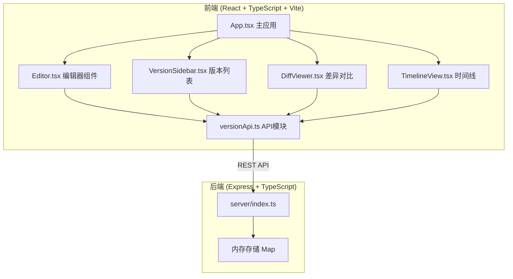
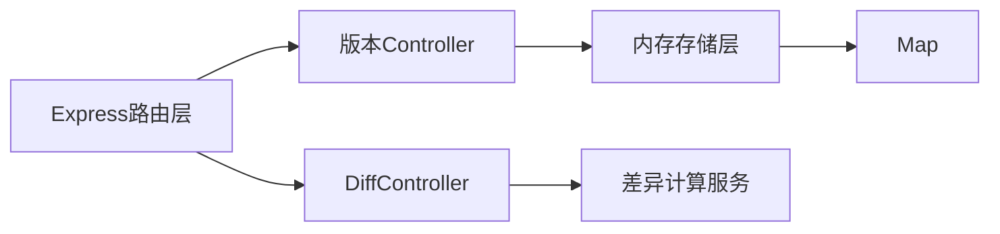

## 1. 架构设计



## 2. 技术描述
- **前端**: React 18 + TypeScript + Vite 5
- **样式方案**: CSS Modules + CSS 变量（主题系统）
- **后端**: Express 4 + TypeScript
- **核心库**: 
  - react-markdown: Markdown 渲染
  - diff: 词级别差异计算
  - date-fns: 日期时间格式化
  - uuid: 版本唯一ID生成
- **数据存储**: 内存 Map 模拟（无需数据库）

## 3. 路由定义
| 路由 | 用途 |
|-------|---------|
| / | 主页面（编辑器、版本列表、时间线） |

## 4. API 定义

```typescript
// 版本数据类型
interface Version {
  id: string;
  content: string;
  label: string;
  comment: string;
  createdAt: number;
}

// 差异对比结果
interface DiffSegment {
  type: 'added' | 'removed' | 'modified' | 'unchanged';
  value: string;
  oldValue?: string;
}
```

### 4.1 REST API 端点
| 方法 | 路径 | 描述 | 请求体 | 响应 |
|------|------|------|--------|------|
| POST | /api/versions | 保存新版本 | `{ content: string, label?: string, comment?: string }` | `Version` |
| GET | /api/versions | 获取版本列表（元数据，不含content） | - | `Omit<Version, 'content'>[]` |
| GET | /api/versions/:id | 获取版本详情（含content） | - | `Version` |
| PUT | /api/versions/:id | 更新版本标签/评论 | `{ label?: string, comment?: string }` | `Version` |
| GET | /api/diff?oldId=xxx&newId=xxx | 对比两个版本差异 | Query参数 | `{ segments: DiffSegment[] }` |

## 5. 服务端架构



## 6. 组件通信架构
- 状态管理：React Context + useReducer 管理全局版本状态
- 数据流：单向数据流，API 层统一处理 HTTP 请求
- 性能优化：版本切换使用 React.memo，差异计算使用 useMemo 缓存

## 7. 性能优化策略
- 差异计算在后端完成，前端仅负责渲染
- 版本列表懒加载（默认加载元数据，点击时加载内容）
- DiffViewer 使用虚拟滚动处理长文本
- 时间线节点使用 CSS transform 实现平滑滚动和缩放
