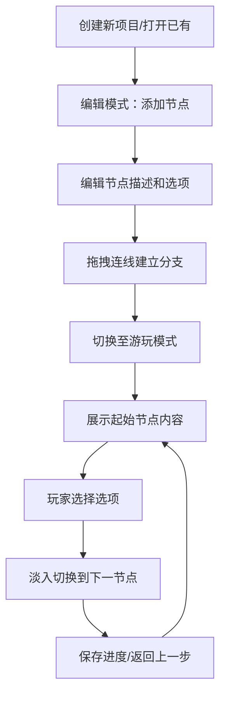

## 1. 产品概述
文字冒险游戏编辑器是一款用于创建和游玩交互式小说（Interactive Fiction）的可视化工具，解决手动编写分支故事耗时、玩家难以沉浸式体验的痛点。
- 主要用途：创作者通过可视化节点画布快速构建多分支剧情，玩家在沉浸式游玩模式中体验故事
- 目标用户：文字冒险游戏创作者、互动小说作者、桌面角色扮演游戏（TRPG）主持人
- 市场价值：降低互动叙事创作门槛，提供专业级的创作与体验一体化解决方案

## 2. 核心功能

### 2.1 用户角色
| 角色 | 注册方式 | 核心权限 |
|------|----------|----------|
| 创作者/玩家 | 无需注册，本地使用 | 创建编辑节点故事、保存进度、游玩体验 |

### 2.2 功能模块
1. **编辑模式**：节点画布、拖拽连线、属性面板、节点增删改
2. **游玩模式**：全屏阅读、选项交互、淡入动画、历史回溯、进度保存

### 2.3 页面详情
| 页面名称 | 模块名称 | 功能描述 |
|----------|----------|----------|
| 编辑主界面 | 顶部工具栏 | 模式切换按钮、添加节点按钮、撤销/重做（预留） |
| 编辑主界面 | 节点画布 | 节点卡片拖拽、贝塞尔曲线连线、滚轮缩放、平移、对齐吸附 |
| 编辑主界面 | 属性面板 | 节点描述编辑（Markdown）、选项列表编辑、目标节点下拉选择 |
| 游玩模式界面 | 内容展示区 | 当前节点文本渲染（Markdown）、淡入切换动画 |
| 游玩模式界面 | 操作区 | 选项按钮（最多4个）、返回按钮、保存进度按钮 |

## 3. 核心流程
创作者在编辑模式下创建多个场景节点，为每个节点编写描述文本和跳转选项，通过拖拽连线建立节点间的分支关系；完成创作后切换至游玩模式，系统从起始节点开始展示故事，玩家点击选项推进剧情，可随时保存进度或回溯历史步骤。

## 4. 用户界面设计
### 4.1 设计风格
- **双主题设计**：编辑模式浅色主题（#f5f5f5背景，#333文字），游玩模式深色主题（#1a1a2e背景，#e0e0e0文字）
- **主色调**：#6c63ff（紫色）作为选中状态和交互强调色
- **节点配色**：预设8色套系，新节点随机分配背景色
- **按钮样式**：圆角pill形状，hover状态有缩放反馈
- **节点卡片**：白色圆角12px，2px边框，选中时边框变主色带box-shadow动画
- **字体**：采用JetBrains Mono等宽字体用于代码和选项，采用思源宋体用于故事文本
- **连线样式**：带箭头的贝塞尔曲线，流畅自然

### 4.2 页面设计概述
| 页面名称 | 模块名称 | UI元素 |
|----------|----------|--------|
| 编辑主界面 | 工具栏 | 左侧品牌标识、中间"添加节点"按钮、右侧"游玩模式"切换按钮 |
| 编辑主界面 | 画布区域 | 无限画布、节点卡片（可拖拽）、贝塞尔连线（带箭头）、网格背景 |
| 编辑主界面 | 属性面板 | 右侧滑出面板、标题栏、描述文本区（textarea）、选项列表（可增删） |
| 游玩模式界面 | 全屏容器 | 居中内容卡片、最大宽度800px、内边距48px |
| 游玩模式界面 | 内容区 | Markdown渲染文本、行高1.8、字号18px |
| 游玩模式界面 | 选项区 | 按钮网格布局、最多2列、间距16px |

### 4.3 响应式
- 桌面端优先设计，适配1920×1080及以上分辨率
- 属性面板固定宽度360px，画布区域自适应剩余空间
- 游玩模式支持全屏显示，内容区域居中自适应

### 4.4 动画与交互
- 节点选中：边框颜色过渡 + box-shadow扩散动画（200ms ease-out）
- 节点拖拽：实时位置更新，对齐吸附时磁吸效果
- 游玩切换：当前内容淡出（300ms）→ 新内容淡入（300ms）
- 按钮hover：轻微上浮（translateY(-2px)）+ 阴影增强
- 画布缩放：平滑过渡动画（150ms）
