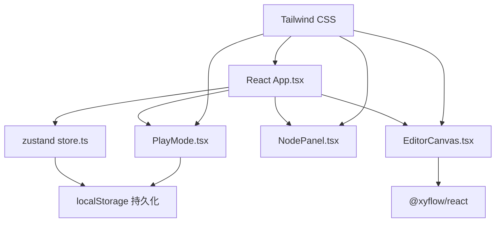

## 1. 架构设计



## 2. 技术描述
- **前端框架**：React 18 + TypeScript 5
- **构建工具**：Vite 5
- **状态管理**：zustand 4
- **图可视化**：@xyflow/react 12（原react-flow）
- **样式方案**：Tailwind CSS 3
- **唯一ID生成**：uuid 9
- **Markdown渲染**：react-markdown + remark-gfm
- **无后端**：纯前端应用，数据存储于localStorage

## 3. 目录结构
```
e:\solo\VersionFastPro\tasks\auto34\
├── .trae\documents\
│   ├── PRD.md
│   └── TECH.md
├── src\
│   ├── App.tsx          # 主组件，模式切换
│   ├── store.ts         # zustand状态管理
│   ├── EditorCanvas.tsx # 画布组件
│   ├── NodePanel.tsx    # 属性面板
│   ├── PlayMode.tsx     # 游玩模式
│   ├── main.tsx         # 入口文件
│   └── index.css        # 全局样式
├── index.html
├── package.json
├── vite.config.js
├── tsconfig.json
├── tailwind.config.js
└── postcss.config.js
```

## 4. 数据模型

### 4.1 节点数据类型
```typescript
interface GameNode {
  id: string;                    // 唯一标识
  description: string;           // 描述文本（Markdown）
  options: GameOption[];         // 选项列表（最多4个）
  backgroundColor: string;       // 背景色（8色套系）
  position: { x: number; y: number }; // 画布位置
}

interface GameOption {
  id: string;                    // 选项唯一标识
  text: string;                  // 选项文本
  targetNodeId: string | null;   // 目标节点ID
}

interface GameEdge {
  id: string;                    // 边唯一标识
  source: string;                // 源节点ID
  target: string;                // 目标节点ID
  sourceHandle?: string;         // 源选项ID（用于标识哪个选项）
}

interface PlayProgress {
  currentNodeId: string;         // 当前节点ID
  history: string[];             // 历史节点ID栈（最多10个）
  savedAt: number;               // 保存时间戳
}
```

### 4.2 Store状态定义
```typescript
interface GameState {
  nodes: GameNode[];
  edges: GameEdge[];
  selectedNodeId: string | null;
  mode: 'edit' | 'play';
  playHistory: string[];
  currentPlayNodeId: string | null;
  savedProgress: PlayProgress | null;
  
  // Actions
  addNode: (position?: { x: number; y: number }) => void;
  updateNode: (id: string, updates: Partial<GameNode>) => void;
  deleteNode: (id: string) => void;
  selectNode: (id: string | null) => void;
  updateNodePosition: (id: string, position: { x: number; y: number }) => void;
  addEdge: (source: string, target: string, sourceHandle?: string) => void;
  deleteEdge: (id: string) => void;
  setMode: (mode: 'edit' | 'play') => void;
  setCurrentPlayNode: (nodeId: string) => void;
  goBack: () => void;
  saveProgress: () => void;
  loadProgress: () => void;
  clearProgress: () => void;
}
```

### 4.3 预设颜色套系
```typescript
const COLOR_PALETTE = [
  '#FFE4E1', // 浅粉
  '#E8F5E9', // 浅绿
  '#E3F2FD', // 浅蓝
  '#FFF3E0', // 浅橙
  '#F3E5F5', // 浅紫
  '#FFFDE7', // 浅黄
  '#E0F2F1', // 浅青
  '#FCE4EC', // 浅玫红
];
```

## 5. 核心实现要点

### 5.1 画布交互
- 使用`@xyflow/react`的`ReactFlow`组件，配置`snapToGrid={true}`实现对齐吸附
- 自定义节点组件，实现白色圆角卡片样式和选中动画
- 边类型使用`smoothstep`（贝塞尔曲线），配置带箭头的marker
- 支持滚轮缩放（minZoom: 0.5, maxZoom: 2）和拖拽平移

### 5.2 状态管理
- zustand store采用分片设计，分离编辑状态和游玩状态
- 节点和边数据结构与@xyflow/react兼容，便于直接渲染
- 自动同步edges与节点options的targetNodeId，保持数据一致性

### 5.3 游玩模式
- 使用CSS transition实现淡入淡出动画（opacity 0→1，300ms）
- 历史栈采用数组实现，限制最大长度10，超出时移除最早记录
- localStorage存储key为`text-adventure-progress`，包含完整进度信息
- 页面加载时自动检测localStorage中的进度，弹窗提示恢复

### 5.4 性能优化
- React.memo包装自定义节点组件，避免不必要重渲染
- zustand使用selector精确订阅所需状态
- 画布使用will-change: transform提升渲染性能
- 拖拽操作使用requestAnimationFrame保持30fps以上

### 5.5 Markdown支持
- 使用react-markdown渲染描述文本
- 配置remark-gfm插件支持表格、删除线、任务列表等扩展语法
- 内联样式支持加粗、斜体、列表等基础格式
