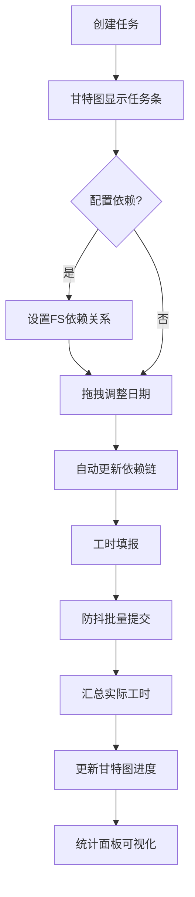

## 1. 产品概述

轻量级甘特图驱动的工时填报与追踪应用，面向团队内部项目工时管理场景，解决非固定周期子任务拆分和可视化排期问题。支持任务分拆、FS依赖管理、拖拽排期、每日工时填报及多维度统计，实现从任务规划到工时归集的闭环管理。

- 目标用户：中小型研发/项目团队，需要灵活拆分子任务并追踪实际工时的项目经理和成员
- 核心价值：替代传统固定周期填报工具，提供可交互甘特图 + 工时一体化方案

## 2. 核心功能

### 2.1 用户角色

| 角色 | 注册方式 | 核心权限 |
|------|----------|----------|
| 团队成员 | 预设账号 | 创建/编辑任务、填报工时、查看甘特图和统计 |
| 项目经理 | 预设账号 | 以上权限 + 删除任务、管理依赖关系、查看全局统计 |

### 2.2 功能模块

1. **任务看板页**：左侧任务列表与筛选栏 + 右侧甘特图主区域，支持任务CRUD和依赖配置
2. **工时填报页**：日历视图选择日期，为任务填报实际工时，批量提交
3. **统计面板页**：全局工时饼图、任务预估vs实际柱状图、累计工时折线图

### 2.3 页面详情

| 页面名称 | 模块名称 | 功能描述 |
|----------|----------|----------|
| 任务看板页 | 左侧任务列表 | 展示所有任务，支持按负责人/颜色标签筛选，点击选中任务高亮甘特图对应条 |
| 任务看板页 | 筛选栏 | 下拉筛选负责人、颜色标签，搜索框模糊搜索任务名称 |
| 任务看板页 | 甘特图主区域 | 日/周/月缩放时间轴，任务条拖拽调整起止日期，右键弹出详情卡片，当前日期红色竖线 |
| 任务看板页 | 任务详情卡片 | 右键弹出的浮层，显示任务名称、起止日期、预估/实际工时、负责人、进度百分比、依赖列表 |
| 任务看板页 | 任务创建/编辑表单 | 模态框表单，填写名称、起止日期、预估工时、负责人、颜色标签，配置依赖关系 |
| 工时填报页 | 日期选择器 | 日历视图选择填报日期 |
| 工时填报页 | 工时输入表 | 列出当日关联任务，输入实际工时，批量提交（防抖300ms） |
| 统计面板页 | 工时分布饼图 | 按负责人维度展示工时占比 |
| 统计面板页 | 预估vs实际柱状图 | 每个任务的预估工时与实际工时对比 |
| 统计面板页 | 累计工时折线图 | 工时随日期的累计变化趋势 |

## 3. 核心流程

### 3.1 任务创建与排期流程
用户在任务看板页点击"新建任务"，填写表单信息并保存。任务出现在甘特图对应时间位置。用户可拖拽任务条调整日期，若该任务有前驱依赖则自动约束起始日期不早于前驱结束日期。

### 3.2 依赖配置与联动流程
用户在任务详情卡片或编辑表单中添加FS依赖关系。拖动前驱任务时，系统自动递归更新所有后续依赖任务的起始日期，保持依赖链一致性。

### 3.3 工时填报与汇总流程
用户切换到工时填报页，选择日期后为各任务输入实际工时。批量提交时后端做防抖处理。系统自动汇总每个任务的总实际工时，计算进度百分比（实际/预估 × 100%）并更新甘特图进度条。

## 4. 界面设计

### 4.1 设计风格

- **主色**：深蓝灰 `#2C3E50`（背景、侧栏、标题）
- **高亮色**：浅蓝 `#3498DB`（交互元素、选中状态、链接）
- **强调色**：柔橙 `#E67E22`（进度条、警示、关键操作）
- **辅助色**：白色/浅灰（内容区域背景）、红色（当前日期线、超工时警示）
- **按钮风格**：圆角6px，悬停时 `translateY(-2px)` 上浮 + `box-shadow` 加深
- **字体**：标题使用 `Outfit`，正文使用 `DM Sans`
- **布局风格**：左右分栏布局，左侧固定宽度280px，右侧自适应

### 4.2 页面设计概览

| 页面名称 | 模块名称 | UI要素 |
|----------|----------|--------|
| 任务看板页 | 左侧列表 | 深蓝灰背景(#2C3E50)，任务卡片带颜色标签圆点，悬停高亮，搜索框顶部固定 |
| 任务看板页 | 甘特图 | 白色背景，任务条按标签色渲染带圆角，时间轴表头深蓝灰，当前日期红色竖线，拖拽时200ms ease-out过渡 |
| 任务看板页 | 详情卡片 | 浮层卡片，毛玻璃背景，显示进度条和依赖箭头 |
| 工时填报页 | 日历+工时表 | 日期格子带已填报标记色，工时输入框内联编辑 |
| 统计面板页 | 图表区域 | 渐变色填充（蓝→浅蓝），饼图带中心总数标注，折线图区域渐变填充 |

### 4.3 响应式设计

- **≥1080px**：完整左右分栏布局，甘特图完整显示
- **768px~1080px**：左侧列表收窄至200px，甘特图自适应
- **<768px**：单列垂直布局，左侧列表变为可切换抽屉（汉堡按钮触发），甘特图占满宽度，时间轴仅显示周视图

### 4.4 动画效果

- 任务条拖拽：`transition: all 200ms ease-out`
- 甘特图缩放：`transition: width 200ms ease-out`（时间列宽度变化）
- 按钮悬停：`transform: translateY(-2px); box-shadow: 0 4px 12px rgba(0,0,0,0.15)` 过渡200ms
- 页面切换：`opacity` 淡入 150ms
- 详情卡片弹出：`scale(0.95) → scale(1)` + `opacity 0→1` 过渡200ms
