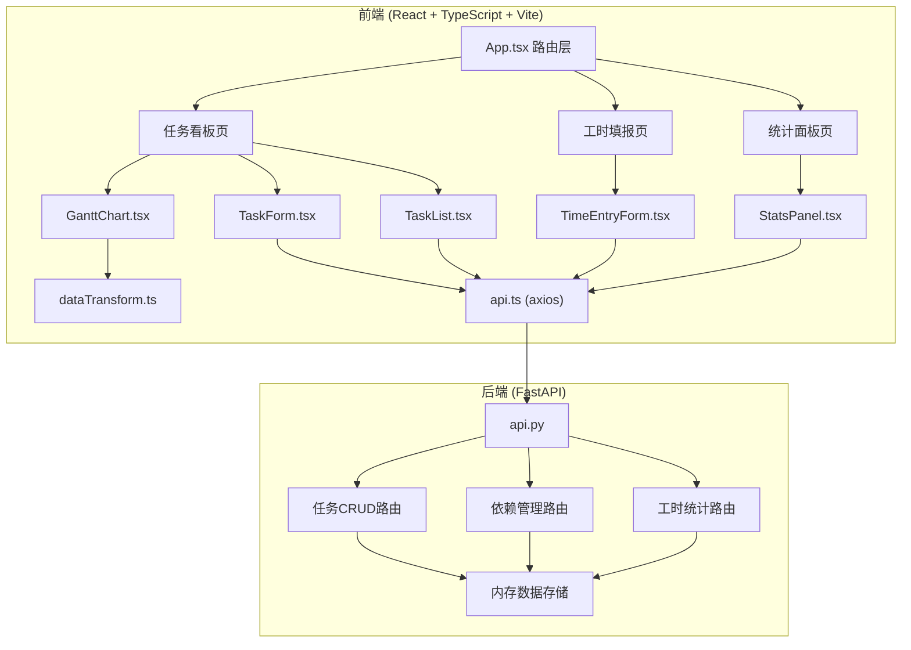
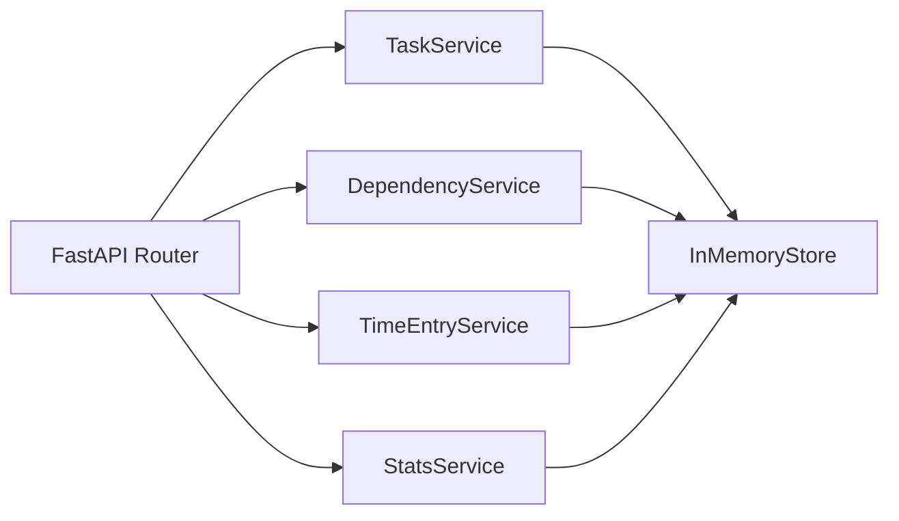
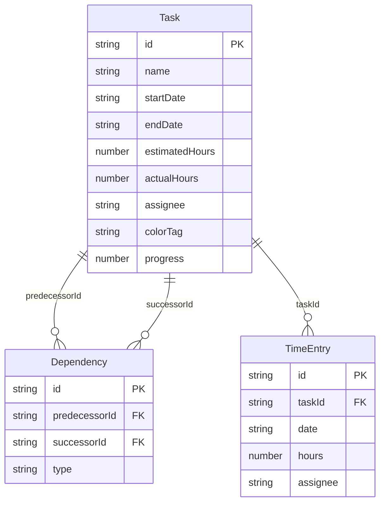

## 1. 架构设计



## 2. 技术说明

- **前端**：React@18 + TypeScript + Vite + TailwindCSS@3
- **初始化工具**：vite-init (react-ts 模板)
- **后端**：FastAPI (Python) + uvicorn
- **数据库**：内存数据存储（模拟持久化，数据在服务运行期间保持）
- **图表库**：recharts（轻量级React图表库）
- **拖拽库**：@dnd-kit/core（甘特图任务条拖拽）
- **状态管理**：zustand
- **HTTP客户端**：axios
- **路由**：react-router-dom@6

## 3. 路由定义

| 路由 | 用途 |
|------|------|
| `/` | 任务看板页（默认页），包含甘特图和任务列表 |
| `/time-entry` | 工时填报页，日历+工时输入 |
| `/stats` | 统计面板页，图表展示 |

## 4. API 定义

### 4.1 数据类型

```typescript
interface Task {
  id: string;
  name: string;
  startDate: string;
  endDate: string;
  estimatedHours: number;
  actualHours: number;
  assignee: string;
  colorTag: string;
  dependencies: string[];
  progress: number;
}

interface Dependency {
  id: string;
  predecessorId: string;
  successorId: string;
  type: "FS";
}

interface TimeEntry {
  id: string;
  taskId: string;
  date: string;
  hours: number;
  assignee: string;
}

interface DailySummary {
  date: string;
  totalHours: number;
  byAssignee: Record<string, number>;
}
```

### 4.2 API端点

| 方法 | 路径 | 请求体 | 响应 | 说明 |
|------|------|--------|------|------|
| GET | `/api/tasks` | - | `Task[]` | 获取所有任务 |
| POST | `/api/tasks` | `Partial<Task>` | `Task` | 创建任务 |
| PUT | `/api/tasks/:id` | `Partial<Task>` | `Task` | 更新任务 |
| DELETE | `/api/tasks/:id` | - | `{ok: bool}` | 删除任务 |
| GET | `/api/dependencies` | - | `Dependency[]` | 获取所有依赖 |
| POST | `/api/dependencies` | `Partial<Dependency>` | `Dependency` | 创建依赖 |
| DELETE | `/api/dependencies/:id` | - | `{ok: bool}` | 删除依赖 |
| POST | `/api/time-entries/batch` | `TimeEntry[]` | `TimeEntry[]` | 批量提交工时（防抖） |
| GET | `/api/time-entries?taskId=&date=` | - | `TimeEntry[]` | 查询工时记录 |
| GET | `/api/stats/distribution` | - | `DailySummary[]` | 工时分布统计 |
| GET | `/api/stats/comparison` | - | `{taskId, estimated, actual}[]` | 预估vs实际对比 |
| GET | `/api/stats/cumulative` | - | `{date, cumulativeHours}[]` | 累计工时趋势 |

## 5. 服务端架构图



## 6. 数据模型

### 6.1 数据模型定义



### 6.2 初始数据

```json
{
  "tasks": [
    {
      "id": "task-1",
      "name": "需求分析",
      "startDate": "2026-06-01",
      "endDate": "2026-06-05",
      "estimatedHours": 40,
      "actualHours": 36,
      "assignee": "张三",
      "colorTag": "#3498DB",
      "dependencies": [],
      "progress": 90
    },
    {
      "id": "task-2",
      "name": "架构设计",
      "startDate": "2026-06-05",
      "endDate": "2026-06-10",
      "estimatedHours": 32,
      "actualHours": 20,
      "assignee": "李四",
      "colorTag": "#E67E22",
      "dependencies": ["task-1"],
      "progress": 60
    },
    {
      "id": "task-3",
      "name": "前端开发",
      "startDate": "2026-06-10",
      "endDate": "2026-06-20",
      "estimatedHours": 80,
      "actualHours": 0,
      "assignee": "王五",
      "colorTag": "#2ECC71",
      "dependencies": ["task-2"],
      "progress": 0
    },
    {
      "id": "task-4",
      "name": "后端开发",
      "startDate": "2026-06-10",
      "endDate": "2026-06-18",
      "estimatedHours": 64,
      "actualHours": 8,
      "assignee": "张三",
      "colorTag": "#9B59B6",
      "dependencies": ["task-2"],
      "progress": 12
    },
    {
      "id": "task-5",
      "name": "集成测试",
      "startDate": "2026-06-20",
      "endDate": "2026-06-25",
      "estimatedHours": 40,
      "actualHours": 0,
      "assignee": "李四",
      "colorTag": "#E74C3C",
      "dependencies": ["task-3", "task-4"],
      "progress": 0
    }
  ],
  "timeEntries": [
    {"id": "te-1", "taskId": "task-1", "date": "2026-06-01", "hours": 8, "assignee": "张三"},
    {"id": "te-2", "taskId": "task-1", "date": "2026-06-02", "hours": 8, "assignee": "张三"},
    {"id": "te-3", "taskId": "task-1", "date": "2026-06-03", "hours": 8, "assignee": "张三"},
    {"id": "te-4", "taskId": "task-1", "date": "2026-06-04", "hours": 8, "assignee": "张三"},
    {"id": "te-5", "taskId": "task-1", "date": "2026-06-05", "hours": 4, "assignee": "张三"},
    {"id": "te-6", "taskId": "task-2", "date": "2026-06-05", "hours": 4, "assignee": "李四"},
    {"id": "te-7", "taskId": "task-2", "date": "2026-06-06", "hours": 8, "assignee": "李四"},
    {"id": "te-8", "taskId": "task-2", "date": "2026-06-07", "hours": 8, "assignee": "李四"},
    {"id": "te-9", "taskId": "task-4", "date": "2026-06-10", "hours": 8, "assignee": "张三"}
  ]
}
```
