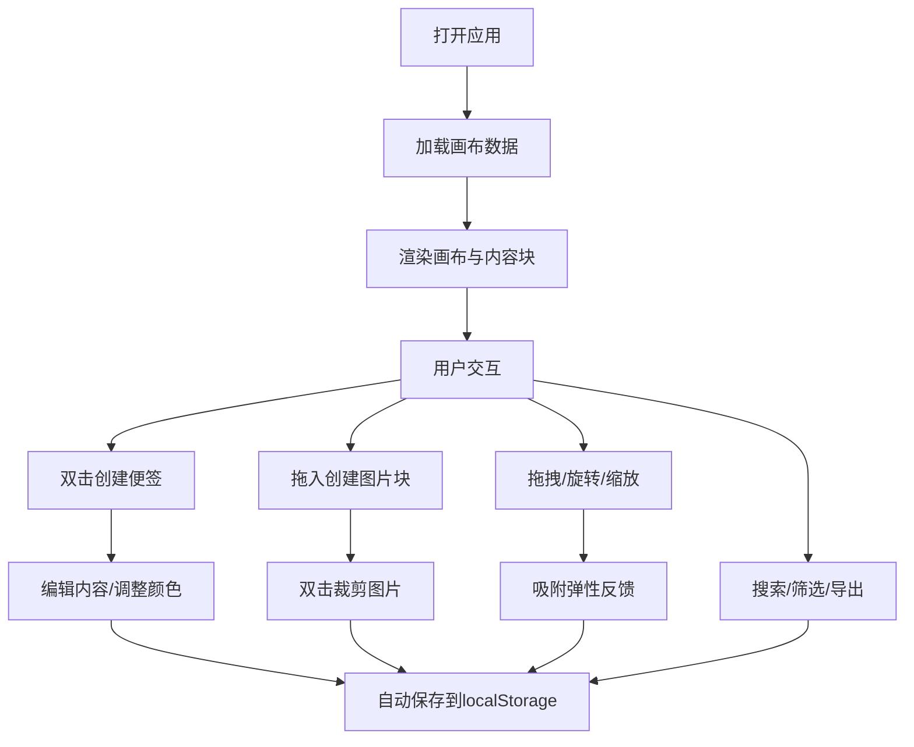

## 1. 产品概述
灵感画布是一款数字白板应用，让用户能在无限画布上自由摆放可编辑的便签和图片块，模拟实体白板贴便签的体验。
- 面向需要头脑风暴、灵感整理、项目规划的创意工作者和团队
- 核心价值在于提供灵活、直观、沉浸式的可视化思考空间

## 2. 核心功能

### 2.1 用户角色
| 角色 | 注册方式 | 核心权限 |
|------|----------|----------|
| 普通用户 | 无需注册，直接使用 | 创建/编辑/删除内容块、导出数据、撤销重做 |

### 2.2 功能模块
1. **画布主界面**：无限滚动画布、缩放视图、全局事件监听
2. **便签模块**：富文本编辑、随机柔和颜色、颜色切换、旋转控制
3. **图片模块**：本地拖入、等比缩放、双击裁剪、旋转控制
4. **侧边工具栏**：撤销/重做/导出、搜索筛选内容块
5. **交互系统**：拖拽排列、角度指示、阴影层次、吸附弹性反馈

### 2.3 页面详情
| 页面名称 | 模块名称 | 功能描述 |
|----------|----------|----------|
| 主画布 | 无限画布 | 支持鼠标滚轮缩放、拖拽平移、双击创建便签、拖入图片 |
| 主画布 | 便签组件 | 富文本编辑（加粗/列表/标题）、随机背景色、颜色切换器、旋转手柄+角度指示 |
| 主画布 | 图片组件 | 等比缩放、双击弹出裁剪对话框、Canvas API裁剪、旋转手柄+角度指示 |
| 主画布 | 内容块交互 | @dnd-kit拖拽、旋转控制、重叠阴影、吸附弹性、缓动动画 |
| 侧边栏 | 工具栏 | 磨砂玻璃半透明效果、撤销/重做/导出按钮、搜索框、筛选器 |

## 3. 核心流程

用户打开应用 → 进入空白画布 → 
  - 双击空白处创建便签 → 编辑富文本内容 → 调整颜色/位置/旋转
  - 拖入本地图片 → 调整大小/位置/旋转 → 双击裁剪图片
→ 通过侧边栏撤销/重做/搜索/导出
→ 数据自动保存到localStorage

## 4. 用户界面设计

### 4.1 设计风格
- **主色调**：暖白色 (#FFFBF5) 背景，搭配焦糖橙 (#E07A5F) 和雾霾蓝 (#81B29A) 装饰色
- **按钮样式**：磨砂玻璃质感，圆角8px，悬停微上浮效果
- **字体**：标题用 Playfair Display，正文用 Lora
- **布局风格**：左侧固定半透明侧边栏，主区域为无限画布
- **视觉细节**：画布微噪点纹理、内容块阴影层次、旋转角度标记

### 4.2 页面设计概览
| 页面名称 | 模块名称 | UI元素 |
|----------|----------|----------|
| 主画布 | 画布区域 | 微噪点暖白背景、网格辅助线（可选）、内容块阴影 |
| 主画布 | 便签 | 柔和彩色背景、便签纸质感阴影、底部旋转手柄带角度标记 |
| 主画布 | 图片块 | 白色边框、圆角、裁剪对话框遮罩层 |
| 侧边栏 | 工具栏 | 半透明毛玻璃 (backdrop-blur)、垂直排列按钮、搜索框 |

### 4.3 响应式
- 桌面端：侧边栏固定左侧宽240px，画布占剩余空间
- 平板端：侧边栏可折叠为图标模式（宽64px）
- 触摸优化：拖拽和旋转手柄增大触摸区域，支持双指缩放

### 4.4 动效设计
- 拖拽：缓动函数 cubic-bezier(0.25, 0.46, 0.45, 0.94)
- 旋转：角度数值实时更新，带数字跳转动效
- 吸附：吸附瞬间弹簧回弹效果 spring(mass: 0.1, stiffness: 150)
- 创建/删除：淡入淡出 + 轻微缩放

## 5. 性能要求
- 同时渲染200个内容块时帧率 ≥ 45fps
- 使用 requestAnimationFrame 节流动画
- 内容块虚拟化（仅渲染视口范围内）
- Canvas离屏渲染图片预览
