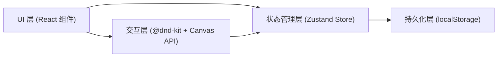
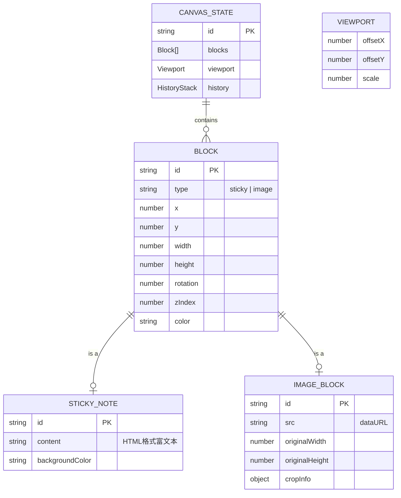

## 1. 架构设计



## 2. 技术说明

- **前端框架**：React@18 + TypeScript
- **构建工具**：Vite@5
- **状态管理**：Zustand（轻量，替代用户要求的React Context，更高效）
- **拖拽库**：@dnd-kit/core、@dnd-kit/utilities
- **富文本编辑**：contentEditable + execCommand（轻量级实现加粗/列表/标题）
- **图片处理**：Canvas API 实现裁剪和缩放
- **ID生成**：uuid
- **样式方案**：原生CSS + CSS变量，确保性能和轻量
- **动画方案**：CSS transitions + requestAnimationFrame + 自定义弹簧缓动

## 3. 路由定义

| 路由 | 用途 |
|------|------|
| / | 主画布页面（唯一页面） |

## 4. 数据模型

### 4.1 数据模型定义



### 4.2 TypeScript 类型定义

```typescript
type BlockType = 'sticky' | 'image';

interface BlockBase {
  id: string;
  type: BlockType;
  x: number;
  y: number;
  width: number;
  height: number;
  rotation: number;
  zIndex: number;
}

interface StickyNoteBlock extends BlockBase {
  type: 'sticky';
  content: string;
  backgroundColor: string;
}

interface ImageBlockData extends BlockBase {
  type: 'image';
  src: string;
  originalWidth: number;
  originalHeight: number;
  cropInfo?: {
    x: number;
    y: number;
    width: number;
    height: number;
    aspectRatio?: string;
  };
}

type Block = StickyNoteBlock | ImageBlockData;

interface Viewport {
  offsetX: number;
  offsetY: number;
  scale: number;
}

interface CanvasState {
  blocks: Block[];
  viewport: Viewport;
  history: { past: Block[][]; future: Block[][] };
  searchQuery: string;
  filterType: BlockType | 'all';
}
```

## 5. 项目文件结构

```
src/
├── stores/
│   └── canvasStore.ts          # Zustand 全局状态管理
├── components/
│   ├── Canvas/
│   │   └── Canvas.tsx          # 画布主组件（无限滚动/缩放/拖拽）
│   ├── StickyNote/
│   │   └── StickyNote.tsx      # 便签组件（富文本/颜色/旋转）
│   ├── ImageBlock/
│   │   └── ImageBlock.tsx      # 图片块组件（拖入/裁剪/缩放）
│   └── Sidebar/
│       └── Sidebar.tsx         # 侧边栏（磨砂玻璃/全局操作）
├── hooks/
│   ├── useVirtualization.ts    # 虚拟渲染优化hook
│   └── useDragRotation.ts      # 旋转控制hook
├── utils/
│   ├── canvasUtils.ts          # Canvas裁剪/缩放工具
│   ├── animationUtils.ts       # 缓动/弹簧动画函数
│   └── constants.ts            # 颜色常量/配置
├── styles/
│   └── global.css              # 全局样式（CSS变量/噪点纹理）
├── App.tsx
└── main.tsx
```

## 6. 性能优化策略

1. **虚拟渲染**：计算视口边界，只渲染可见区域内的内容块
2. **requestAnimationFrame 节流**：拖拽和旋转时使用 RAF 批量更新
3. **CSS transform 合成**：位置/缩放/旋转全部用 transform，触发 GPU 合成层
4. **will-change 提示**：活跃交互的元素标记 will-change: transform
5. **图片懒处理**：大图使用离屏 Canvas 预缩放，降低内存占用
6. **批量 state 更新**：Zustand 支持批量更新减少 re-render
7. **React.memo**：内容块组件包裹 memo，props 未变时跳过渲染

## 7. 核心交互实现方案

### 7.1 拖拽
- 使用 @dnd-kit/core 实现，自定义 DragOverlay 样式
- 拖拽过程使用 transform: translate3d(x, y, 0) 硬件加速
- 吸附逻辑：检测邻近块边缘，在阈值内用弹簧动画吸附

### 7.2 旋转
- 自定义旋转手柄，位于元素底部中心下方16px处
- 计算鼠标相对于元素中心的极坐标角度
- 按住 Shift 时吸附到15°整数倍
- 实时显示角度数值（跟随手柄位置）

### 7.3 无限滚动与缩放
- 监听鼠标滚轮事件，Ctrl+滚轮缩放，普通滚轮平移
- 缩放以鼠标指针为中心（改变 offsetX/Y 补偿）
- 画布边界无限制，viewBox 无最大/最小值约束

### 7.4 富文本编辑
- 使用 contentEditable div
- 工具栏按钮调用 document.execCommand('bold'|'insertUnorderedList' 等)
- 编辑时阻止冒泡，避免干扰拖拽
- 失焦时保存内容到 store

### 7.5 图片裁剪
- 双击图片弹出模态裁剪对话框
- 支持预设比例（1:1 / 4:3 / 16:9 / 自由）
- 使用离屏 Canvas 根据裁剪区域生成新 dataURL
- 裁剪框支持拖拽调整和移动
