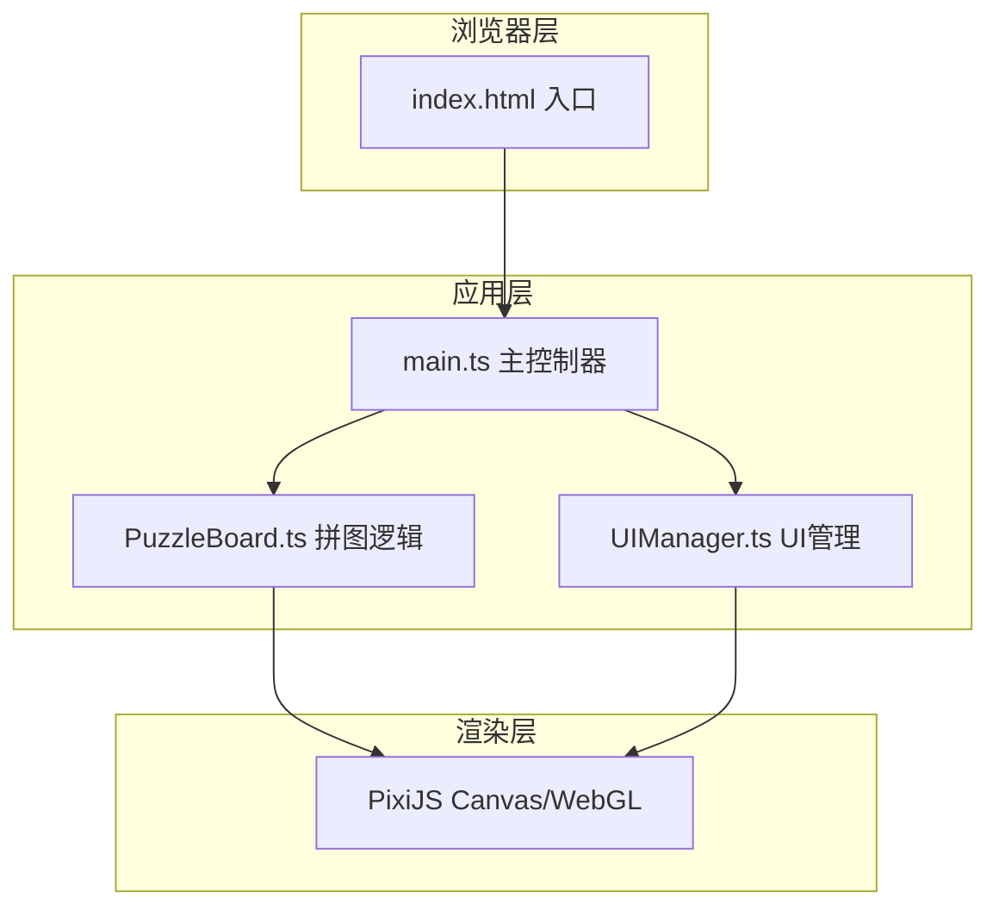

## 1. 架构设计



## 2. 技术选型

- **前端框架**：无框架，纯 TypeScript + 原生模块化
- **渲染引擎**：PixiJS v7.3.0 (Canvas 2D / WebGL)
- **构建工具**：Vite 5.x
- **语言**：TypeScript (严格模式)
- **图片资源**：使用公共名画图片 URL，无需后端

## 3. 文件结构

```
e:\solo\VersionFastPro\tasks\auto1\
├── package.json
├── vite.config.js
├── tsconfig.json
├── index.html
└── src/
    ├── main.ts          # 主逻辑入口，初始化与游戏流程控制
    ├── PuzzleBoard.ts   # 拼图板核心逻辑（切割、打乱、交换、检测）
    └── UIManager.ts     # UI管理（工具栏、计时器、完成动画）
```

## 4. 数据模型

### 4.1 名画数据

```typescript
interface Painting {
  id: string;
  name: string;           // 画作名称
  artist: string;         // 作者
  year: string;           // 创作年代
  imageUrl: string;       // 图片URL
}
```

### 4.2 碎片数据

```typescript
interface PuzzlePiece {
  id: number;             // 碎片唯一ID (0-15)
  correctIndex: number;   // 正确位置索引
  currentIndex: number;   // 当前位置索引
  sprite: PIXI.Sprite;    // Pixi 精灵
  isCorrect: boolean;     // 是否在正确位置
}
```

### 4.3 游戏状态

```typescript
interface GameState {
  isPlaying: boolean;
  isCompleted: boolean;
  startTime: number;
  elapsedTime: number;
  moveCount: number;
  currentPainting: Painting | null;
}
```

## 5. 核心模块职责

### 5.1 PuzzleBoard.ts

- `loadPainting(image: HTMLImageElement, cutOffsets?: {x: number[], y: number[]})`：加载图片并切割
- `generatePieces()`：根据切割位置生成16块碎片精灵
- `shufflePieces()`：Fisher-Yates 打乱碎片
- `swapPieces(indexA: number, indexB: number)`：交换两块碎片
- `checkCompletion(): boolean`：检测拼图是否完成
- `getPieceAtPosition(x: number, y: number): PuzzlePiece | null`：根据坐标获取碎片
- `onPieceDragStart / onPieceDragMove / onPieceDragEnd`：拖拽事件处理

### 5.2 UIManager.ts

- `createToolbar()`：创建毛玻璃工具栏
- `updateTimer(seconds: number)`：更新计时器显示
- `updateMoveCount(count: number)`：更新步数显示
- `showCompletion(painting: Painting, time: number, moves: number)`：显示完成动画与画作信息
- `triggerCelebration()`：触发庆祝粒子动画

### 5.3 main.ts

- 初始化 PixiJS Application
- 加载名画数据列表
- 随机选择一幅名画
- 创建 PuzzleBoard 和 UIManager 实例
- 控制游戏状态流转（开始→进行中→完成）
- 监听窗口 resize，实现响应式

## 6. 性能优化

- 使用 PixiJS WebGL 渲染，确保 60 FPS
- 拖拽时只更新被拖拽精灵的 transform，不重绘整个场景
- 粒子动画使用对象池复用
- 图片预加载，避免加载卡顿
- 使用 requestAnimationFrame 驱动动画
