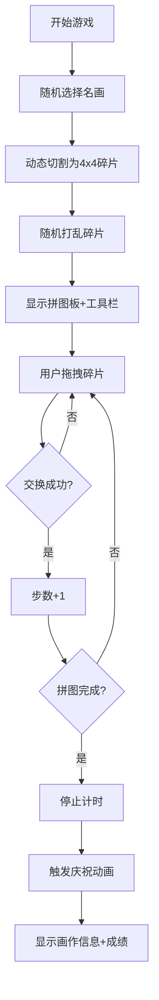

## 1. 产品概述

名画拼图挑战是一款基于名画修复主题的互动拼图游戏，用户通过拖拽碎片还原名画，体验博物馆文物修复的乐趣。

- 核心目标：提供沉浸式名画拼图体验，融合艺术欣赏与益智游戏
- 目标用户：艺术爱好者、休闲游戏玩家

## 2. 核心功能

### 2.1 功能模块

1. **主游戏页面**：拼图板、工具栏、完成动画
2. **图片系统**：多幅名画随机选择、动态切割、碎片打乱
3. **交互系统**：拖拽交换、视觉反馈、平滑动画
4. **计分系统**：计时器、步数统计、完成信息展示

### 2.2 功能详情

| 模块名称 | 功能描述 |
|---------|---------|
| 图片加载 | 从至少3幅名画中随机选择1幅 |
| 动态切割 | 将图片切割为4x4共16块碎片，切割位置每次随机偏移 |
| 碎片打乱 | 随机打乱碎片位置，确保可解 |
| 拖拽交换 | 鼠标/触摸拖拽交换两块碎片位置 |
| 视觉反馈 | 拖拽时1.05倍缩放+阴影、正确放置金色闪烁 |
| 计时计分 | 实时计时器、步数统计 |
| 完成检测 | 自动检测拼图是否完成 |
| 庆祝动画 | 完成后触发粒子/光效动画 |
| 画作信息 | 展示画作名称、作者、创作年代 |

## 3. 核心流程

## 4. 用户界面设计

### 4.1 设计风格

- **主色调**：米白色背景 (#F5F0E6)
- **边框**：木质纹理边框，深棕色系
- **碎片分割线**：2px 深灰色 (#333333)
- **金色光效**：#FFD700 用于正确放置闪烁
- **工具栏**：半透明毛玻璃效果 (backdrop-filter: blur)
- **字体**：优雅的衬线字体展示画作信息，无衬线字体用于数据

### 4.2 页面设计

| 区域 | 设计元素 |
|-----|---------|
| 顶部工具栏 | 毛玻璃半透明背景，左侧计时器，右侧步数，中间可放标题 |
| 拼图板区域 | 正方形拼图板，木质边框，米白色内底，16块碎片网格 |
| 完成弹窗 | 居中展示画作完整图+信息卡片，下方展示完成时间和步数 |

### 4.3 响应式设计

- **桌面端**：拼图板占屏幕中央，最大尺寸约 600x600px
- **移动端**：拼图板适配屏幕宽度，保持正方形比例，触摸优化
- **触摸支持**：支持 touchstart/touchmove/touchend 事件

### 4.4 动效设计

- 拖拽中：碎片 scale=1.05，box-shadow 投影跟随
- 交换时：0.3s 平滑过渡动画 (ease-out)
- 正确放置：边缘金色闪烁光晕 (0.5s 脉冲)
- 完成时：粒子爆炸动画 + 碎片整体发光
