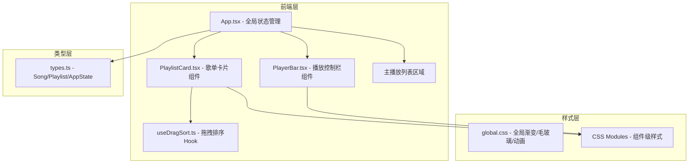
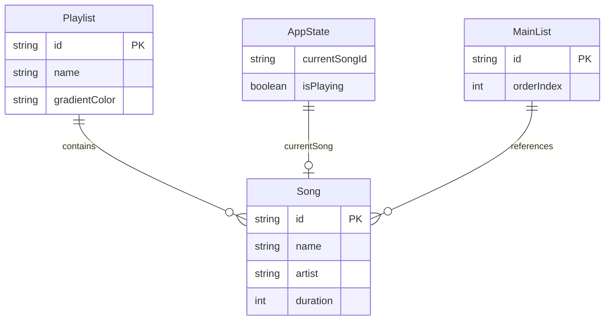

## 1. 架构设计



## 2. 技术说明

- 前端：React@18 + TypeScript + Vite + CSS Modules
- 初始化工具：Vite
- 后端：无（纯前端应用，数据存储在组件状态中）
- 数据库：无（使用内存状态管理，可选localStorage持久化）

## 3. 路由定义

| 路由 | 用途 |
|------|------|
| / | 主应用页面，包含所有歌单管理、播放控制、混搭列表功能 |

本项目为单页应用，所有功能在一个页面内完成。

## 4. API定义

无后端API，所有数据通过前端状态管理。

### 4.1 核心类型定义

```typescript
interface Song {
  id: string;
  name: string;
  artist: string;
  duration: number; // 秒
}

interface Playlist {
  id: string;
  name: string;
  songs: Song[];
  gradientColor: string; // 自定义渐变背景色
}

interface AppState {
  playlists: Playlist[];
  mainList: Song[]; // 主播放列表（跨歌单混搭）
  currentSong: Song | null;
  isPlaying: boolean;
}
```

## 5. 服务端架构图

不适用，纯前端应用。

## 6. 数据模型

### 6.1 数据模型定义



### 6.2 数据定义

无数据库DDL，数据结构通过TypeScript接口定义，存储在React组件状态中。

## 7. 文件组织

```
├── package.json
├── vite.config.js
├── tsconfig.json
├── index.html
└── src/
    ├── types.ts
    ├── App.tsx
    ├── App.module.css
    ├── components/
    │   ├── PlaylistCard.tsx
    │   ├── PlaylistCard.module.css
    │   ├── PlayerBar.tsx
    │   └── PlayerBar.module.css
    ├── hooks/
    │   └── useDragSort.ts
    └── styles/
        └── global.css
```

## 8. 关键技术决策

1. **拖拽排序**：使用自定义 `useDragSort` hook，基于 HTML5 Drag and Drop API + useRef 优化，避免不必要的重渲染，保证55-60FPS
2. **伪播放进度条**：使用 CSS `@keyframes` 动画控制进度条宽度，配合 `animation-play-state` 实现暂停/继续
3. **毛玻璃效果**：使用 `backdrop-filter: blur(12px)` + 半透明背景色
4. **跨歌单拖拽**：通过 HTML5 Drag and Drop 的 `dataTransfer` 传递歌曲ID和来源歌单ID
5. **响应式布局**：CSS Grid + 媒体查询，移动端主播放列表折叠到底部
6. **弹性动画**：拖拽时使用 `transform: scale(1.05)` + `transition: transform 0.2s ease` 实现弹性反馈
