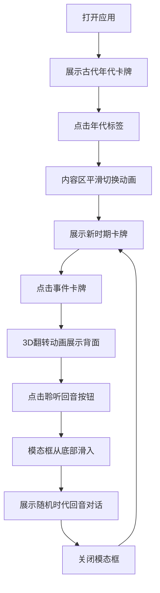

## 1. 产品概述

历史回声壁是一个沉浸式历史事件探索应用，让用户像翻阅魔法书一样，通过点击不同历史时期的标签，浏览各时代的标志性事件，并通过"时代回音"功能与历史进行跨时空的对话互动。

- 目标用户：历史爱好者、学生、对人类文明演进感兴趣的普通用户
- 核心价值：以生动有趣的交互方式，让历史事件变得可触摸、可对话，激发用户探索历史的兴趣

## 2. 核心功能

### 2.1 用户角色
| 角色 | 注册方式 | 核心权限 |
|------|---------|---------|
| 访客用户 | 无需注册 | 浏览所有历史事件、使用搜索功能、聆听时代回音 |

### 2.2 功能模块
1. **年代标签栏**：横向滚动的年代导航（古代、中世纪、工业革命、近代、现代）
2. **事件卡牌展示区**：以网格形式展示对应年代的历史事件卡牌
3. **卡牌翻转交互**：点击卡牌进行3D翻转，展示事件详情
4. **时代回音模态框**：点击"聆听回音"按钮，弹出模拟AI对话
5. **全局搜索**：支持按事件名称或关键词实时搜索

### 2.3 页面详情
| 页面名称 | 模块名称 | 功能描述 |
|---------|---------|----------|
| 主页面 | 年代标签栏 | 横向滚动，5个年代标签，点击切换内容区，带平滑滑动动画 |
| 主页面 | 事件卡牌网格 | 每个年代至少6张卡牌，正面显示事件名称和年份，点击3D翻转显示背面 |
| 主页面 | 时代回音模态框 | 底部滑入动画，展示随机选取的预设对话文本 |
| 主页面 | 全局搜索框 | 实时过滤，300ms内响应，支持键盘上下选择 |

## 3. 核心流程

用户打开应用 → 默认展示古代年代的事件卡牌 → 点击年代标签切换时期（内容区平滑过渡） → 点击事件卡牌（3D翻转展示详情） → 点击"聆听回音"按钮 → 模态框从底部滑入，展示时代回音对话 → 关闭模态框继续探索

## 4. 用户界面设计

### 4.1 设计风格
- **主题风格**：深色复古魔法书风格
- **主色调**：#2c1810（深棕色背景）
- **辅色调**：#d4a574（金色/羊皮纸色）
- **描边色**：1px rgba(212, 165, 116, 0.6)（微弱金色描边）
- **卡牌背景**：羊皮纸纹理效果
- **字体风格**：衬线字体（serif）
- **动画缓动**：cubic-bezier(0.4, 0, 0.2, 1)
- **动画时长**：400ms

### 4.2 页面设计概述
| 页面名称 | 模块名称 | UI元素 |
|---------|---------|--------|
| 主页面 | 年代标签栏 | 横向滚动、金色描边、选中态高亮、衬线字体 |
| 主页面 | 事件卡牌 | 羊皮纸纹理、金色描边、3D翻转效果、正面/背面布局 |
| 主页面 | 时代回音模态框 | 底部滑入、深色半透明遮罩、对话气泡样式 |
| 主页面 | 搜索面板 | 实时过滤列表、键盘导航高亮、金色描边输入框 |

### 4.3 响应性
- 桌面端优先设计
- 卡牌网格自适应列数
- 移动端单列布局
- 标签栏支持触摸滑动

### 4.4 动效设计
- 年代切换：旧内容向左淡出，新内容从右侧滑入，400ms
- 卡牌翻转：3D perspective 翻转效果
- 模态框：从底部滑入，带遮罩淡入
- 搜索结果：实时过滤，平滑显示/隐藏
