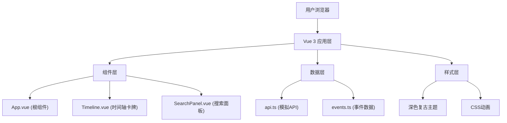

## 1. 架构设计

本项目为纯前端应用，采用 Vue 3 + TypeScript + Vite 技术栈，数据采用本地模拟方式，无需后端服务。



## 2. 技术描述

- **前端框架**：Vue@3.4.0 + TypeScript
- **构建工具**：Vite@5.0.0
- **路由**：vue-router@4.3.0（单页应用，主要用于年代切换的URL同步）
- **状态管理**：Vue 3 Composition API（组件内状态管理，无需额外状态管理库）
- **样式方案**：原生CSS + CSS变量（深色复古主题）
- **数据来源**：本地预设数据（events.ts），通过模拟API（api.ts）访问

## 3. 路由定义

| 路由 | 用途 |
|------|------|
| / | 首页，默认展示古代年代 |
| /era/:era | 指定年代的事件展示 |

## 4. 数据模型

### 4.1 事件数据模型

```typescript
interface HistoryEvent {
  id: string;
  title: string;
  year: string;
  description: string;
  eras: string[];
  echoes: string[];
}
```

### 4.2 年代列表

- 古代 (ancient)
- 中世纪 (medieval)
- 工业革命 (industrial)
- 近代 (modern)
- 现代 (contemporary)

## 5. 文件结构

```
├── index.html                 # 入口HTML
├── package.json               # 项目配置和依赖
├── tsconfig.json              # TypeScript配置
├── vite.config.js             # Vite配置
└── src/
    ├── App.vue                # 根组件
    ├── main.ts                # 应用入口
    ├── components/
    │   ├── Timeline.vue       # 时间轴卡牌组件
    │   └── SearchPanel.vue    # 搜索面板组件
    ├── data/
    │   └── events.ts          # 预设事件数据
    └── utils/
        └── api.ts             # 模拟API函数
```

## 6. 核心组件职责

### 6.1 App.vue（根组件）
- 管理当前选中的年代状态
- 管理全局搜索状态
- 调用API模块获取数据
- 处理年代切换的动画逻辑
- 将事件数据分发给 Timeline 和 SearchPanel

### 6.2 Timeline.vue（时间轴组件）
- 接收年代数据 props
- 渲染事件卡牌网格
- 处理卡牌点击翻转（3D动画）
- 处理"聆听回音"按钮点击
- 发出事件给父组件

### 6.3 SearchPanel.vue（搜索面板组件）
- 搜索输入框
- 监听 input 事件触发过滤
- 结果列表展示
- 支持键盘上下选择
- 点击结果项跳转到对应事件

## 7. 性能要求

- 所有动画在60fps下流畅运行
- 搜索响应时间不超过300ms
- 使用 CSS transform 和 opacity 实现动画（GPU加速）
- 搜索使用防抖处理（300ms延迟）
- 避免不必要的重排重绘

## 8. 动画规范

- 年代切换动画：400ms，cubic-bezier(0.4, 0, 0.2, 1)
- 卡牌翻转动画：3D perspective，cubic-bezier(0.4, 0, 0.2, 1)
- 模态框动画：从底部滑入，cubic-bezier(0.4, 0, 0.2, 1)
- 统一缓动函数：cubic-bezier(0.4, 0, 0.2, 1)
