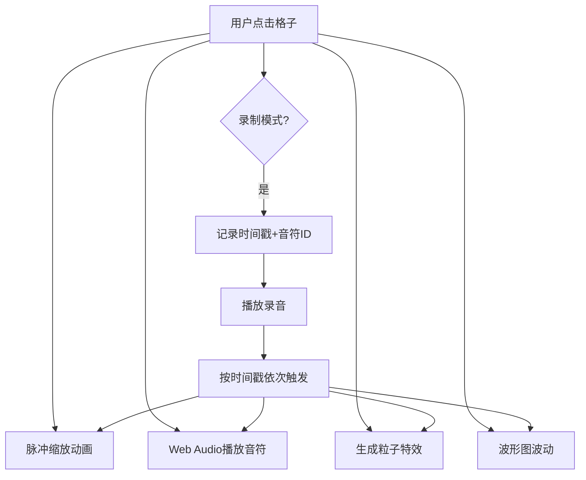

## 1. 产品概述
节奏律动墙是一款沉浸式音乐创作交互应用，让用户像DJ打碟一样通过点击彩色网格触发音符、粒子特效和波形可视化，支持即兴创作的录制与回放。
- 核心价值：将音乐创作转化为直观的视觉交互体验，降低音乐创作门槛
- 目标用户：音乐爱好者、创意人士、休闲娱乐用户

## 2. 核心功能

### 2.1 用户角色
无需角色区分，单用户应用

### 2.2 功能模块
1. **首页**：5x10音符网格、波形可视化、录制播放控制、粒子特效层

### 2.3 页面详情
| 页面名称 | 模块名称 | 功能描述 |
|-----------|-------------|---------------------|
| 首页 | 音符网格 | 5行10列网格，每格对应一个音符（中央C到高音C），点击触发音符播放、脉冲动画和粒子散发 |
| 首页 | 波形可视化 | 右侧实时显示音频波形，蓝紫渐变，随点击节奏波动，1秒后平滑衰减 |
| 首页 | 录制控制 | 开始录制/停止录制按钮，顶部红色闪烁指示器，记录时间戳-音符序列 |
| 首页 | 播放控制 | 播放录音按钮，按原始节奏重演所有交互效果 |
| 首页 | 粒子系统 | Canvas绘制的彩色粒子，从点击位置向外扩散，颜色匹配主题色 |
| 首页 | 主题切换 | 支持三种配色方案（红、青、紫），所有元素0.3秒平滑过渡 |

## 3. 核心流程
用户点击网格格子 → 触发脉冲缩放动画 → 播放对应音高音符 → 生成彩色粒子扩散 → 波形图波动 → 录制模式下记录事件 → 回放时按时间戳重演所有效果

## 4. 用户界面设计

### 4.1 设计风格
- **主色调**：深色背景 #0a0a1a，格子默认半透明暗蓝色
- **强调色**：红 #ff3366、青 #00f0ff、紫 #b44dff
- **视觉效果**：内发光、荧光高亮、粒子扩散、波形渐变
- **字体**：现代无衬线字体，数字使用等宽字体
- **布局**：居中对称，网格在左，波形在右，控制栏在底部

### 4.2 页面设计概述
| 页面名称 | 模块名称 | UI 元素 |
|-----------|-------------|-------------|
| 首页 | 音符网格 | 5x10网格布局，半透明暗蓝底色，悬停内发光，点击脉冲缩放高亮 |
| 首页 | 波形可视化 | 右侧Canvas，蓝紫渐变线条，平滑波动动画 |
| 首页 | 录制指示器 | 顶部居中，红色圆点闪烁动画 |
| 首页 | 控制按钮 | 底部水平排列，圆角按钮，悬停发光效果 |
| 首页 | 粒子层 | 全屏Canvas，彩色粒子向外扩散淡出 |

### 4.3 响应性
- 桌面端优先，固定画布尺寸
- 触摸设备优化点击区域
- 最小窗口尺寸 1024x768

### 4.4 交互细节
- **点击响应**：<100ms延迟，格子立即缩放+发光
- **粒子效果**：从点击位置向四周散发20-30个粒子
- **波形动画**：每次点击产生一次波峰，1秒内平滑衰减
- **主题切换**：所有元素0.3秒ease过渡
- **录制回放**：节奏偏差≤50ms
